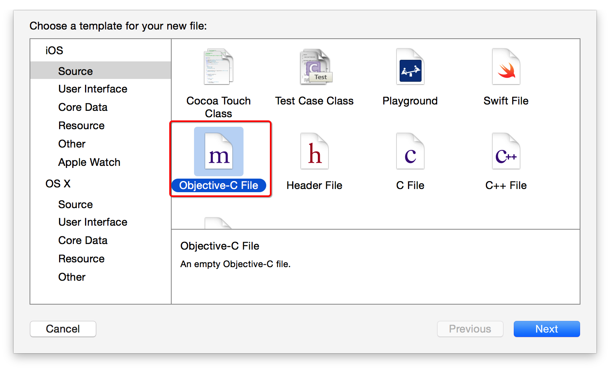
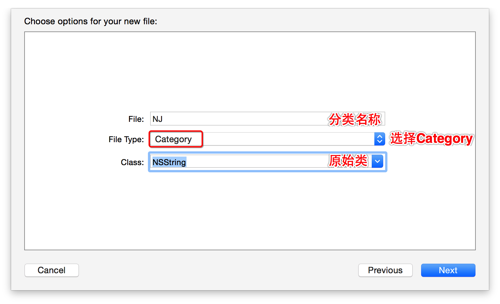

# Category基本概念
##本小节知识点:
1. 【理解】什么是Category
2. 【掌握】Category的格式


##1.什么是Category
- Category有很多种翻译: 分类 \ 类别 \ 类目 (一般叫分类)

- Category是OC特有的语法, 其他语言没有的语法

- Category的作用
    + 可以在不修改原来类的基础上, 为这个类扩充一些方法
    + 一个庞大的类可以分模块开发
    + 一个庞大的类可以由多个人来编写,更有利于团队合作

---

##2.Category的格式
- 在.h文件中声明类别
    + 1)新添加的方法必须写在 @interface 与 @end之间
    + 2)ClassName 现有类的类名(要为哪个类扩展方法)            + 3)CategoryName 待声明的类别名称
    + 4)NewMethod 新添加的方法
```objc
@interface ClassName (CategoryName)
NewMethod; //在类别中添加方法
//不允许在类别中添加变量
@end
```
    + >注意: 1)不允许在声明类别的时候定义变量

- 在.m文件中实现类别:
    + 1)新方法的实现必须写在@ implementation与@end之间
    + 2)ClassName 现有类的类名
    + 3)CategoryName 待声明的类别名称
    + 4)NewMethod 新添加的方法的实现

```objc
@implementation ClassName(CategoryName)

NewMethod
... ...
@end
```

- 使用Xcode创建分类






---
