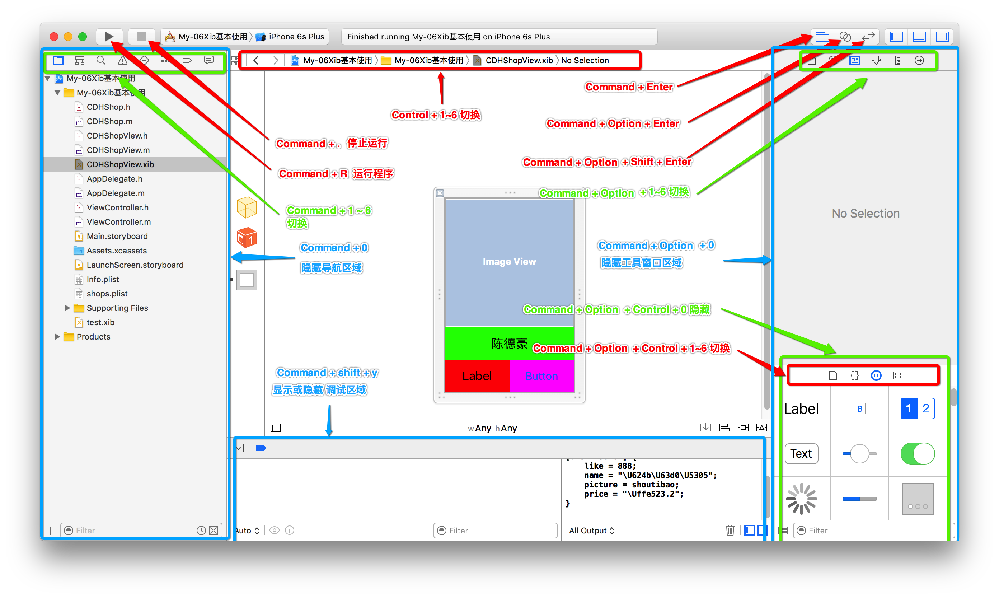

#Xcode常用快捷键
## Xcode窗口快捷键

##其他补充：

1. 编译代码: `command + B` 将代码翻译为计算机能够识别的语言(0/1)
2. 调试Xcode中程序: `command + R`
3. 折叠与展开方法代码：
    - 折叠代码的快捷键 : `command + option +  ←`
    - 展开代码的快捷键 : `command + option + →`
4. `.h`和`.m`之间切换 `command  + control + ↑`
5. 单行注释的快捷键: `command + /`
6. 添加断点快捷键: `command + \`
7. 代码移动的快捷键:
    - 上移动: `command + option + [`
    - 下移动: `command + option + ]`
    - 左移动: `command + ]`
    - 右移动: `command + [`
8. 光标移动快捷键:
    - 移至本行行首：`Ctrl + A`
    - 移至本行行尾：`Ctrl + E`
9. 删除代码快捷键：
    - 删除光标右边一行内容：`Ctrl + K`
    - 删除光标右边一个字符：`Ctrl + D`
8. 修改变量名称的快捷键 `command + control + E`
9. 自动调整代码格式（错落有致） `command + i`
11. 创建文件：`Command + N`
12. 创建新工程：`Command + Shift + N`
13. 清理工程：`Command + Shift + K`
14. 文件中查找与替换：
    - 文件中查找：`Command + F`
    - 查找下一个：`Command + G`
    - 查找上一个：`Command +Shift + G`
    - 文件中替换：`Command + Option + F`
15. 导航器中搜索
    - 方法一：`Command + 3`
    - 方法二：`Command + Shift + F`
16. 显示/隐藏Xcode窗口面板
    - 导航器面板：`Command + 0`
    - 实用工具面板：`Command + Option + 0`
    - 调试区：`Command + Shift + Y`
17. 调试区快捷键：
    - 单步调试（step over）：F6
    - 单步进入（step into）：F7
    - 跳出函数（step out）：F8
18. 打开首选项(preferences)：`Command + ，`
19. 文档与帮助：`Command + Shift +0（ZERO）`
20. 快速帮助：
    - 在类或者方法名上执行:`Option + Left－click`操作
    - 在文档中搜索：`Option + 双击`
    - 显示代码提示菜单：`Esc`

21. 模拟器快捷键
    - 拷贝模拟器屏幕 `option +  command + C`
    - 模拟器横竖屏切换：`command + →`  或者 `command + ←`
    - 模拟器上返回手机Home：`shitf + command + H`
    - 模拟内存警告: `shitf + command + M`
    - 模拟器显示比例：
        - 按100%的比例显示：`command + 1`
        - 按75%的比例显示：`command + 2`
        - 按50%的比例显示：`command + 3`
        - 按33%的比例显示：`command + 4`
        - 按25%的比例显示：`command + 5`

22. 快速复制粘贴控件：`command + d`  
    等于`command + c`和`command + v`
    
23. 快速选中某个单词:光标在单词尾部  `option + shift  +  ←`
24. 前后窗口来回切换快捷键:` command + ~ `
25. 工具栏中给Label 中的文本框换行: `option +  enter `

    

未完待续。。。

