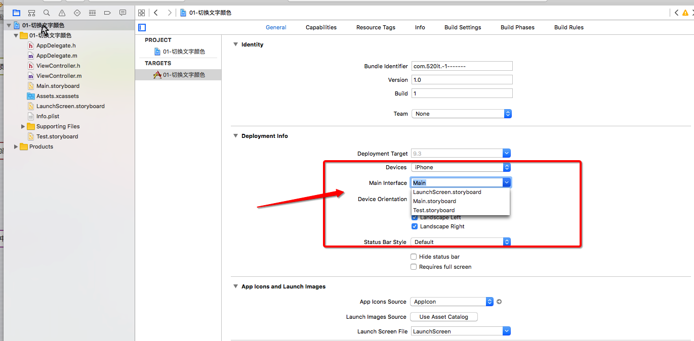

# 切换文字颜色

---
##本节小结知识点：

1. storyboard文件的认识
2. 控制器
3. IBAction
4. IBOutlet
5. 关于IBAction、IBOutlet前缀IB的解释
6. 类扩展(Class Extension)
7. 注意点
8. 常见错误

---

## 1.storyboard文件的认识
- **作用：描述软件界面**
- **程序启动的简单过程**
    - 程序一启动，就会加载`Main.storyboard`文件
    - 会创建箭头所指的控制器，并且显示控制器所管理的软件界面
- **配置程序一启动就会加载的storyboard文件**



---

## 2. 控制器
- **概念**：凡是继承自UIViewController的对象，都叫做控制器；
- **作用**：专门用来管理软件界面，负责软件界面的创建和销毁，负责处理软件界面的各种交互事件；
- **注意：**每一个控制器都会专门管理一个软件界面；


---

## 3. IBAction
- 只能修饰方法的返回值类型
- 被IBAction修饰的方法
    - 能拖线到storyboard中
    - 返回值类型实际是void


- 使用格式

```objectivec
- (IBAction)buttonClick{
    //方法语句；
}
```
  
---
  

## 4. IBOutlet
- 只能修饰属性
- 被IBOutlet修饰的属性
    - 能拖线到storyboard中


- 使用格式

  ```objectivec
  // 对象我们使用 strong 修饰，但UI 控件我们可以使用 weak 修饰
  // 系统默认生成的UI控件的属性由 weak 修饰; 
  @property (nonatomic, weak) IBOutlet UILabel *label;
  ```
  
---
  

## 5. 关于IBAction、IBOutlet前缀IB的解释
- 全称：Interface Builder
- 以前的UI界面开发模式：Xcode3 + Interface Builder
- 从Xcode4开始，Interface Builder已经整合到Xcode中了


---

## 6. 类扩展(Class Extension)
- **作用**
    - 能为某个类增加额外的属性、成员变量、方法声明
    - 一般将类扩展写到.m文件中
    - 一般将一些**私有的属性写到类扩展中**


- **使用格式**

```objectivec
@interface 类名()
/* 属性、成员变量、方法声明 */
@end
```

- **与分类的区别**
    - 分类的小括号必须有名字
    - 分类只能扩充方法
    - 如果在分类中声明了一个属性，分类只会生成这个属性的get\set方法声明
    - **注意:** 可以通过 runtime 在分类中添加实例属性

```objectivec
@interface 类名(分类名字)
/* 方法声明 */
@end

@implementation 类名(分类名字)
/* 方法实现 */
@end
```


---


## 7. 注意点
- 每一个控制器都专门管理一个属于自己的界面
- 一个方法可以和多个UI按钮控件连线；
- 一个UI控件也可以同时和多个方法连线；
- 如果一个控件监听了多个方法，调用的顺序会是反够来，会先连线后调用，后连线先调用；
- 拷贝UI控件的时候，也会将该控件含有的所有方法、属性（包括连线）都一起拷贝；
- 控制器一定要与之类型匹配，才能用控制器中的控件与该类中的方法或者属性连线；
- 属性变量是指针，指向堆中的对象，存储在栈中；


---
## 8. 常见错误
- **第1种错误描述：**

  ```objectivec
  reason：-[<ViewController 0x7fdc0152d300> setValue:forUndefinedKey:]: this class is not key value coding-compliant for the key label.
  ```
  - 原因：IBOutlet属性代码被删掉了，但是属性连线还在
  - 解决：将残留的连线删掉


- **第2种错误描述：**

  ```objectivec
  reason：-[ViewController blueClick]: unrecognized selector sent to instance 0x7ff59d014320
  ```
  - 原因：调用了一个不存在的方法
  - 解决：认真检查方法名，使用正确并且存在的方法名

---
 
