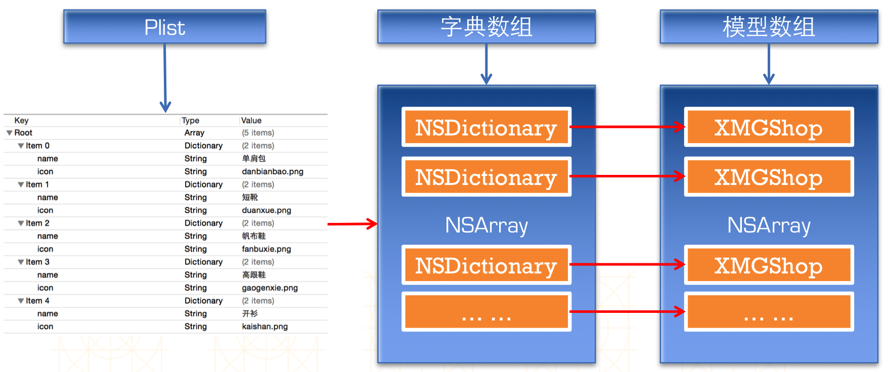

# 模型取代字典

##本节知识点：
1. 模型的基本概念
2. 模型取代字典的原因
3. 字典转模型
4. 字典转模型的过程
5. 字典转模型第三方框架
6. 设计框架需要考虑的问题
7. 补充

---

##1. 模型的基本概念

- **模型的概念：**所谓模型，其实就是数据模型，专门用来存放数据的对象，用它来表示数据会更加专业；

---

##2. 模型取代字典的原因

- **使用字典的坏处**:手敲字符串key，key容易写错，key出错了也不会有警告和报错
    >一般情况下，设置数据和取出数据都使用“字符串类型的key”，编写这些key时，编辑器没有智能提示，需要手敲,Key如果写错了，编译器不会有任何警告和报错，造成设错数据或者取错数据

```objc
dict[@"name"] = @"Jack";
NSString *name = dict[@"name"];
```

- **使用模型的好处：**
    - 模型设置数据和取出数据都是通过它的属性，属性名如果写错了，编译器会马上报错，因此，保证了数据的正确性
    - 使用模型访问属性时，编译器会提供一系列的提示，提高编码效率

```objc
app.name = @"Jack";
NSString *name = app.name;
```

---

##3. 字典转模型

- 字典转模型的过程最好封装在模型内部
- 模型应该提供一个可以传入字典参数的构造方法 和一个类方法

```objc
// 自定义构造方法
- (instancetype)initWithDict:(NSDictionary *)dict;
// 自定义类方法
+ (instancetype)xxxWithDict:(NSDictionary *)dict;
```

---

##4. 字典转模型的过程



```objc
//  CDHShop.h
//  商品模型类 .h文件

#import <Foundation/Foundation.h>

@interface XMGShop : NSObject
/** 图像 */
@property (nonatomic ,copy)NSString *icon;
/** 名字 */
@property (nonatomic ,copy)NSString *name;
/** 通过字典初始化模型 */
- (instancetype)initWithDict:(NSDictionary *)dict;
/** 通过字典创建模型 */
+ (instancetype)shopWithDict:(NSDictionary *)dict;
@end
```

```objc
//  XMGShop.m
//  商品模型类 .m文件

#import "XMGShop.h"

@implementation XMGShop

- (instancetype)initWithDict:(NSDictionary *)dict
{
    if (self = [super init]) {
        self.icon = dict[@"icon"];
        self.name = dict[@"name"];
    }
    return self;
}

+ (instancetype)shopWithDict:(NSDictionary *)dict
{
    // 这里最好写self ，有利于扩展子类，谁调用就代表着谁
    XMGShop *shop = [[self alloc] initWithDict:dict];
    return shop;
}
@end
```


---


##5. 字典转模型第三方框架
- Mantle
    - 所有模型都必须继承自MTModel
- JSONModel
    - 所有模型都必须继承自JSONModel
- MJExtension
    - 不需要强制继承任何其他类


---


##6. 设计框架需要考虑的问题
- 侵入性
    - 侵入性大就意味着很难离开这个框架
- 易用性
    - 比如少量代码实现N多功能
- 扩展性
    - 很容易给这个框架增加新功能


---

##补充：
- **`instancetype`**
    - instancetype在类型表示上，跟id一样，可以表示任何对象类型
    - instancetype只能用在返回值类型上，不能像id一样用在参数类型上
    - instancetype比id多一个好处：编译器会检测instancetype的真实类型


