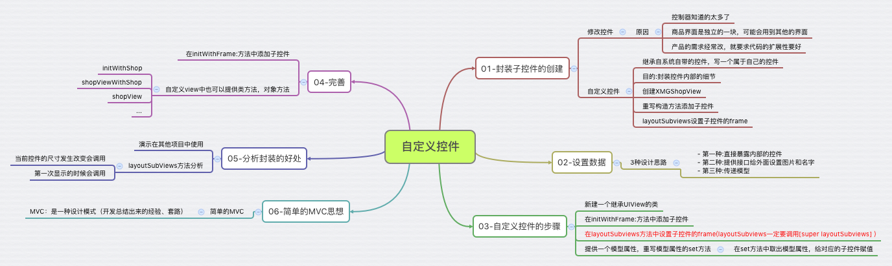

# 自定义控件

##本节知识点：

1. 封装子控件的创建
2. 自定义控件的步骤
3. 提供设置子控件数据接口
4. 分析封装的好处
5. 简单的MVC思想

---

##1. 自定义控件的概念

 


- **什么是自定义控件? **  
    - 继承自系统自带的控件，写一个属于自己的控件   


- **为什么需要自定义控件的？**
  + 封装控件内部的细节，不让外界关心
  + 控制器管的太多，耦合性太强，扩展性差
  + 商品界面是独立的一块，可能会用到其他的界面
  + 产品的需求经常改，就要求代码的扩展性要好 


- **自定义控件的步骤：**
  + 继承自系统自带的控件，写一个属于自己的控件
  + 创建自定义控件类(如：`CDHShopView`)
  + 重写构造方法添加子控件（`init...`）
  + `layoutSubviews`设置子控件的`frame`
  + 提供设置子控件数据接口
  + 提供方便创建自定义控件的方法（构造方法 和 类工厂方法）

---

##2. 自定义控件的步骤
   
- **新建一个继承UIView的类**(如：`CDHShopView`)


- **重写`initWithFrame:`方法，并在该方法中添加子控件**
  + 创建控件时如果使用 `init` 方法，则会在内部调用`initWithFrame: `这个方法(因此一般直接重写此方法)
  + 在添加子控件时，不能设置子控件的`frame`(位置、尺寸)，因为当前控件(相对于子控件来说就是父控件)在创建时，可能没有设置 `frame`；
  + 可以设置其他属性，比如背景颜色、对其方式，等；
  + **注意：**一定要将局部创建出来的控件加入父控件中，并且一定要给父控件中对应的子控件获取到该局部控件；
  
  ```objectivec
  - (instancetype)initWithFrame:(CGRect)frame{
    if (self = [super initWithFrame:frame]) {
        // 添加图片控件UIImageView
        UIImageView *iconImageView = [[UIImageView alloc] init];
        [self addSubview:iconImageView];
        self.iconImageView = iconImageView;
        // 注意：一定要将这个局部定义出来的控件加入父控件中，并且一定要给父控件中对应的子控件获取到该局部控件；
        // 原因1：ARC 中默认所有指针变量都是强指针，因此局部控件被定义出来是被强指针指向，
        // 原因2：将局部控件添加入父控件之后，就表示父控件（内部数组中元素,）也指向了该局部变量，
        //       只要有强指针指向则该变量就不会被释放，因此只要父控件一直存在着父控件中对应的这个局部控件也就存在，
        //       这样也就保证的局部定义出来的控件的存储空间暂时不会被释放；
        // 原因3：要将局部变量控件赋值给父控件对应的子控件，虽然父控件中对应的子控件也是弱指针（weak）指向，
        //       但该局部控件指向是强指针指向，并且只有父控件中对应的子控件获取到了该控件，
        //       才能通过 父控件.子控件 来设置子控件的位置、尺寸、背景色,等一系列的操作（实际也就是设置局部控件的属性）；
        
        // 添加文字文字控件UILabel
        UILabel *nameLabel = [[UILabel alloc] init];
        nameLabel.textAlignment = NSTextAlignmentCenter;
        [self addSubview:nameLabel];
        self.nameLabel = nameLabel;
    }
    return self;
  }
  ```
    
- **重写`layoutSubviews`方法，设置子控件的`frame`**
  + 该方法是继承 `View` 的方法
  + 布局子控件,设置子控件的位置和尺寸
  + 第一次显示的时候会调用该方法
  + 当前控件的尺寸发生改变会调用该方法
  + **注意：**重写一定要先调用`[super layoutSubviews]`;先布局父控件;

  ```objectivec
  - (void)layoutSubviews
  {
      // 这里一定要写，并且要写在最前面
      [super layoutSubviews];

      CGFloat shopW = self.frame.size.width;
      CGFloat shopH = self.frame.size.height;
      NSLog(@"layoutSubviews");

      self.iconImageView.frame = CGRectMake(0, 0, shopW, shopW);
      self.nameLabel.frame = CGRectMake(0, shopW, shopW, shopH - shopW);
  }
  ```

- **提供设置子控件数据接口**(三种方法)
  + **方法一：**直接暴漏子控件对应的属性方便外面设置数据（子控件声明在`.h`文件）
  + **方法二：**提供子控件外部接口方便设置数据（重写子控件setter 方法）
  + **方法三：**提供模型属性及其接口（重写模型属性`setter`方法）


- **提供方便快捷创建自定义控件的方法**

```objectivec
// 自定义构造方法   
- (instancetype)initWithShop:(CDHShop *)shop
{
    // [super init] 内部会调用当前类的initWithFrame:
    if (self = [super init]) {
        self.shop =  shop;
    }
    return self;
}
```

```objectivec
// 类工厂方法
+ (instancetype)shopViewWithShop:(CDHShop *)shop{
    // 注意：这里最好使用 self 而不是对应该 类名(CDHShopView) ，有利于其他自定义控件继承该控件的扩展
    CDHShopView * shopView = [[self alloc]initWithShop:shop];
    return shopView;
}
```

---


##3. 提供设置子控件数据接口

- **3种设计思路**

- **方法一：**直接暴漏子控件对应属性方便外面设置数据
  + 自定义控件的成员变量声明在`.h`文件中
  + 在控制器定义创建的自定义控件的`.m`文件中包含自定义控件的`.h`文件
  + 直接在控制器的`.m`文件中设置自定义控件的数据

  + **特点：**
    * 控制器管的太多，耦合性太强，扩展性差；
    * 自定义控件直接暴露内部控件，数据不安全；

  + **例子：**

  ```objectivec
  //  自定义控件CDHShopView.h 文件
  
  #import <UIKit/UIKit.h>

  @interface CDHShopView : UIView

  // 方法一:直接暴漏子控件方便外面设置数据
  @property (weak, nonatomic) IBOutlet UIImageView *iconImageView;
  @property (weak, nonatomic) IBOutlet UILabel *nameLabel;
  
  @end
  ```

  ```objectivec
  //  控制器 ViewController.m 文件

  /******** 创建商品父控件  ********/
  // 创建商品父控件(自定义view)
  CDHShopView *shopView = [[CDHShopView alloc] init];
  shopView.frame = CGRectMake(shopX, shopY, shopW, shopH);
  // 将商品父控件添加到shopsView
  [self.shopsView addSubview:shopView];
  ```

  ```objectivec
  //  控制器 ViewController.m 文件
  
  /******** 设置数据 方法一 ********/
  CDHShop *shop = self.shops[index];
  // 1.第一种设计思路:直接给自定义控件内部对应子控件设置数据
  shopView.iconImageView.image = [UIImage imageNamed:shop.icon];
  shopView.nameLabel.text = shop.name;
  ```
  
  
- **方法二：**提供每个子控件外部接口方便设置数据
  + 自定义控件的成员变量声明在`.m`文件写在类扩展中（保证私有性、安全性高）
  + 在控制器定义创建的自定义控件的`.m`文件中包含自定义控件的`.h`文件
  + 重写每个控件的`setter`方法，提供每个子控件的数据接口给外部设置数据

  + **特点：**
    * 控制器管的太多，耦合性太强，扩展性较差；
    * 内部数据不暴露，但设置数据过程依然繁琐；

  + **例子：**
  
  ```objectivec
  // 在自定义控件 CDHShopView.h 文件，声明每个子控件的外部接口
  - (void)setIcon:(NSString *)icon;
  - (void)setName:(NSString *)name;
  - (void)setIcon:(NSString *)icon name:(NSString *)name;
  ```
  
  ```objectivec
  // 在自定义控件 CDHShopView.m 文件，实现每个子控件的外部接口
  - (void)setIcon:(NSString *)icon{
      self.iconImageView.image = [UIImage imageNamed:icon];
  }
  - (void)setName:(NSString *)name{
      self.nameLabel.text = name;
  }
  - (void)setIcon:(NSString *)icon name:(NSString *)name{
       self.iconImageView.image = [UIImage imageNamed:icon];
       self.nameLabel.text = name;
  }
  ```
  
  ```objectivec
  //  控制器 ViewController.m 文件
  /******** 设置数据 方法二 ********/
  CDHShop *shop = self.shops[index];
  // 2.第二种设计思路：通过自定义控件内部对应子控件的(setter方法)接口设置数据
  [shopView setIcon:shop.icon];
  [shopView setName:shop.name];
  //    [shopView setIcon:shop.icon name:shop.name];
  ```
    
    
- **方法三：提供模型属性及其接口 (常用)**
  + 自定义控件的成员变量声明在`.m`文件写在类扩展中（保证私有性、安全性高）
  + 在控制器定义创建的自定义控件的`.m`文件中包含自定义控件的`.h`文件
  + 重写模型`setter`方法，提供模型数据接口给外部设置数据
  + **特点：**
    * 扩展性好；
    * 内部数据不暴露，但设置数据过程较为方便；

  + **例子：**  

  ```objectivec
  // 在自定义控件 CDHShopView.h 文件，提供模型属性
  @property (nonatomic ,strong)CDHShop *shop;
  ```

  ```objectivec
  // 在自定义控件 CDHShopView.m 文件，实现模型属性接口设置数据
  - (void)setShop:(CDHShop *)shop{
      // 注意： 第一件事就是先给模型属性赋值，方便其他地方使用该模型属性
      _shop = shop;
      self.iconImageView.image = [UIImage imageNamed:shop.icon];
      self.nameLabel.text = shop.name;
  }
  ```

  ```objectivec
  // 3.第三种设计思路:通过模型的(setter方法)接口设置数据
  shopView.shop = shop;
  ```
    
---


##4. 封装的好处
>1. 如果一个view内部的子控件比较多，一般会考虑自定义一个view，把它内部子控件的创建屏蔽起来，不让外界关心    
>2. 外界可以传入对应的模型数据给view，view拿到模型数据后给内部的子控件设置对应的数据

- **封装的优点：**方便在其他项目中使用，扩展性强

---

##5. 简单的MVC思想
- MVC：是一种设计模式（开发总结出来的经验、套路）
  + M: Model 数据模型，数据
  + V: View  视图，显示数据
  + C: Controller 控制，大管家


---


