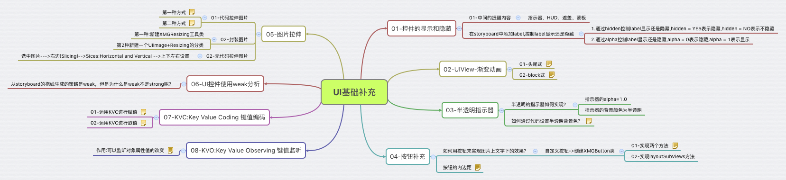
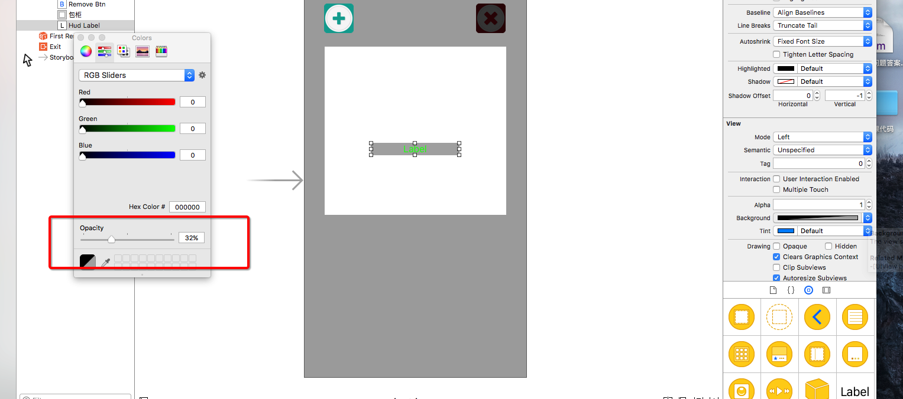
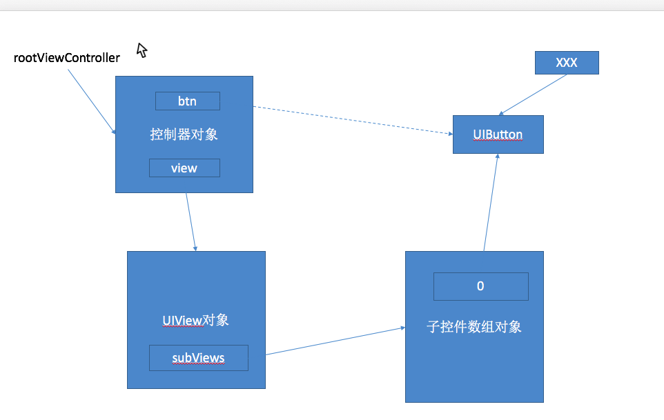

#UI基础补充

##本节知识点：
1. 控件的显示和隐藏
2. UIView-渐变动画
3. 半透明指示器
4. 按钮补充
5. 图片拉伸
6. UI控件使用weak分析
7. KVC:Key Value Coding 键值编码
8. KVO:Key Value Observing 键值监听




---

##1. 控件的显示和隐藏
- 中间的提醒内容
    - 指示器、HUD、遮盖、蒙板


- 在storyboard中添加label,控制label显示还是隐藏 
    - 通过属性 hidden 控制 label 显示还是隐藏, hidden = YES 表示隐藏,hidden = NO表示不隐藏
    - 通过alpha控制label显示还是隐藏,alpha = 0表示隐藏,alpha = 1表示显示（不隐藏）


```objc
//    self.hudLabel.hidden = YES;
self.hudLabel.alpha = 0.0; // 完全透明
```

---

##2. UIView-渐变动画


- ** block 式(常用)**

```objc  
// 动画两秒 红色 View 被隐藏
[UIView animateWithDuration:2.0 animations:^{
    self.redView.alpha = 0.0;
} completion:^(BOOL finished) {
    NSLog(@"动画执行完毕的时候回来到这个block");
}];
```

```objc
// 1.5s后，再执行动画（动画持续2s)
// options：这个参数不知道写什么的时候一般选择 kNilOptions
[UIView animateWithDuration:2.0 delay:1.5 options:kNilOptions animations:^{

    /* 插入需要执行动画的代码(如：调整后的尺寸大小) */
    
} completion:nil];
```


- **头尾式**

```objc
// 开始动画
[UIView beginAnimations:nil context:nil];
// 设置动画时间  时间都是以 秒 为单位
[UIView setAnimationDuration:2.0];//设置时间 2s

/* 插入需要执行动画的代码 (如：调整后的尺寸大小) */

// 提交动画
[UIView commitAnimations];
```

---


##3. 半透明指示器

- **设置半透明的指示器**

    - 指示器的`alpha=1.0`, (取值`0.0~1.0`，值越小越透明)
   
	- 指示器的背景颜色为半透明


- **通过工具栏设置透明度背景色**

  

- **通过代码设置透明度背景色**
```objc
  // 根据RGB组合创建颜色,alpha传0.5表示半透明
  + (UIColor *)colorWithRed:(CGFloat)red green:(CGFloat)green blue:(CGFloat)blue alpha:(CGFloat)alpha;
```


---

##4. 按钮补充

- **用按钮来实现图片上文字下的效果**
    - **实现步骤**：
    - 自定义按钮->创建一个继承 UIButton 的子类（如：CDHButton）
    - 给自定义按钮中的子控件重新布局（有两种方法）
        + 方法一：要实现两个对象方法
        ```objc
          -（CGRect）titleRectForContentRect:(CGRect)contentRect{
              // 返回文字的frame   
          }

          -  (CGRect)imageRectForContentRect:(CGRect)contentRect{
              // 返回图片的frame
          }
        ```
		+ 方法二：实现layoutSubViews方法

        ```objc
          - (void)layoutSubviews
          {
              [super layoutSubviews];

              // 插入需要设置位置尺寸的语句，并返回frame
          }
        ```

- **设置是否调整图片的显示亮度**

    - 设置属性

    ```objc
    // 设置在 Highlighted 状态点击时是否调整图片显示亮度
    @property(nonatomic)          BOOL         adjustsImageWhenHighlighted;    // default is YES. if YES, image is drawn darker when highlighted(pressed)
    // 设置在disabled状态是否调整图片显示亮度
    @property(nonatomic)          BOOL         adjustsImageWhenDisabled;       // default is YES. if YES, image is drawn lighter when disabled
    ```

    ```objc
    // 在disabled要不要调整显示的图片，当disabled的时候也不改变背景色
    self.adjustsImageWhenDisabled = NO;
    ```

- **按钮的内边距**

    - 设置内边距属性

    ```objc
    // 按钮内的子控件（图片和文字）的内边距，
    @property(nonatomic)          UIEdgeInsets contentEdgeInsets UI_APPEARANCE_SELECTOR; // default is UIEdgeInsetsZero
    // 按钮内的子控件（文字）的内边距，
    @property(nonatomic)          UIEdgeInsets titleEdgeInsets;                // default is UIEdgeInsetsZero
    // 按钮内的子控件（图片）的内边距，
    @property(nonatomic)          UIEdgeInsets imageEdgeInsets;                // default is UIEdgeInsetsZero
    ```

    - 例子

    ```objc
    // 设置按钮内图片和文字内边距位置为（30，30），即是按钮内图片和文字一起右移30，下移30
    self.btn.contentEdgeInsets = UIEdgeInsetsMake(30, 30, 0, 0);
    // 设置按钮内文字内边距位置为（0，-30），即是按钮内文字上移30
    self.btn.titleEdgeInsets = UIEdgeInsetsMake(0, -30, 0, 0);
    // 设置按钮内图片内边距位置为（0，-30），即是按钮内图片上移30
    self.btn.imageEdgeInsets = UIEdgeInsetsMake(0, -30, 0, 0);
    ```

---

##5. 图片拉伸

- **无代码拉伸图片**  
    `选中图片--->右边(Slicing)-->Sices:Horizontal  Vertical -->上下左右设置`


- **代码拉伸图片**

	- **第一种方式**

    ```objc
    // 1. 默认就是平铺模式
    // CapInsets: 是受保护区域  UIEdgeInsetsMake(top, left, bottom,right)
    UIImage *resizingImage = [image resizableImageWithCapInsets:<#(UIEdgeInsets)#>];
    // 2. 可以选择设置填充模式
    // 拉伸部分的模式有两种：
    //   1. UIImageResizingModeStretch 拉伸模式
    //   2. UIImageResizingModetile    平铺模式
    UIImage *resizingImage = [image resizableImageWithCapInsets:<#(UIEdgeInsets)#> resizingMode:<#(UIImageResizingMode)#>];
    ```

    - 例1:

    ```objc
    //    1. 创建图片对象
    UIImage *image = [UIImage imageNamed:@"buttongreen"];
    //    2. 可拉伸的图片（告诉拉伸的区域），默认是平铺模式
    UIImage *resizingImage = [image resizableImageWithCapInsets:UIEdgeInsetsMake(10, 10, 10, 10)];
    //    3. 将被拉伸的图片设置为按钮的背景图片
    [self.button setBackgroundImage:resizingImage forState:UIControlStateNormal];
    ```
    
    - 例2

    ```objc
    //    1. 创建图片对象
    UIImage *image2 = [UIImage imageNamed:@"chat"];
    //    2. 找到可拉伸的区域
    CGFloat imageW = image2.size.width * 0.5;
    CGFloat imageH = image2.size.height* 0.5;
    //    3. 可拉伸的图片
    UIImage *resizingImage2 = [image2 resizableImageWithCapInsets:UIEdgeInsetsMake(imageW, imageH, imageW - 1, imageH - 1) resizingMode:UIImageResizingModeTile];
    //    4. 将其设置为按钮的背景图片
    [self.button setBackgroundImage:resizingImage2 forState:UIControlStateNormal];    
    ```
    
    - **注意：**例 2 中的计算方法，可以用于较为复杂外围轮廓的图片拉伸

	- **第二种方式**（了解）
    ```objc
      bg = [bg stretchableImageWithLeftCapWidth: topCapHeight:];
           把官方计算拷贝
           // 1 == width - leftCapWidth - right cap
           // 1 == height - topCapWidth - bottom cap
           // 只拉伸1*1的像素
    ```
    
    ```objc
     //    该方法了解 ，没有例2方法效果好，有可能导致复杂外围轮廓的图片拉伸出现模糊
    //    1. 创建图片对象
    UIImage *image2 = [UIImage imageNamed:@"chat"];
    //    2. 找到可拉伸的区域
    CGFloat imageW = image2.size.width * 0.5;
    CGFloat imageH = image2.size.height* 0.5;
    //    3. 可拉伸的图片
    UIImage *resizingImage2 = [image2 stretchableImageWithLeftCapWidth:imageW topCapHeight:imageH];
    //    4. 将其设置为按钮的背景图片
    [self.button setBackgroundImage:resizingImage2 forState:UIControlStateNormal];
    ```
    
    

- **封装图片**

	- 第1种:创建一个工具类，专门处理拉伸图片的工具类（如：CDHResizingImage工具类）

    ```objc
    //    3. 使用拉伸工具类来处理图片
    [self.button setBackgroundImage:[CDHResizingImage resizingImageWithName:@"chat"] forState:UIControlStateNormal];
    ```

	- 第2种:新建一个UIImage+Resizing的分类

    ```objc
    //    4. 使用图片拉伸分类来处理图片
    [self.button setBackgroundImage:[UIImage resizingImageWithImageName:@"chat"] forState:UIControlStateNormal];
    ```


---


##6. UI控件使用weak分析

- 从storyboard的拖线生成的策略是weak，但是为什么是weak不是strong呢？
- **控件子控件存储原理分析**
    1. 控制器对象有一个系统的 rootViewController（强指针）指向控制器对象；
    2. 在 storyboard 中添加控件，则该控件会被添加到控制器 View ，成了控制器对象（strong 修饰）的 View 属性所指的对象 UIView 的子控件；
    2. 控制器子控件 UIView 中（strong 修饰）的属性 subViews 会指向 UIView 的子控件数组对象；
    3. 子控件数组对象中的元素都是 strong 修饰的属性，所以对应的子控件数组中的元素指向了该子控件也是强指针指向；
    4. 为避免内存泄漏，因此从 storyboard 中拖线生成的策略都是 weak 修饰的属性。


- **总结**：因为UI控件添加到父控件中以后,会有强指针指向这个对象,就可以保证这个对象不会被销毁.在搞一个属性引用这个对象,用弱引用就可以。

 


- **strong/weak/assign/copy关键字的做用于区别：**
    - strong 一般用在 ARC 中，用于除了 NSString/block 修饰的 OC 对象之外的对象；
    - weak 在 ARC 中当指针不需要对对象强引用的时候使用
    - ARC 中当两个对象具有互拥有的关系时，应该一端用 strong，一端用 weak
    - MRC 中如果两个对象相互拥有的关系时，应该一端用 retain，一端用 assign
    - copy 一般用于 NSString 和 block


- **NSString 对象作为属性是为什么推荐使用 copy 关键字修饰，什么时候可以用 strong 修饰呢？**
    - 为了防止 NSMutableString 被无意中修改,NSMutableString 是 NSString 的子类，因此 NSString 指针可以持有 NSMutableString 对象。
    - 当该属性真实类型就是 NSString 时，完全可以使用 strong 来修饰。

---

##7. KVC:Key Value Coding 键值编码

- **运用KVC进行赋值**

```objc
// KVC 能修改私有成员变量，就是可以给私有属性赋值
// 1. 只能给简单属性赋值，就是只有一层关系
- (void)setValue:(id)value forKey:(NSString *)key;
// 2. 既可以给简单属性赋值，也可以给复杂属性（多层关系）赋值，即是可以给属性中的属性赋值
//    所谓复杂属性是指，属性变量可以是类型性属性,如：person.dog.name也同样可以赋值
- (void)setValue:(id)value forKeyPath:(NSString *)keyPath;
// 3. 可以快熟将字典转模型
- (void)setValuesForKeysWithDictionary:(NSDictionary *)keyedValues;
```

- **运用KVC进行取值**

```objc
// KVC 能取得私有成员变量的值
// 1. 取出简单属性的值，就是只有一层关系
- (id)valueForKey:(NSString *)key;
// 2. 既可以取出简单属性的值，也可以取出复杂属性（多层关系）的值，即是可以取出属性中的属性的值
//    所谓复杂属性是指，属性变量可以是类型性属性,如：person.dog.name也同样可以取值
- (id)valueForKeyPath:(NSString *)keyPath;
- (NSDictionary *)dictionaryWithValuesForKeys:(NSArray *)keys;
```


---

##8. KVO:Key Value Observing 键值监听

- **作用:可以监听对象属性值的改变**
- **使用步骤:**（三步不可少）
    1. 添加监听器，开始监听
    2. 移除监听器，结束监听
    3. 在监听器中实现监听方法
        
```objc
// 利用b对象来监听a对象name属性的改变
[a addObserver:b forKeyPath:@"name" options:NSKeyValueObservingOptionOld | NSKeyValueObservingOptionNew context:@"test"];

// 这里写被监听的过程

// 监听结束是一定要移除监听
[p removeObserver:self forKeyPath:@"name"];
```
 
```objc  
// 在监听器中实现监听方法
-(void)observeValueForKeyPath:(NSString *)keyPath ofObject:(id)object change:(NSDictionary *)change     context:(void *)context
{
    NSLog(@"%@ %@ %@ %@", object, keyPath, change, context);
}
```

---

