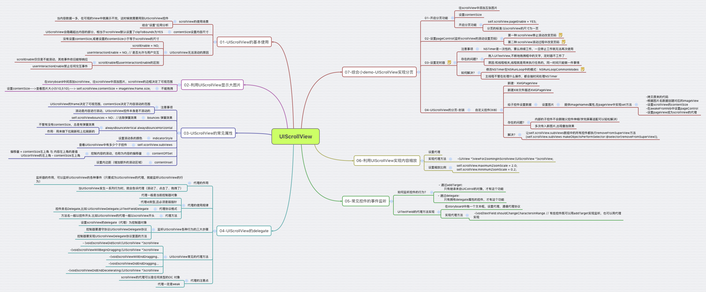

# UIScrollView

---



## 本节知识点：

1. UIScrollView的基本概念
2. UIScrollView的常见属性
3. UIScrollView的其他属性
4. UIScrollView的基本使用
5. UIScrollView的代理（delegate）
6. UIScrollView的缩放
7. UIScrollView和UIPageControl的分页
8. NSTimer的使用


---

##1. UIScrollView的基本概念


- **什么是UIScrollView？**

```objc
  1. 移动设备的屏幕大小是极其有限的，因此直接展示在用户眼前的内容也相当有限   
  2. 当展示的内容较多，超出一个屏幕时，用户可通过滚动手势来查看屏幕以外的内容
  3. 普通的UIView不具备滚动功能，不适合显示过多的内容
  4. UIScrollView是一个能够滚动的视图控件，可以用来展示大量的内容，并且可以通过滚动查看所有的内容
  5. UIScrollView 在滚动的时候,里面的所有子控件的(X,Y)是不变的
```     

- 举例：手机上的“设置”

---

##2. UIScrollView的常见属性

- **内容的偏移量**
```objc
@property(nonatomic) CGPoint contentOffset; 
```

- 作用:
    1. 控制scrollView内容滚动的位置;
    2. 得知scrollView内容滚动的位置,
    其实就是内容左上角与scrollView左上角的间距值

- 例子：
```objc
  // 设置内容的偏移量为 y = -100
  self.scrollView.contentOffset = CGPointMake(0, -100);
```

- **内容的尺寸**
```objc
@property(nonatomic) CGSize contentSize; 
```  

- 作用：告诉scrollView 能够滚动的尺寸范围（能够滚多远）
- 注意：一定要在需要显示的图片后面，紧跟着就设置这个参数，如果在其他地方（不同方法中）设置有可能设置不成功，大致拖拽不了
- 例子：
```objc
// 设置contentSize 能够滚得的尺寸就是图片的大小
self.scrollView.contentSize = image.size;
```

- **增加额外的滚动区域**
```objc
  @property(nonatomic) UIEdgeInsets contentInset; 
```

- 作用：能够在UIScrollView的4周增加额外的滚动区域，一般用来避免scrollView的内容被其他控件挡住 
- 例子：
```objc
  // 增加左边100的额外滚动区域
  self.scrollView.contentInset = UIEdgeInsetsMake(100, 0, 0, 0);
```


---


##3. UIScrollView的其他属性
- **设置UIScrollView是否需要弹簧效果**
```objc
  @property(nonatomic) BOOL bounces;
  // default YES. if YES, bounces past edge of content and back again
```

- **设置UIScrollView是否能滚动**
```objc
  @property(nonatomic,getter=isScrollEnabled) BOOL scrollEnabled; 
  // default YES. turn off any dragging temporarily
```

- **是否显示水平滚动条**
```objc
  @property(nonatomic) BOOL showsHorizontalScrollIndicator;
  // default YES. show indicator while we are tracking. fades out after tracking
```

- **是否显示垂直滚动条**
```objc
  @property(nonatomic) BOOL showsVerticalScrollIndicator;
  // default YES. show indicator while we are tracking. fades out after tracking
```

- 例子：
```objc
  // 1.设置scrollView的弹簧效果 无弹簧效果
  self.scrollView.bounces = NO;
  // 2.设置scrollView是否能够滚动 无法滚动
  self.scrollView.scrollEnabled = NO;
  // 3.不管有没有设置contentSize,总是有弹簧效果
  self.scrollView.alwaysBounceVertical = YES;
  self.scrollView.alwaysBounceHorizontal = YES;
  // 4.设置scrollView是否显示滚动条
  self.scrollView.showsHorizontalScrollIndicator = NO;
  self.scrollView.showsVerticalScrollIndicator = NO;
```


- **利用UIScrollView显示下面的大图片**

- **注意点：**
    - 1.千万不要通过索引去subviews这个数组中去访问scrollView的子控件
    - 2.由于scrollView中有连个滚动条，滚动条内部创建与我们自己添加的控件的先后顺序不好明确


---


##4. UIScrollView的基本使用
- **将需要展示的内容添加到UIScrollView中**
```objc
    // 1. 创建蓝色的view添加到scrollView
    UIView *blueView = [[UIView alloc]init];
    //     添加入父控件scrollView中
    [self.scrollView addSubview:blueView];
    //     设置该空间的位置尺寸
    blueView.frame = CGRectMake(0, 0, 400, 300);
    //    blueView.frame = CGRectMake(0, 0, 200, 100);
    //    blueView.frame = CGRectMake(0,0, 300, 200);
    //      设置背景色为蓝色
    blueView.backgroundColor = [UIColor blueColor];
```    
    
- **设置内容尺寸(contentSize) **  
```objc
    // 2. 设置内容尺寸contenSize ，决定的是滚动范围
    //      可滚动的尺寸：contenSize 的尺寸减去 scrollView 的尺寸
    // 注意点：如果设置的尺寸比scrollView 小或者等于scrollView 的尺寸这都是不可以滚动的
    self.scrollView.contentSize = blueView.frame.size;
```

- **超出UIScrollView边框的内容是否会被自动隐藏，并可以弹动**
```objc
    // 3. 设置在超出scrollView的部分是否要隐藏，默认设置该属性为YES
    //      scrollView默认设置该属性为YES  弹簧效果
    //    self.scrollView.clipsToBounds = NO;
    self.scrollView.clipsToBounds = YES;
```
  
- **设置scrollView 是否能够滚动(使能)**
```objc
    // 4. 设置scrollView 是否能够滚动(使能)
    //      在前面设置了内容尺寸如果大于scrollView的尺寸这默认是可以滚动的
    self.scrollView.scrollEnabled = YES;
    //    self.scrollView.scrollEnabled = NO;
```

- **设置scrollView 是否能处理用户交互事件**
```objc
    // 5. 设置scrollView 是否能够跟用户交互（能不能响应用户的点击，拖拽等操作）， 默认是 NO
    // 注意点:设置了scrollView的userInteractionEnabled为NO,scrollView以及它内部所有的子控件的都不能跟用户交互, 
    //    self.scrollView.userInteractionEnabled = YES;
    self.scrollView.userInteractionEnabled = NO;
```

- **UIScrollView无法滚动的可能原因：**
    - 没有设置contentSize(或者contentSize的尺寸小于等于scrollView的尺寸)
    - 滚动使能被设为了scrollEnabled = NO,必须要设为YES 
    ```objc
        // 4.设置scrollView不能够滚动
        self.scrollView.scrollEnabled = NO;
    ```
    
    - 设置交互处理事件功能被设置为了 userInteractionEnabled = YES; 要修改为NO;
    ```objc
        // 5. 设置scrollView 是否能够跟用户交互（能不能响应用户的点击，拖拽等操作）， 默认是 NO
        // 注意点:设置了scrollView的userInteractionEnabled为NO,scrollView以及它内部所有的子控件的都不能跟用户交互, 
        //    self.scrollView.userInteractionEnabled = YES;
        self.scrollView.userInteractionEnabled = NO;
    ```

    - **补充：按钮**
    ```objc
        UIButton *btn = nil;
        btn.enabled = NO;
        btn.userInteractionEnabled = NO;

        UIControlStateNormal;
        UIControlStateHighlighted;
        // 注意点:只有设置按钮的enabled==NO才能达到Disabled状态（图标变灰色）;
        //     设置按钮的userInteractionEnabled==NO是达不到Disabled状态的图标不会变灰色
        UIControlStateDisabled;
    ```


---


##5. UIScrollView的代理（delegate）

>1. 很多时候，我们想在UIScrollView正在滚动 或 滚动到某个位置 或者 停止滚动 时做一些特定的操作   
>2. 要想完成上述功能，前提条件就是能够监听到UIScrollView的整个滚动过程
>3. 当UIScrollView发生一系列的滚动操作时， 会自动通知它的代理（delegate）对象，给它的代理发送相应的消息，让代理得知它的滚动情况
>4. 也就是说，要想监听UIScrollView的滚动过程，就必须先给UIScrollView设置一个代理对象，然后通过代理得知UIScrollView的滚动过程


- **代理的作用**
    - 监听器的作用，可以监听UIScrollView的各种事件（只要成为UIScrollView的代理，就能监听UIScrollView的行为）
    - 当UIScrollView发生一系列行为时，就会告诉代理（滚动了、点击了、拖拽了）

- **代理的使用规律**
    - 代理一般是当前控制器对象
    - 代理id类型,且必须是弱指针
    - 代理协议格式:`控件类名+Delegate`
        - 如：`UIScrollViewDelegate`,`UITextFieldDelegate`
	- 代理方法：
crollView各种行为的三大步骤**
    - 设置scrollView的delegate（代理）为控制器对象
    - 控制器要遵守协议UIScrollViewDelegate协议
    - 控制器要实现UIScrollViewDelegate协议里面的方法

- **UIScrollView常见的代理方法**
```objc
    - (void)scrollViewDidScroll:(UIScrollView *)scrollView
    -(void)scrollViewWillBeginDragging:(UIScrollView *)scrollView
    -(void)scrollViewWillEndDragging..
    -(void)scrollViewDidEndDragging...
    -(void)scrollViewDidEndDecelerating:(UIScrollView *)scrollView
```

- **成为delegate的条件**
    - UIScrollView将delegate需要实现的方法都定义在了UIScrollViewDelegate协议中，因此要想成为UIScrollView的delegate，必须遵守UIScrollViewDelegate协议，然后实现协议中相应的方法，就可以监听UIScrollView的滚动过程了


- **UIScrollView和控制器(或`xib`)**
    - 一般情况下，UIScrollView所在的控制器 或者其所在的父控件 为 UIScrollView的delegate 
        - 通过代码设置代理（self就是控制器或者所在父控件）
        ```objc
            self.scrollView.delegate = self;
        ```
        
        - 通过拖线`storyboard`或`xib`设置代理（右击UIScrollView）

    - 然后，控制器应该遵守`<UIScrollViewDelegate>`协议
        - 一般情况代理的协议名就是`<类名+Delegate>`
    - 最后，实现协议中定义的相关方法


- **UIScrollView协议中常用的方法**
    - 当scrollView正在滚动的时候就会自动调用这个方法
    ```objc
        - (void)scrollViewDidScroll:(UIScrollView *)scrollView{
            // 方法中的语句
        }
    ```
    
    - 开始拖拽scrollView时,就会自动调用这个方法
    ```objc
        - (void)scrollViewWillBeginDragging:(UIScrollView *)scrollView{
            // 方法中的语句
        }
    ```
    
    - 停止拖拽scrollView时,就会自动调用这个方法
    ```objc   
        - (void)scrollViewWillEndDragging:(UIScrollView *)scrollView withVelocity:(CGPoint)velocity targetContentOffset:(inout CGPoint *)targetContentOffset{
            // 方法中的语句
        }
    ```

    - 已经停止拖拽scrollView时,并在后面还会出现减速的时候，就会自动调用这个方法
    ```objc
        - (void)scrollViewDidEndDragging:(UIScrollView *)scrollView willDecelerate:(BOOL)decelerate
        {
            if (decelerate == NO) {
                NSLog(@"用户已经停止拖拽scrollView,scrollView已经停止滚动");
            } else {
                NSLog(@"用户已经停止拖拽scrollView,但是scrollView由于惯性继续滚动,并且减速");
            }
        }
    ```
    
    - 减速完毕的时候回调用这个方法(已经停止滚动)
    ```objc
        - (void)scrollViewDidEndDecelerating:(UIScrollView *)scrollView
        {
            NSLog(@"scrollView减速完毕,已经停止滚动");
        }
    ```
    
- **代理的注意点**
    - 任何OC对象都可以作为scrollView的代理,不仅仅是控制器 
    - 代理一般都是weak   


---

##6. UIScrollView的缩放

- **缩放要设置两个参数**
```objc
    @property(nonatomic) CGFloat minimumZoomScale;     // default is 1.0
    @property(nonatomic) CGFloat maximumZoomScale;     // default is 1.0. must be > minimum zoom scale to enable zooming
```

- 例子
```objc
    // 设置缩放比例  最大可缩放比例  为 2.0
    self.scrollView.maximumZoomScale = 2.0;
    // 设置缩放比例  最小可缩放比例  为 0.5
    self.scrollView.minimumZoomScale = 0.5;
    
    // 模拟器上缩放使用到的按键有 Option + 鼠标右键（或左键），
    // 如果需要移动鼠标则先按住shift + option 移动鼠标
```

- **返回需要缩放的子控件(scrollView的子控件)的方法**
```objc
    - (nullable UIView *)viewForZoomingInScrollView:(UIScrollView *)scrollView;     // return a view that will be scaled. if delegate returns nil, nothing happens
```

- **跟缩放相关的其他代理方法**
- 即将开始缩放的时候调用 
```objc
    - (void)scrollViewWillBeginZooming:(UIScrollView *)scrollView withView:(UIView *)view
```

- 正在缩放的时候调用
```objc
    - (void)scrollViewDidZoom:(UIScrollView *)scrollView
```

--- 

##7. UIScrollView和UIPageControl的分页


- **scrollView开启分页功能**
    - 只要将UIScrollView的pageEnabled属性设置为YES，UIScrollView会被分割成多个独立页面，里面的内容就能进行分页展示
```objc
    // 分页标准:以scrollView的尺寸为一页
    self.scrollView.pagingEnabled = YES;
```

- **UIPageControl页码控件**
- 一般会配合UIPageControl增强分页效果，UIPageControl常用属性如下 :
    - 一共有多少页
    ```objc
        @property(nonatomic) NSInteger numberOfPages;
    ```
    - 当前显示的页码
    ```objc
        @property(nonatomic) NSInteger currentPage; 
    ```
    - 只有一页时，是否需要隐藏页码指示器
    ```objc
        @property(nonatomic) BOOL hidesForSinglePage; 
    ```
    - 其他页码指示器的颜色
    ```objc
        @property(nonatomic,retain) UIColor *pageIndicatorTintColor;
    ```
    - 当前页码指示器的颜色
    ```objc
        @property(nonatomic,retain) UIColor *currentPageIndicatorTintColor;
    ```


- **修改页码**

    ```objc
        //  声明UIPageControl *pageControl 属性
        @property (weak, nonatomic) IBOutlet UIPageControl *pageControl;
    ```
    
    - **方法一**：停止修改页码
    ```objc
        /**
        * 结束拖拽，即将停止，可能还有减速动作，就会调用这个方法
        */
        - (void)scrollViewDidEndDragging:(UIScrollView *)scrollView willDecelerate:(BOOL)decelerate{
            if (decelerate == NO) {
                // 计算页码
                int page = self.scrollView.contentOffset.x / self.scrollView.frame.size.width;
                // 修改页码
                self.pageControl.currentPage = page;
            }
        }

        /**
         *  结束减速动作就会调用该方法
         */
        - (void)scrollViewDidEndDecelerating:(UIScrollView *)scrollView{
            // 计算页码
            int page = self.scrollView.contentOffset.x / self.scrollView.frame.size.width;
            // 修改页码
            self.pageControl.currentPage = page;
        }
    ```

    - **方法二**：页面过半就修改页码（动态实时响应）
    ```objc
        //- (void)scrollViewDidZoom:(UIScrollView *)scrollView{
        - (void)scrollViewDidScroll:(UIScrollView *)scrollView{
            // 计算页码
            int page = self.scrollView.contentOffset.x / self.scrollView.frame.size.width + 0.5;
            // 修改页码
            self.pageControl.currentPage = page;
        }
    ```
    
- **设置UIPageControl的总页数**
```objc
    // 4.设置总页数
    self.pageControl.numberOfPages = count;
```

- **设置pageControl单页的时候隐藏**
```objc
    //  思路一： 直接设置pageControl中的属性
    self.pageControl.hidesForSinglePage = YES;
    //  思路二： 通过隐藏方法
    //    if (count <= 1) {
    //        //  方法一： 
            //self.pageControl.hidden = YES;
    //        //  方法二：
            //self.pageControl.alpha = 0.0;
    //    }
```

- **设置pageControl显示的图片(KVC方法直接设置pageControl中的私有属性)**
```objc
    [self.pageControl setValue:[UIImage imageNamed:@"current"] forKeyPath:@"_currentPageImage"];
    [self.pageControl setValue:[UIImage imageNamed:@"other"] forKeyPath:@"_pageImage"];
```

---

##8. NSTimer的使用
- **声明定义一个定时器属性**
```objc
    @property (strong, nonatomic) NSTimer *timer;
```

- **创建一个定时器（开启）**
```objc
    /**
     *  Description      定时器类工厂方法
     *
     *  @param ti        时间参数，以秒为单位
     *  @param aTarget   一般是控制器（或者是父控件）
     *  @param aSelector 所要用到的方法签名
     *  @param userInfo  需要给定时器对象中的 userInfo属性赋值的 信息，没有信息的话一般都是直接写 nil
     *  @param yesOrNo   是否重复操作
     *
     *  @return          返回一个定时器对象
     */
    + (NSTimer *)scheduledTimerWithTimeInterval:(NSTimeInterval)ti target:(id)aTarget selector:(SEL)aSelector userInfo:(nullable id)userInfo repeats:(BOOL)yesOrNo;
```

- 例子
```objc
    // 返回一个自动执行任务的定时器
    //  2 秒执行 nextPage: 方法
    // self.timer.userInfo = @"123";// 这里用不上，随便写的 可以做直接写 nil
    // 重复循环，即是每 2.0 秒执行 nextPage： 方法一次
    self.timer = [NSTimer scheduledTimerWithTimeInterval:2.0 target:self selector:@selector(nextPage:) userInfo:@"123" repeats:YES];
    // 注意：定时器在创建时就会被强指针引用，所以对应的self.timer 可以是weak修饰
```

- **停止定时器**
```objc
    // 方法一： 调用定时器内部的对象方法
    [self.timer invalidate];
    // 方法二： 直接将该定时器对象设为空指针,
    //    self.timer = nil;
```

- **注意**：通过invalidate方法可以停止定时器的工作，一旦定时器被停止了，就不能再次执行任务。只能再创建一个新的定时器才能执行新的任务


- **补充：**
    - **线程**:用来执行任务的,同一时间只能执行一个任务
    - **主线程**:程序一启动就会默认创建一条线程,这个线程就叫着主线程
    - **主线程的作用**: 显示刷新UI界面,处理与用户的交互事件
    - **多线程的原理**:1s -> 1万个0.0001s.cpu在多个任务之间快速的切换
    - **对线程的目的**:不管主线程在做什么操作,都会分配一定的时间处理定时器
    - 修改定时器在runloop中的模式为NSRunLoopCommonModes
        - NSDefaultRunLoopMode(默认):同一时间只能执行一个任务
        - NSRunLoopCommonModes(公用):可以分配一定的时候处理其他任务

    ```objc
        // 设为多线程模式
        [[NSRunLoop mainRunLoop] addTimer: self.timer forMode:NSRunLoopCommonModes];
    ```
    
    - **注意：**定时器只能一次性使用，要是被停止了，就不能再被使用了。
    

---