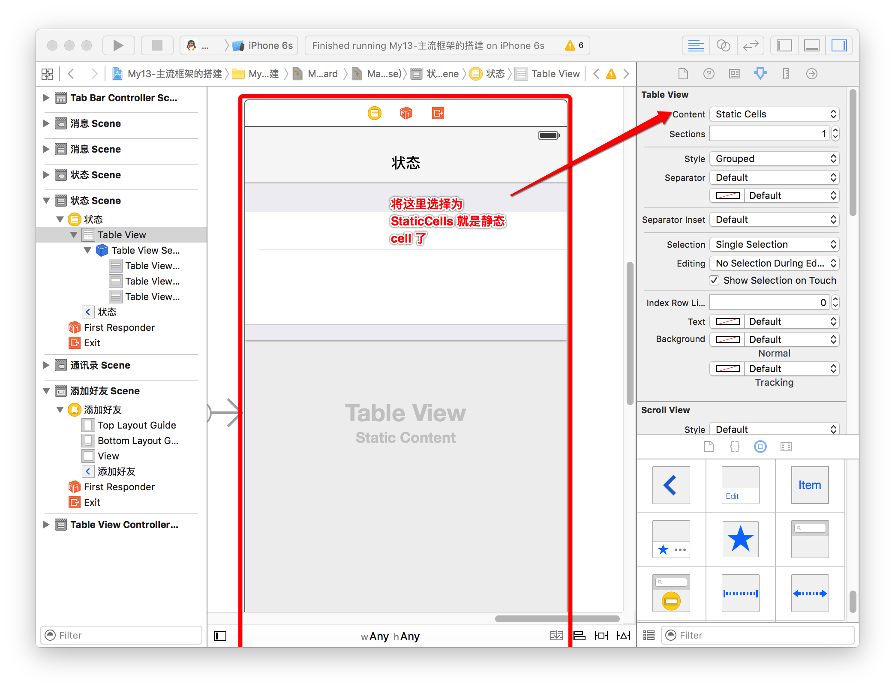

# UITableView展现数据


##本节知识点：

1. UITabView的基本使用
2. 展示多组数据
3. 展示单组数据
4. UITableView的常见属性
5. UITableViewCell的常见设置
6. UITableView的代理方法
7. UITableViewController
8. UITableView的性能优化
9. UITableView的索引条
10. 补充静态 cell 

---

##1. UITabView的基本使用

- 在iOS中，要实现展示列表数据，最常用的做法就是使用UITableView
- UITableView继承自UIScrollView，因此支持垂直滚动，而且性能极佳


####1.1 UITableView的两种样式
- UITableViewStylePlain
- UITableViewStyleGrouped


####1.2 UITableView如何展示数据?

- **设置数据源对象**
    - 一般控制器就是它的数据源

```objc
- self.tableView.dataSource = self;      
```	
    
- **数据源对象要遵守协议**

```objc
@interface ViewController () <UITableViewDataSource>
@end
```


- **实现数据源方法**


- 设置分组数，返回值就是要设置的分组数（该方法不实现就默认是一组）

```objc
- (NSInteger)numberOfSectionsInTableView:(UITableView *)tableView;
```

- 设置每组的行数，返回值就是行数

```objc
- (NSInteger)tableView:(UITableView *)tableView numberOfRowsInSection:(NSInteger)section;
```

- 设置每组显示的内容，返回值就是要设置的内容（对象）

```objc
- (UITableViewCell *)tableView:(UITableView *)tableView cellForRowAtIndexPath:(NSIndexPath *)indexPath;
// 返回类型是 UITableViewCell 类 或者 子类
```

- 设置每组头部显示的内容，返回值就是要设置的内容（对象）

```objc
- (NSString *)tableView:(UITableView *)tableView titleForHeaderInSection:(NSInteger)section;
```

- 设置每组尾部显示的内容，返回值就是要设置的内容（对象）

```objc
- (NSString *)tableView:(UITableView *)tableView titleForFooterInSection:(NSInteger)section
```

---
##2. 展示多组数据


- 汽车数据

- 使用模型改进

- 复杂plist解析


---
##3. 展示单组数据


- `numberOfSectionsInTableView`默认是1组
- `numberOfRowsInSection`传入的section参数永远为0,因为只有1组


---

##4. UITableView的常见属性

- **设置每一行cell的高度,(默认是 44)**
```objc
self.tableView.rowHeight
```

- **设置每一组头部的高度**
```objc
self.tableView.sectionHeaderHeight
```

- **设置每一组尾部的高度**
```objc
self.tableView.sectionFooterHeight 
```

- **设置分割线颜色**
```objc
self.tableView.separatorColor = [UIColor redColor];
```

- **设置分割线样式**
```objc
self.tableView.separatorStyle = UITableViewCellSeparatorStyleNone;
```

- **设置表头控件**
```objc
self.tableView.tableHeaderView = [[UISwitch alloc] init];
```

- **设置表尾控件**
```objc
self.tableView.tableFooterView = [UIButton buttonWithType:UIButtonTypeContactAdd];
```

- **设置右边索引文字的颜色**
```objc
self.tableView.sectionIndexColor = [UIColor redColor];
```

- **设置右边索引文字的背景色**
```objc
self.tableView.sectionIndexBackgroundColor = [UIColor blackColor];
```


---


##5. UITableViewCell的常见设置

- **设置右边的指示样式**
```objc
// 这是个枚举值, 可以点击进入头文件查看
cell.accessoryType = UITableViewCellAccessoryDisclosureIndicator;
```

- **设置右边的指示控件**
```objc
cell.accessoryView = [[UISwitch alloc] init];
```

- **设置cell的选中样式**
```objc
cell.selectionStyle = UITableViewCellSelectionStyleNone;
```

- **设置背景色**
```objc
cell.backgroundColor = [UIColor redColor];
```

- **设置背景view**
```objc
UIView *bg = [[UIView alloc] init];
bg.backgroundColor = [UIColor blueColor];
cell.backgroundView = bg;
// cell.backgroundColor = [UIColor redColor];
```

- **设置选中的背景view**
```objc
UIView *selectedBg = [[UIView alloc] init];
selectedBg.backgroundColor = [UIColor purpleColor];
cell.selectedBackgroundView = selectedBg;
// 注意: 这个例子创建的 selectedBg 没有尺寸, 可能不是显示成为我们下面设置的颜色效果
//      因此也一定要给他加上尺寸, 一般设置尺寸为 cell 的大小, 
cell.selectedBackgroundView = [[UIView alloc] initWithFrame:cell.frame];
cell.selectedBackgroundView.backgroundColor = [UIColor purpleColor];
```

---


##6. UITableView的代理方法

- **选中某一行cell就会调用这个方法**

```objc
- (void)tableView:(UITableView *)tableView didSelectRowAtIndexPath:(NSIndexPath *)indexPath
```

- **取消选中某一行cell就会调用这个方法**

```objc
- (void)tableView:(UITableView *)tableView didDeselectRowAtIndexPath:(NSIndexPath *)indexPath
```

- **设置每组头部控件，返回的就是该控件**

```objc
- (UIView *)tableView:(UITableView *)tableView viewForHeaderInSection:(NSInteger)section
```

- **设置每组尾部控件，返回的就是该控件**

```objc
- (UIView *)tableView:(UITableView *)tableView viewForFooterInSection:(NSInteger)section
```

- **设置每组头部高度，返回值就是头部高度**

```objc
- (CGFloat)tableView:(UITableView *)tableView heightForHeaderInSection:(NSInteger)section
```

- **设置每组尾部高度，返回值就是尾部高度**

```objc
- (CGFloat)tableView:(UITableView *)tableView heightForFooterInSection:(NSInteger)section
```

- **设置每行 cell 高度，返回的每一行 cell 的高度**

```objc
- (CGFloat)tableView:(UITableView *)tableView heightForRowAtIndexPath:(NSIndexPath *)indexPath
```


---


##7. UITableViewController

- tableVieController有个tableView属性,指向一个tableView,
- 而tableView的dataSource和delegate属性指向就是这个控制器.
- 并且这个控制器已经遵守了UITableViewDataSource和UITableViewDelegate协议.
- 每个控制器的内部都有一个view属性,
- 在tableVieController中,view和tableView属性指向的是同一个对象.


---

##8. UITableView的性能优化

- **性能优化的思路**
    -  iOS 设备的内存有限，如果用UITableView显示成千上万条数据，就需要成千上万个UITableViewCell对象的话，那将会耗尽iOS设备的内存。要解决该问题，需要重用UITableViewCell对象


- **性能优化的具体实现**
	- 当滚动列表时，部分UITableViewCell会移出窗口，UITableView会将窗口外的UITableViewCell放入一个对象池中，等待重用
	- 当UITableView要求dataSource返回UITableViewCell时，dataSource会先查看这个对象池，如果池中有未使用的UITableViewCell，dataSource会用新的数据配置这个UITableViewCell，然后返回给UITableView，重新显示到窗口中，从而避免创建新对象


- **传统写法（一般写法）**
```objc
    /**
     *  每当一个cell要进入视野范围就会调用这个方法
     */
    - (UITableViewCell *)tableView:(UITableView *)tableView cellForRowAtIndexPath:(NSIndexPath *)indexPath
    {
        // 1.定义一个重用标识
        static NSString *ID = @"wine";
        // 2.去缓存池取可循环利用的cell
        UITableViewCell *cell = [tableView dequeueReusableCellWithIdentifier:ID];

        // 3.缓存池如果没有可循环利用的cell,自己创建
        if (cell == nil) {
            cell = [[UITableViewCell alloc] initWithStyle:UITableViewCellStyleDefault reuseIdentifier:ID];
            // 建议:所有cell都一样的设置,写在这个大括号中;所有cell不都一样的设置写在外面
           cell.backgroundColor = [UIColor redColor];

        }
        // 4.设置数据
        cell.textLabel.text = [NSString stringWithFormat:@"第%zd行数据",indexPath.row];

        return cell;
    }
```


- **注册写法**(经常用于自定义 UITableViewCell 中)
```objc
    NSString *ID = @"wine";

    - (void)viewDidLoad {
        [super viewDidLoad];

        // 注册ID 这个标识对应的cell类型为UITableViewCell
        [self.tableView registerClass:[UITableViewCell class] forCellReuseIdentifier:ID];
    }

    - (UITableViewCell *)tableView:(UITableView *)tableView cellForRowAtIndexPath:(NSIndexPath *)indexPath
    {
        // 1.先去缓存池中查找可循环利用的cell
        UITableViewCell *cell = [tableView dequeueReusableCellWithIdentifier:ID];

        // 2.设置数据
        cell.textLabel.text = [NSString stringWithFormat:@"%zd行的数据", indexPath.row];

        return cell;
    }
```


---
##9. UITableView的索引条

- **设置右边索引文字的颜色**

```objc
self.tableView.sectionIndexColor = [UIColor redColor];
```

- **设置右边索引文字的背景色**

```objc
self.tableView.sectionIndexBackgroundColor = [UIColor blackColor];
```
	
- **返回每一组的索引标题**

```objc
- (NSArray *)sectionIndexTitlesForTableView:(UITableView *)tableView
```


---


```objc
@interface ViewController ()

@property (nonatomic, strong) NSArray *carGroups;

@end


@implementation ViewController

#pragma  mark - carGroups
/**
 *  懒加载思想，重写 carGroups 的 getter 方法
 */
- (NSArray *)carGroups{
    
    if (!_carGroups) {
        
        //        1. 加载 plist 文件的数据
        //        1.1 获取包文件
        NSBundle *bundle = [NSBundle mainBundle];
        //        1.2 获取文件全路径
        NSString *path = [bundle pathForResource:@"cars" ofType:@"plist"];
        //        1.3 加载 plist 文件的数据到数组中
        NSArray  *arrayDictionary = [NSArray arrayWithObject:path];
        
        //        2. 数组转模型
        //        2.1 新建一个可变的临时数组
        NSMutableArray *tempMutableArray = [[NSMutableArray alloc]init];
        for (NSDictionary *dict in arrayDictionary) {
            //            2.2 通过 kvc 快速字典转模型
            //            2.2.1 定义个临时的车组模型，接收字典转模型后的模型
            CDHCarGroup *carGroup = [CDHCarGroup carGroupWithDictionary:dict];
            //            2.2.2 将模型添加入到可变数组中
            [tempMutableArray addObject:carGroup];
        }
        //        3. 将数组赋值给 carGroups 属性
        _carGroups = tempMutableArray;
    }
    //    4. 返回 carGroups 车组数组类型的属性
    return _carGroups;
}

- (void)viewDidLoad {
    [super viewDidLoad];

}

/**
 *  隐藏状态栏(隐藏手机最上面的状态栏电池电量、WiFi、时间显示等状态)
 */
- (BOOL)prefersStatusBarHidden
{
    return YES;
}

#pragma mark - 数据源方法
/**
 *  设置分组数
 */
- (NSInteger)numberOfSectionsInTableView:(UITableView *)tableView{
    return _carGroups.count;   
}
/**
 *  设置每组的行数,
 *  section 参数是组号
 */
- (NSInteger)tableView:(UITableView *)tableView numberOfRowsInSection:(NSInteger)section{
//    1. 先得到是属于哪一组的
    CDHCarGroup *Group = self.carGroups[section];
//    2. 根据组数在返回该组的行数
    return Group.cars.count;
}

/**
 *  创建 UITableViewCell 或者 子类控件并返回该对象
 */
- (UITableViewCell *)tableView:(UITableView *)tableView cellForRowAtIndexPath:(NSIndexPath *)indexPath{
    
//    1. 定义重用标示
    static NSString *ID = @"car";
//    2. 访问缓存池
    UITableViewCell *cell = [tableView dequeueReusableCellWithIdentifier:ID];
    
//    3. 缓存池没有可用的 cell ,就自己创建
    if (cell == nil) {
//        4. 创建一个 cell
        cell = [[UITableViewCell alloc]initWithStyle:UITableViewCellStyleDefault reuseIdentifier:ID];
        
    }
//    5. 设置数据
//    5.1 获取对应组号
    CDHCarGroup *group = self.carGroups[indexPath.section];
//    5.2 获取行号
    CDHCar *car  =  group.cars[indexPath.row];
    
//    5.3 设置 cell 中的 images
    cell.imageView.image = [UIImage imageNamed:car.icon];
//    5.4 设置 cell 中的 text
    cell.textLabel.text = car.name;
    
    return cell;

}

/**
 *  设置每组的标题，并返回标题对象
 */
- (NSString *)tableView:(UITableView *)tableView titleForHeaderInSection:(NSInteger)section {

//    取出第 section 组的对应的模型
    CDHCarGroup *group = self.carGroups[section];
    
    return group.title;

}

/**
 *  告诉tableView显示的索引文字
 */
- (NSArray<NSString *> *)sectionIndexTitlesForTableView:(UITableView *)tableView{
    // 抽取self.carGroups这个数组中每一个元素(XMGCarGroup对象)的title属性的值,并且放在一个新的数组中返回
    return [self.carGroups valueForKeyPath:@"title"];
}

@end
```

##补充:静态 cell 
- 其他设置都和动态 cell 基本一样



