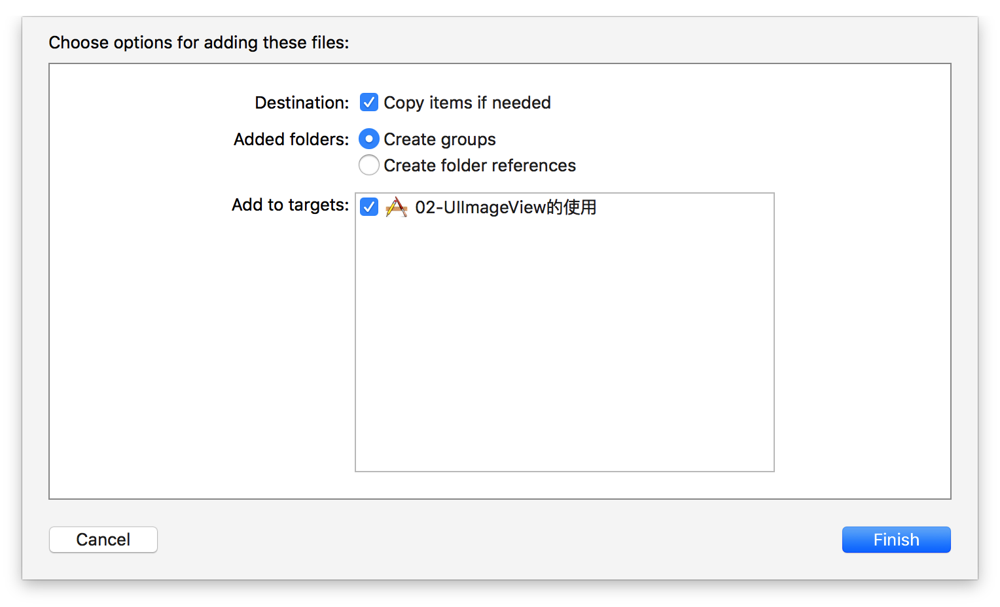

# 资源引用问题

##本节知识点：
1. 资源管理
2. 文件放到supporting Files
3. 文件放到 images.xcassets


---

##1. 资源管理
- 将文件直接拖到工程项目中时，会弹出下面这个窗口：


- **是否勾选 Destination **
    >1. 勾选，将文件拷贝放在项目的文件夹中，文件独立,与源文件不会相互影响
    >2. 不勾选，项目文件夹中是没有的,仅仅是引用，与源文件有直接的联系      


- **Added folder**
    >1. 如果选Create groups,会创建一个虚拟的文件夹,程序打包后,安装包中不存在这个文件夹;
    >2. 如果选Create folder references,真的创建一个文件夹(文件夹颜色不一样),程序打包后,安装包中真的有这个文件夹.


- **Add to targets**
    >1. 勾选，把文件资源打包到软件安装包中去
    >2. 不勾选，程序打包后,安装包中没有这个资源

---

##2. **图片文件放到supporting Files**


- **默认无缓存**，代码块或者图片文件使用结束时，就会释放图片所占内存
- 在代码中访问这个路径下获取图片的时候需要分开写后缀名：

```objc
imageView.image = [UIImage imageNamed:@"2.jpg"];
```

---

##3. **图片文件放到 images.xcassets**
- 默认就是拷贝源文件过来
- 并最终将所有在image.xcassets中的文件打包成一个文件
- 同时也打包到软件安装包中
- **默认就带有缓存**，代码块或者图片文件使用结束时，不会释放图片所占内存
- 图片在代码中访问，不需要写后缀名；

```objc
imageView.image = [UIImage imageNamed:@"2"];
```
  
---