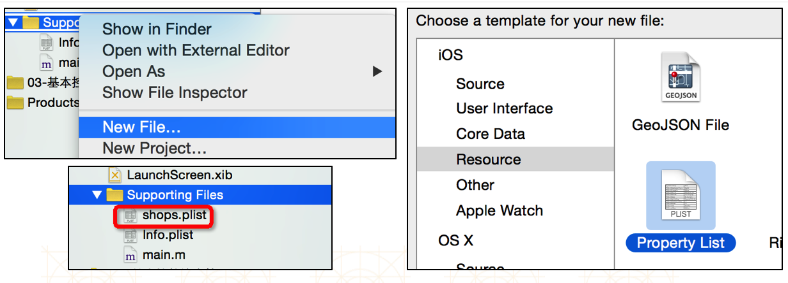
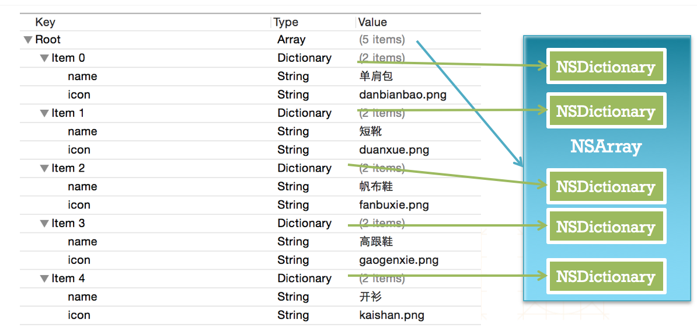
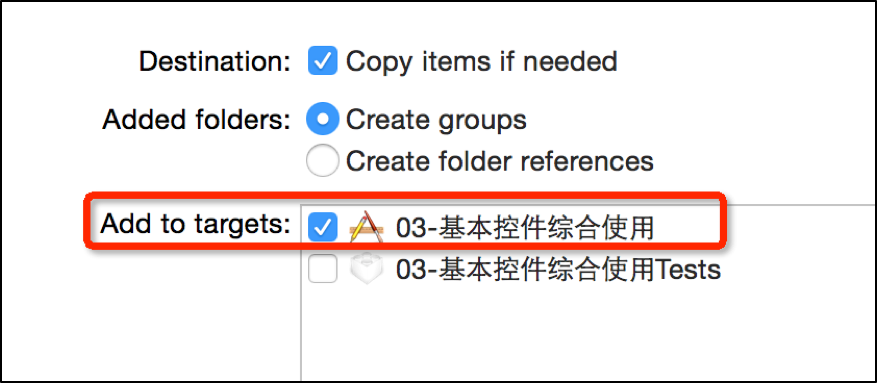

# plist的回顾


##1. 什么是Plist文件

- 直接将数据直接写在代码里面，不是一种合理的做法。如果数据经常改，就要经常翻开对应的代码进行修改，造成代码扩展性低
- 可以考虑将经常变的数据放在文件中进行存储，程序启动后从文件中读取最新的数据。如果要变动数据，直接修改数据文件即可，不用修改代码
- 一般可以使用属性列表文件存储NSArray或者NSDictionary之类的数据，这种“属性列表文件”的扩展名是plist，因此也称为“plist文件”

---

##2. 创建Plist文件
- **直接 Xcode 创建**

    

- **代码创建 Plist 文件与读取**

```objc
    // 1.将数据存储到Plist文件中
    NSArray *names = @[@"lmj",@"lnj",@"zhc",@"xiaoming"];
    BOOL flag = [names writeToFile:@"/Users/chendehao/Desktop/names.plist" atomically:YES];
    if (flag) {
        NSLog(@"写入成功");
    }
```

```objc
    // 2.从Plist文件中读取数据
    NSArray *names = [NSArray arrayWithContentsOfFile:@"/Users/chendehao/Desktop/names.plist"];
    NSLog(@"%@",names);
```

---

##3. 解析Plist文件

- 通过代码来解析Plist文件中的数据
- 获得Plist文件的全路径

```objc
// 从安装包中读取数据
NSBundle *bundle = [NSBundle mainBundle];
// 写法一：
// Resource: 是文件名称，这例子文件名：shop
// Type: 文件类型（后缀名）
NSString *path = [bundle pathForResource:@"shops" ofType:@"plist"];
// 写法二：
NSString *path2 = [bundle pathForResource:@"shops.plist" ofType:nil];
// 写法三：
NSString *path3 = [[NSBundle mainBundle] pathForResource:@"shops.plist" ofType:nil];
```

- 加载plist文件

```objc
// 写法一：
_shops = [NSArray arrayWithContentsOfFile:path];
// 写法二：
_shops = [NSArray arrayWithContentsOfFile:[[NSBundle mainBundle] pathForResource:@"shops.plist" ofType:nil]]
```

- **注意：**方法用只要有file 都是写全路径

##4. Plist文件的解析过程




##5. Plist的使用注意
- `plist`的文件名不能叫做`info`、`Info`之类的
    - 因为每个 iOS 项目中都有一个配置文件，文件名就是 `info.plist`


- 添加plist等文件资源的时候，一定要勾选下面的选项，只有勾选了才会加入到工程项目的包文件中
    


---
