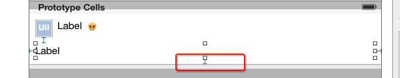

#storyboard


##方法步骤
- 对比自定义等高cell，需要几个额外的步骤（iOS8开始才支持）
    - 添加子控件和contentView之间的间距约束
    - 设置tableViewCell的真实行高和估算行高


- 如果要支持iOS8之前（增加方法步骤）
    - 如果cell内部有自动换行的label，需要设置preferredMaxLayoutWidth属性
    - 设置tableView的cell估算高度
    - 在代理方法中计算cell的高度
    - 在CDHStatusCell.m 文件中计算 cell 的高度


---

##1. 对比自定义等高cell，需要几个额外的步骤（iOS8开始才支持）
- 添加子控件和contentView之间的间距约束



- 设置tableViewCell的真实行高和估算行高

```objc
// 告诉tableView所有cell的真实高度是自动计算（根据设置的约束来计算）
// 要支持 iOS8 之前是没有这行自动计算内容的代码
self.tableView.rowHeight = UITableViewAutomaticDimension;
// 告诉tableView所有cell的估算高度
self.tableView.estimatedRowHeight = 44;
```


---

##2. 如果要支持iOS8之前
- 如果cell内部有自动换行的label，需要设置preferredMaxLayoutWidth属性

```objc
- (void)awakeFromNib
{
    // 手动设置文字的最大宽度（目的是：让label知道自己文字的最大宽度，进而能够计算出自己的frame）
    self.text_label.preferredMaxLayoutWidth = [UIScreen mainScreen].bounds.size.width - 20;
}
```

- 设置tableView的cell估算高度

```objc
// 告诉tableView所有cell的估算高度
// 设置了估算高度，就可以减少tableView:heightForRowAtIndexPath:方法的调用次数
self.tableView.estimatedRowHeight = 200;
```

- 在代理方法中计算cell的高度

```objc
CDHStatusCell *cell;
- (CGFloat)tableView:(UITableView *)tableView heightForRowAtIndexPath:(NSIndexPath *)indexPath
{
    // 创建一个临时的cell（cell的作用：根据模型数据布局所有的子控件，进而计算出cell的高度）
    if (!cell) {
        cell = [tableView dequeueReusableCellWithIdentifier:ID];
    }

    // 设置模型数据
    cell.status = self.statuses[indexPath.row];

    return cell.height;
}
```

- 在CDHStatusCell.m 文件中计算 cell 的高度

```objc
- (CGFloat)height
{
    // 强制布局cell内部的所有子控件(label根据文字多少计算出自己最真实的尺寸)
    [self layoutIfNeeded];

    // 计算cell的高度
    if (self.status.picture) {
        return CGRectGetMaxY(self.pictureImageView.frame) + 10;
    } else {
        return CGRectGetMaxY(self.text_label.frame) + 10;
    }
}
```


