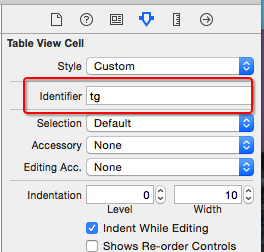

# storyboard

##方法步骤
- 新建一个继承自`UITableViewCell`的子类，比如CDHTgCell
- 在storyboard文件中，找到UITableView里面的cell（动态cell）
    - 修改cell的class为CDHTgCell
    - 绑定循环利用标识
    - 添加子控件，设置子控件约束
    - 将子控件连线到类扩展中


- 在CDHTgCell.h文件中提供一个模型属性，比如CDHTg模型
- 在CDHTgCell.m中重写模型属性的set方法
    - 在set方法中给子控件设置模型数据


- 在控制器中
    - 给cell传递模型数据

---
##1. 新建一个继承自`UITableViewCell`的子类，比如CDHTgCell
```objc
@interface CDHTgCell : UITableViewCell
@end
```


---

##2. 在storyboard文件中，找到UITableView里面的cell（动态cell）
- 修改cell的class为CDHTgCell


- 绑定循环利用标识



- 添加子控件，设置子控件约束


- 将子控件连线到类扩展中

```objc
@interface CDHTgCell()
@property (weak, nonatomic) IBOutlet UIImageView *iconImageView;
@property (weak, nonatomic) IBOutlet UILabel *titleLabel;
@property (weak, nonatomic) IBOutlet UILabel *priceLabel;
@property (weak, nonatomic) IBOutlet UILabel *buyCountLabel;
@end
```

---

##3. 在CDHTgCell.h文件中提供一个模型属性，比如CDHTg模型
```objc
@class CDHTg;

@interface CDHTgCell : UITableViewCell
/** 团购模型数据 */
@property (nonatomic, strong) CDHTg *tg;
@end
```

---

##4. 在CDHTgCell.m中重写模型属性的set方法
- 在set方法中给子控件设置模型数据

```objc
- (void)setTg:(CDHTg *)tg
{
    _tg = tg;

    // .......
}
```

---

##5. 在控制器中
- 给cell传递模型数据

```objc
- (UITableViewCell *)tableView:(UITableView *)tableView cellForRowAtIndexPath:(NSIndexPath *)indexPath
{
    static NSString *ID = @"tg";
    // 访问缓存池
    // dequeueReusableCellWithIdentifier:这个方法内部首先去缓存池中找对应 ID 可循环利用的cell;
    // 如果没有,会判断有没有注册;如果没有注册,会自动去storyboard找有没有ID这种标识的cell;
    // 如果有,会加载这种标识的cell,并且绑定ID这个标识返回.
    CDHTgCell *cell = [tableView dequeueReusableCellWithIdentifier:ID];

    // 设置数据(传递模型数据)
    cell.tg = self.tgs[indexPath.row];

    return cell;
}
```

---

