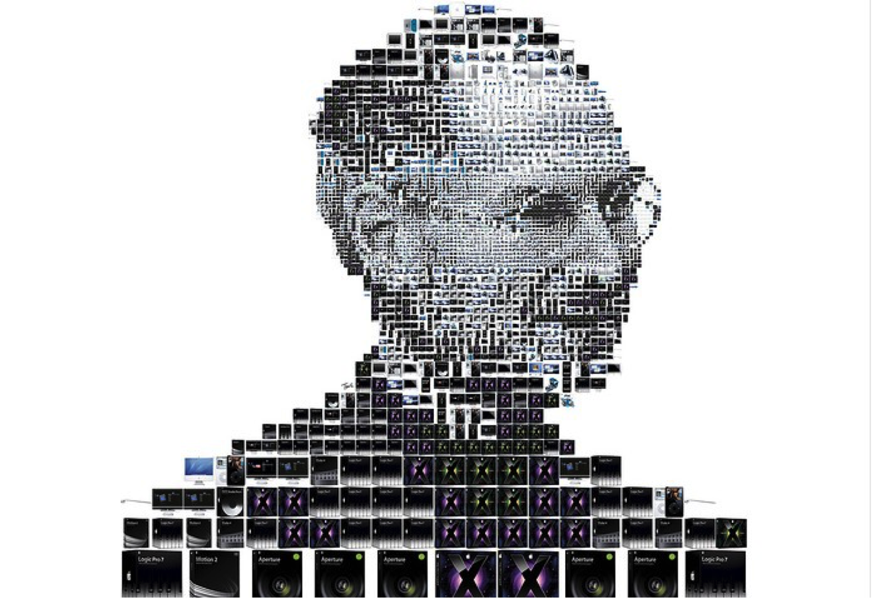
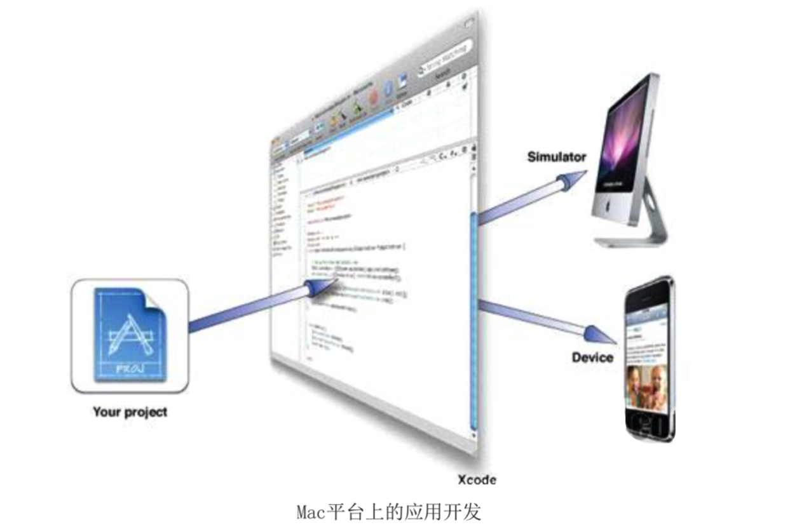
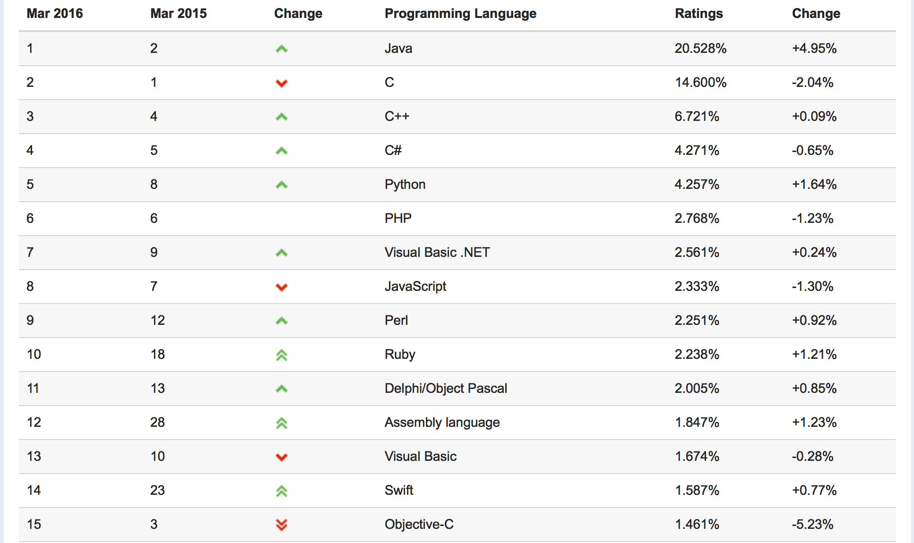

# Objective-C简介
##本小节知识点
1. 【了解】Objective-C简介
2. 【了解】Objective-C发展现状

---
##1.Objective-C简介
- Objective-C是一种面向对象的计算机语言

- OC不是一门全新的语言

- C语言的基础上增加了一层最小的面向对象语法

- OC完全兼容C语言

- 可以在OC代码中混入C语言代码，甚至是C++代码

- 可以使用OC开发Mac OS X平台和iOS平台的应用程序

---
##2. Objective-C发展现状
- 1986年，BradCox(布莱德·考克斯)在第一个纯面向对象语言Smalltalk基础上写成了Objective-C语言。

- 1985年,被赶出苹果公司的Steve Jobs成立了NeXT公司,致力于开发强大且经济的工作 站。NeXT选择Unix作为其操作系统

- 1988年Steve Jobs获得了Objective-C的使用版权,使用Objective-C来编写NeXTSTEP操作系统,Objective-C使得设计NeXTSTEP操作系统更加容易

- 1994,NeXT与Sun共同制定OpenStep API标准,其中两个重要的部分是Foundation跟 Application Kit,此时开始使用命名前缀NS。

- 在1995年,NeXT从Stepstone得到了Objective-C全部版权

- 1996  Steve Jobs重回苹果公司,把OpenStep用于 Mac OS X操作系统开发,它的版本和开发环境叫Cocoa,使用 Objective-C作为基础语言,开发工具Xcode和Interface Builder。

- 2007 苹果公司推出Objective-C2.0,Objective-C是Mac OS X和 iOS开发的基础语言。

- Objective-C编程语言排名
    + 2009年 排名32
    + 2010年 排名8
    + 2011年 排名6
    + 2014年 排名3
    + 2015年 排名4(因为Swift一直在上升)
    + 2015年 排名15（因为Swift还在上升， 并且已经超越OC）
    + 编程语言排名网站：http://www.tiobe.com/index.php/content/paperinfo/tpci/index.html

---
##3.学习目标
- 语法学习
- 建立面向对象思维能力
- 建立基本项目需求分析能力
