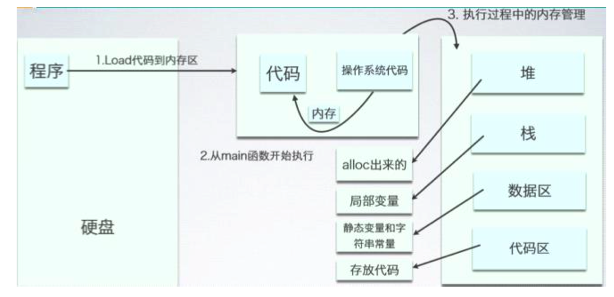
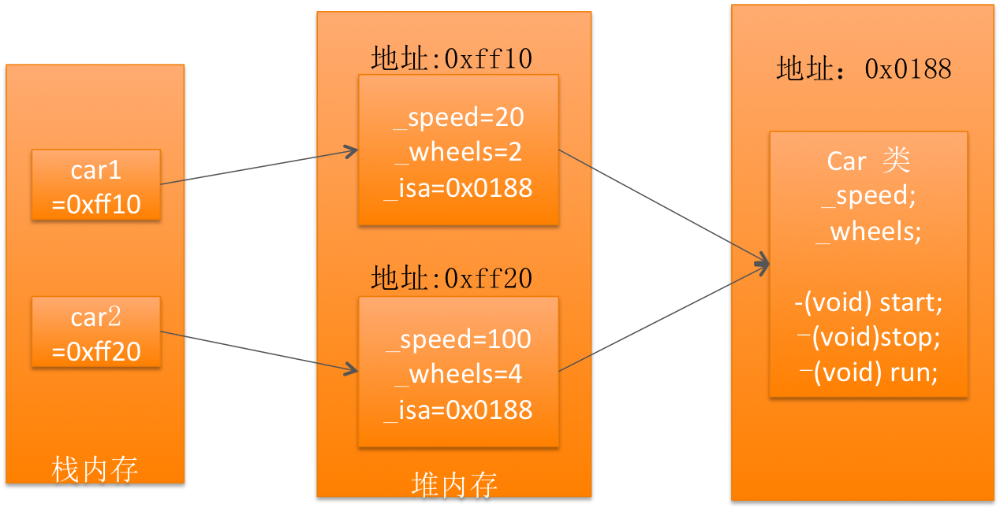

# 对象的存储细节
##本小节知识点
1. 对象的存储细节
2. isa指针
3. 使用一个类创建多个对象

##1.对象的存储细节
- 类创建对象,每个对象在内存中都占据一定的存储空间,每个对象都有一份属于自己的单独的成员变量,所有的对象公用类的成员方法,方法在整个内存中只有一份,类本身在内存中占据一份存储空间,类的方法存储于此。



---

##2.isa指针
- 每一个对象都包含一个isa指针.这个指针指向当前对象所属的类。
- [p eat];表示给p所指向的对象发送一条eat消息,调用对象的eat方法,此时对象会顺着内部的isa指针找到存 储于类中的方法,执行。
- isa是对象中的隐藏指针,指向创建这个对象的类。
- 通过isa指针我们可以在运行的时候知道当前对象是属于那个Class（类）的


---

##3.使用一个类创建多个对象

```objc
Car *car1 = [Car new];
Car *car2 = [Car new]
```


---
