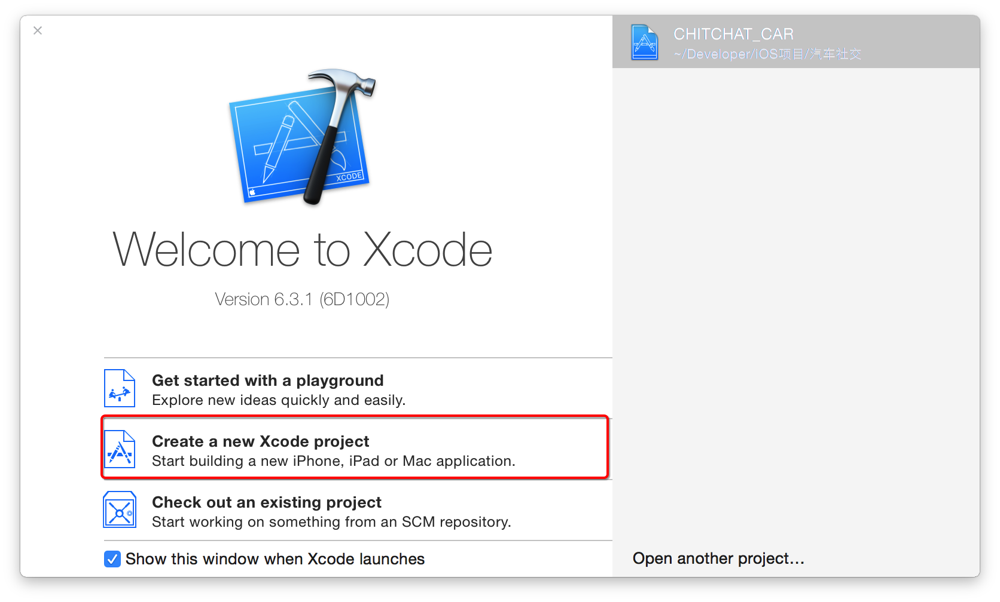
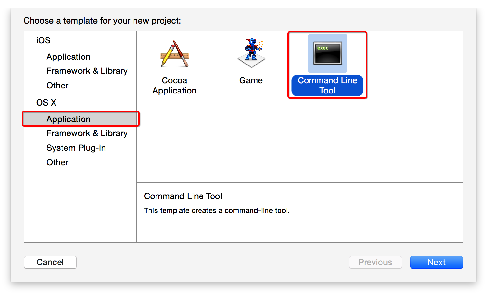
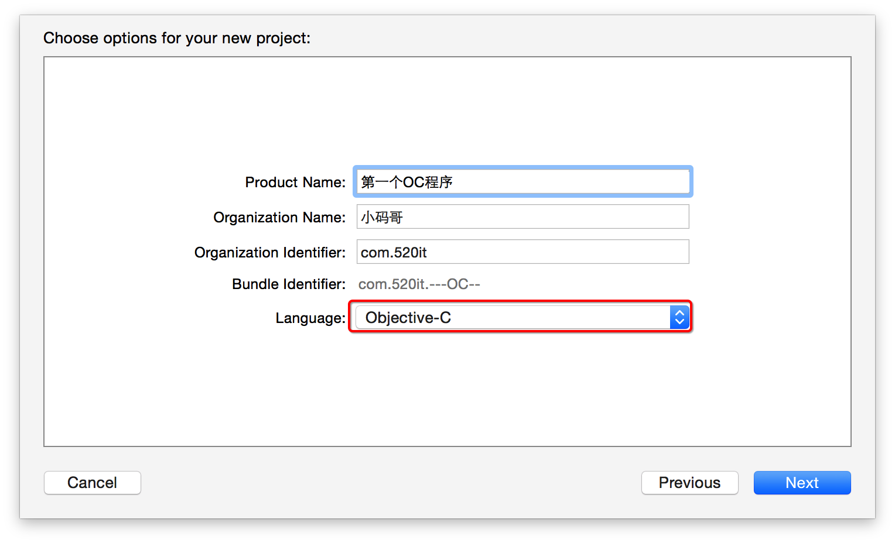
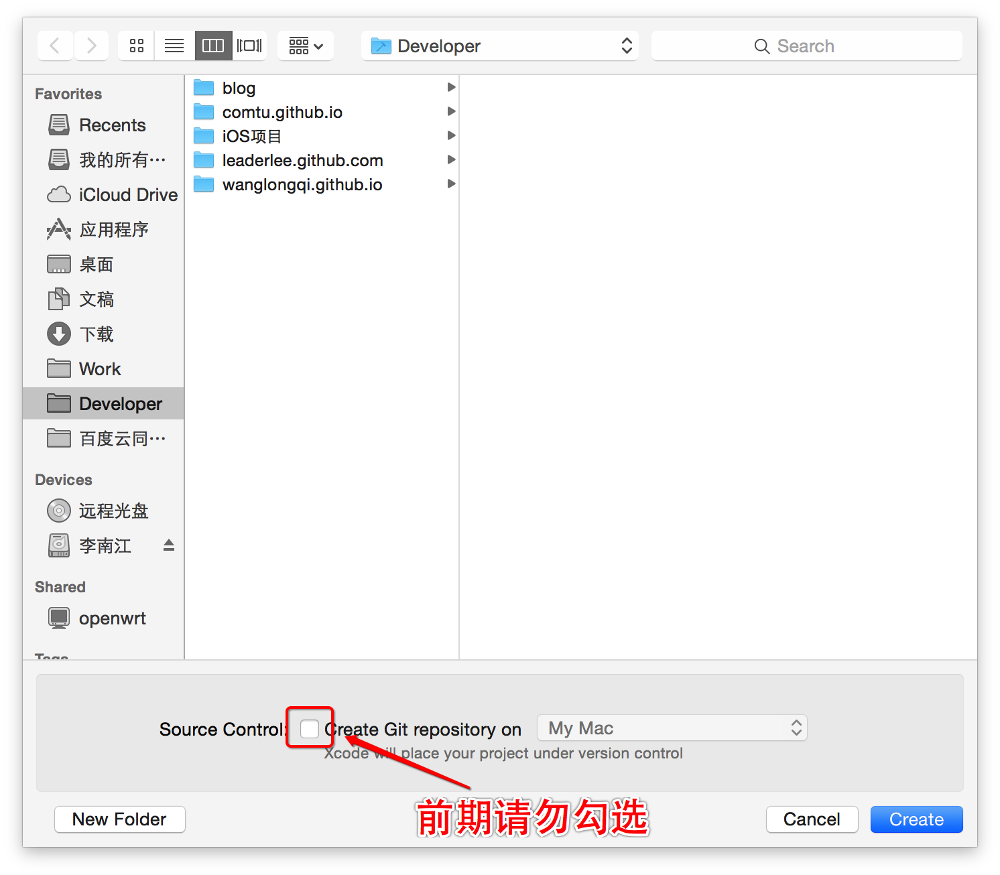
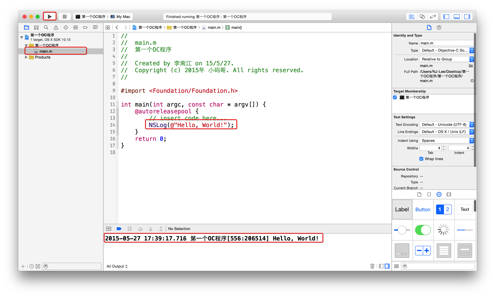

# 第一个OC程序
##本小节知识点
1. 如何创建Objective-C项目
2. \#import和#include区别
3. NSLog 和printf区别
4. “@”的使用方法
5. NS前缀

---

##1.如何创建Objective-C项目
- 创建工程





- 查看结果运行结果


---

##2.#import和#include区别
- \#import与#include的类似，都是把其后面的文件拷贝到该指令所在的地方
- \#import可以自动防止重复导入
- \#import <> 用于包含系统文件
- \#import""用于包含本项目中的文件

- \#import <Foundation/Foundation.h>, 告诉编译器找到并处理名为Foundation.h文件,这是一个系统文件,#import表示将该文件的信息导入到程序中。

- 框架地址: /Applications/Xcode.app/Contents/Developer/Platforms/iPhoneOS.platform/Developer/SDKs/iPhoneO S.sdk/System/Library/Frameworks/

---

##3.NSLog 和printf区别
- NSLog是Foundation框架􏰀供的Objective-C日志输出函数,与标准C中的printf函数类似,并可以格式化输出。
    + NSLog传递进去的格式化字符是NSString的对象,而不是char *这种字符串指针
    + NSLog输出的内容中会自动包含一些系统信息
    + NSLog输出的内容会自动换行

- NSLog声明在NSObjCRuntime.h中
    + 声明：void NSLog(NSString *format, ...);

```objc
NSLog(@“this is a test”); //打印一个字符串
NSString *str = @"hello xiaomage!”;
NSLog(@"string is:%@",str);//使用占位符,%@表示打印一个对象,%@ OC特有的
NSLog(@"x=%d, y=%d",10,20);//使用多个占位符,%d表示整型数

```
---

##4.“@”的使用方法
- 在OC中“@”有特殊的用法
    + @"" 这个符号表示将一个C的字符串转化为OC中的字符串对象NSString.
    + @符号 OC中大部分的关键字都是以@开头的,比如@interface,@implementation,@end @class等。

---

##5.NS前缀
- NS来自于NeXTStep的一个软件 NeXT Software
- OC中不支持命名空间(namespace)
- NS是为了避免命名冲突而给的前缀
- 看到NS前缀就知道是Cocoa中的系统类的名称

---
