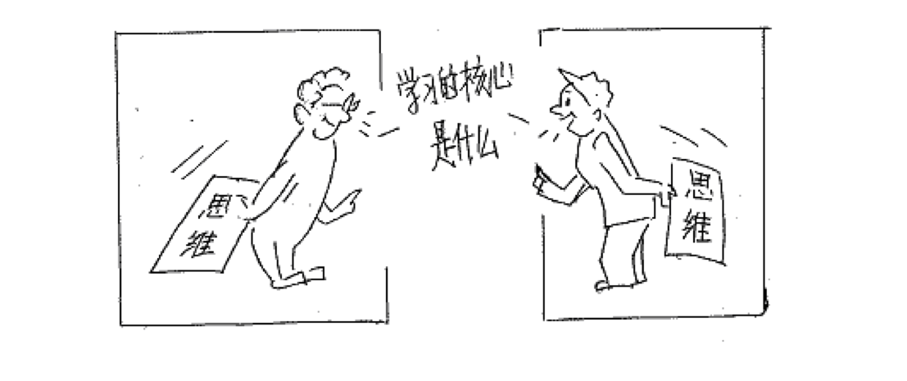

# 面向对象思想
##本小节知识点
1. 面向对象基本概念
2. 面向对象和面向过程区别
3. 面向对象的特点

---

##1.面向对象基本概念
- 软件编程就是将我们的思维转变成计算机能够识别语言的一个过程

- 面向对象(Object Oriented,OO)是软件开发方法
- 面向对象是相向对象是一种对现实世界理解和抽象的方法，是计算机编程技术发展到一定阶段后的产物。
- Object Oriented Programming-OOP ——面向对象编程

---

##2.面向对象和面向过程区别
-   面向对象是相对面向过程而言
- 面向对象和面向过程都是一种思想
- 面向过程
    + 强调的是功能行为
    + 关注的是解决问题需要哪些步骤
- 面向对象
    + 将功能封装进对象，强调具备了功能的对象
    + 关注的是解决问题需要哪些对象

- 示例
- 把衣服放进洗衣机
    + 面向过程
        * 打开洗衣机
        * 放进去衣服
        * 关闭洗衣机

    + 面向对象
        * 洗衣机-打开
        * 洗衣机-存储
        * 洗衣机-关闭

- 现实生活中我们是如何应用面相对象思想的
    + 想打电话\发短信
    + 去饭店吃饭
    + 汽车坏了
    + 买电脑
    + 包工头
    + 女朋友
    + 面试

---

##3.面向对象的特点
- 是一种符合人们思考习惯的思想
- 可以将复杂的事情简单化
- 将程序员从执行者转换成了指挥者

- 完成需求时：
    + 先要去找具有所需的功能的对象来用。
    + 如果该对象不存在，那么创建一个具有所需功能的对象。
    + 这样简化开发并提高复用。

