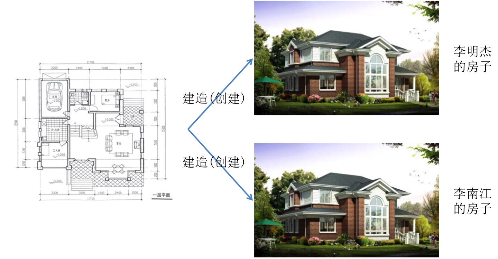
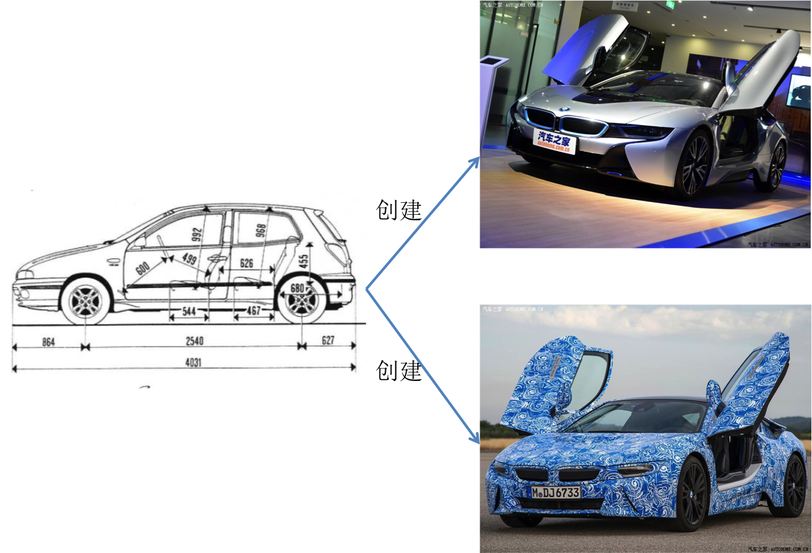

# 类与对象
##本小节知识点
1. 类与对象的关系

---

##1.类与对象的关系
- 面向对象的核心就是对象,那怎么创建对象?
    + OC中创建对象比较复杂, 首先要理解一个概念叫做类.
    + 现实生活中是根据一份描述,一份模板创建对象,编程语言也一样,也必须先有一份描述,在这个描述中说清楚将来创建出来的对象有哪些属性和行为

- OC中􏰁述事物通过类的形式体现,类是多个同种类型事物的抽象,概念上的定 义。

- OC中的类相当于图纸，用来描述一类事物。也就是说，要想创建对象，必须先有类
- OC利用类来创建对象，对象是类的具体存在, 因此面向对象解决问题应该是先考虑需要设计哪些类，再利用类创建多少个对象

---

