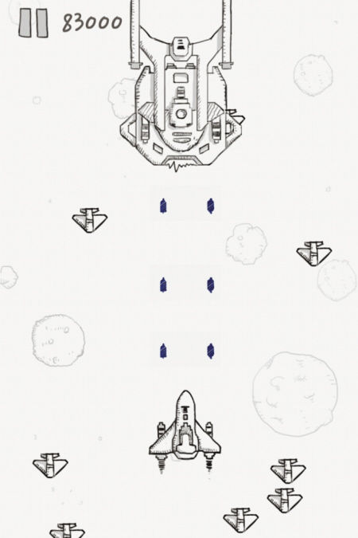
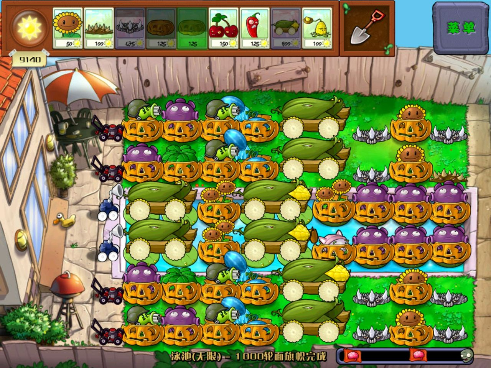
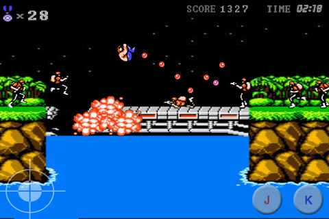
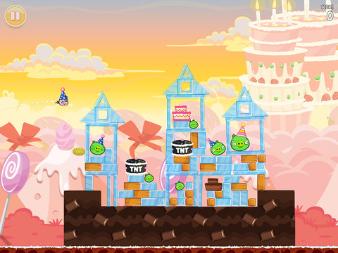

# 类的设计
##本小节知识点
1. 如何设计一个类
2. 如何分析一个类
3. 练习

---

##1.如何设计一个类
- 生活中描述事物无非就是描述事物的`名称`/`属性`和`行为`。
    + 如：人有身高，体重等属性，有说话，打架等行为。
```objc
事物名称(类名):人(Person)
属性:身高(height)、年龄(age)
行为(功能):跑(run)、打架(fight)
```

- OC中用类来描述事物也是如此
    + 属性：对应类中的成员变量。
    + 行为：对应类中的成员方法。

- 定义类其实在定义类中的成员(成员变量和成员方法)

---

##2.如何分析一个类
- 一般名词都是类(名词提炼法)
    + 飞机发射两颗炮弹摧毁了8辆装甲车
```
飞机
炮弹
装甲车
```
    + 隔壁老王在公车上牵着一条叼着热狗的草泥马
```
老王
热狗
草泥马
```

- 拥有相同(或者类似)`属性`（状态特征）和`行为`（能干什么事）的对象都可以抽像成为一个类

  

  

  

  


---

##3.练习
- 定义僵尸类
- 定义灰机类
- 定义电脑类
- 定义手机类

