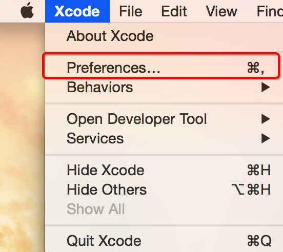
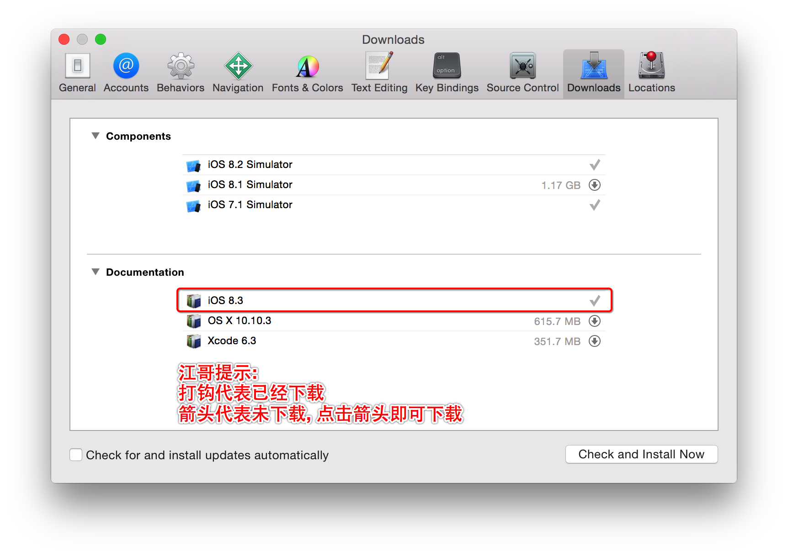
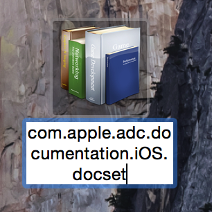
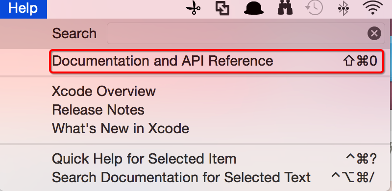
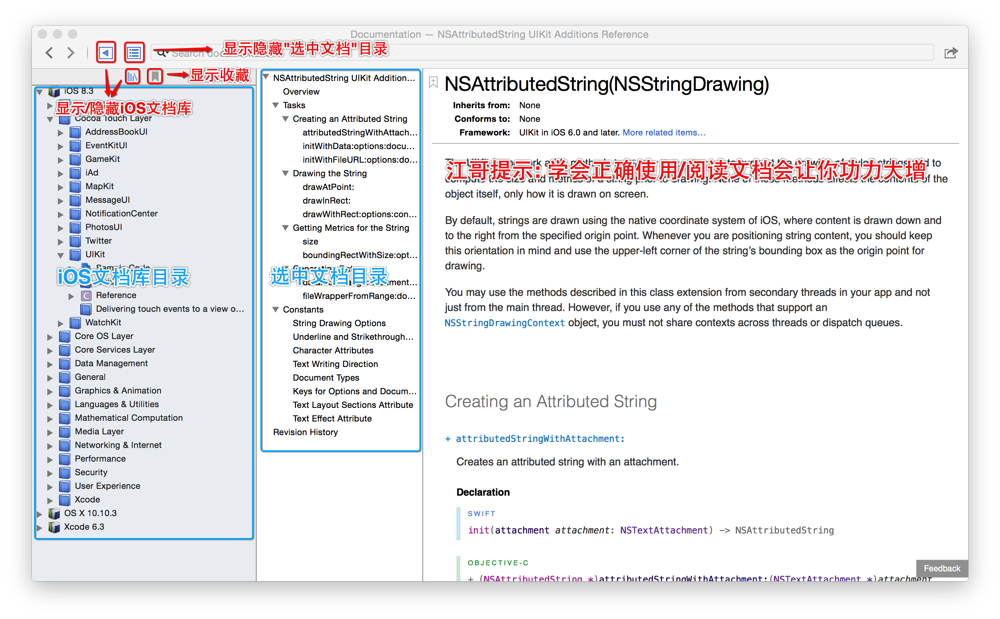
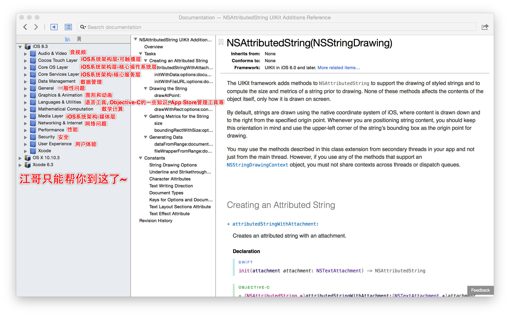
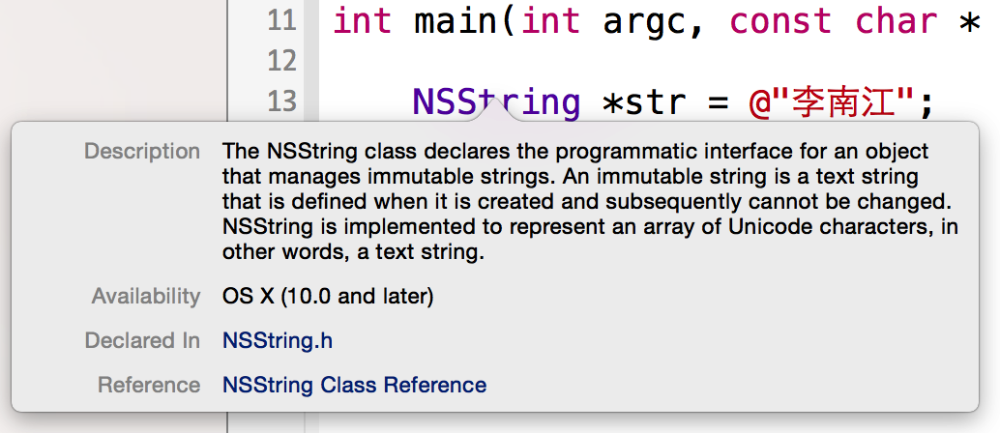
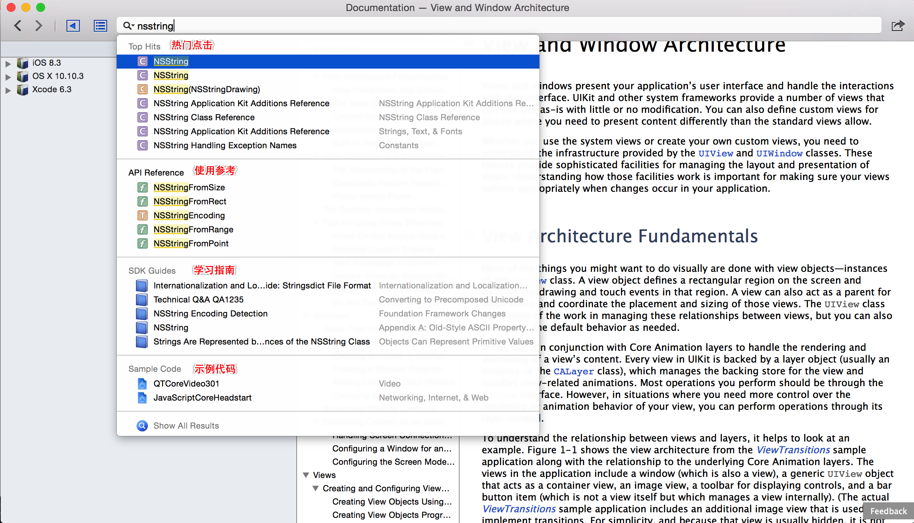
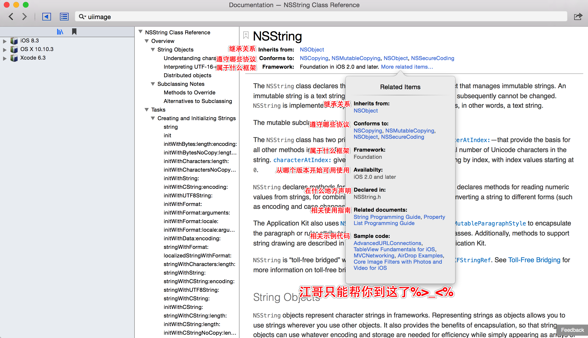

# Xcode文档安装
##本小节知识点:
1. Xcode文档在线安装
2. Xcode文档离线安装
3. Xcode文档基本使用
4. 如何阅读文档?
5. 离开江哥你还能干什么?

---

##1.Xcode文档在线安装
- 打开Xcode,首选项

- 点击DownLoads下载文档

---

##2.Xcode文档离线安装
- 找到备份的文档
    + com.apple.adc.documentation.AppleiOS8.0.iOSLibrary.docset

- 找到DocSets目录
    +  /Applications/Xcode.app/Contents/Developer/Documentation/DocSets

- 拷贝文件到该目录

- 退出重新打开Xcode
    + 如果还不行，/Users/你的用户名/Library/Developer/Shared/Documentation/DocSets，看是否存在同名的或版本更新的，把它删掉

- 注意: 如果文件夹中有版本更高的文档不会显示低版本文档

---

##3.Xcode文档基本使用
- 如何打开文档

- 文档结构

- 关键字说明
    + Getting Started —— 新手入门，一般来说，是给完全的新手看的。建议初学者看看，这里面有一些建立观念的东西，有了这些建立观念的东西，后面的学习就比较容易了。
    +  Guides —— 指南，指南是Xcode里面最酷最好的部分，学会看指南则大多数情况完全不用买书。Xcode文档里面的指南，就是一个一个问题的，从一个问题，或者系统的一个方面出发，一步一步详细介绍怎么使用Cocoa库的文档。一般程序员比较熟悉的是Reference，就是你查某个类、方法、函数的文档时候，冒出来的东西。那些其实是一点一点的细碎知识，光看那些东西就完全没有脉络。而Guides就是帮你整理好的学习的脉络。
    + Reference —— 参考资料。一个一个框架一个一个类组织起来的文档，包含了每个方法的使用方法。
    + Release Notes —— 发布说明。一个iOS新版本带来了哪些新特性，这样的信息，熟悉新iOS，比较不同iOS版本API不同，都需要参考这些文档。
    + Sample Code —— 示例代码。苹果官方提供的一些示例代码，帮助你学习某些技术某些API。非常强烈建议学习的时候参考，一方面光看文档有时候还是很难弄明白具体实现是怎么回事儿。另外一方面这些示例代码都是苹果的工程师写的，你从示例代码的变迁可以看到苹果官方推荐的代码风格流变。
    + Technical Notes —— 技术说明。一些技术主题文章，有空的时候可以浏览一下。往往会有一些收获。
    + Technical Q&A —— 常见技术问答。这是技术社区里面一些常见问题以及回答的整理。
    + Video —— 视频。目前主要是WWDC的视频，实际上是登录到开发者网站上去浏览的，这里就是快捷方式。想深入学习的话，一定不能错过，大量的看，不仅可以学好技术，还可以练好英文。
    >+ 这里面的Reference、Release Notes、Sample Code、Technical Notes、Technical Q&A，一般来说只是备查的。主要要看的是Getting Started和Guides。

---
##4.如何阅读文档?
- 快速查询文档
    + 按住Option键查询

    + 通过Quick Help查询

- 搜索帮助

- 阅读文档

---

##5.离开江哥你还能干什么?
- Start Developing iOS Apps Today
    + 马上着手开发 iOS 应用程序, 建立基本iOS开发概览

- iOS Technology Overview
    + iOS技术概览,阅读这个文档的目的和检测标准是，遇到具体问题，知道应该去看哪方面的文档

- iOS Human Interface Guidelines
    + iOS 人机交互指南,阅读这个文档的目的和检测标准是，看到任何一个App，你可以知道它的任何一个UI是系统控件，还是自定义控件，它的层次关系等等。

- Programming with Objective-C
    + 学习OC基础语法,阅读这个文档的目的和检测标准是，看得懂基本的Objective-C代码，方便后面的学习和阅读各种示例代码

- App Programming Guide for iOS
    + iOS应用程序编程指南,介绍的就是开发一个App的完整流程，包括App的生命周期、休眠、激活等等. 阅读这个文档的目的和检测标准是，了解全部流程和很多细节问题

- View Programming Guide for iOS
- View Controller Programming Guide for iOS
    + 阅读这两个文档的目的和检测标准是，深刻理解什么是View，什么是View Controller，理解什么情况用View，什么情况用View Controller。

- Table View Programming Guide for iOS
    + 阅读这个文档的目的和检测标准是，深刻理解UITableView／UITableViewController的理论和使用方法

---

