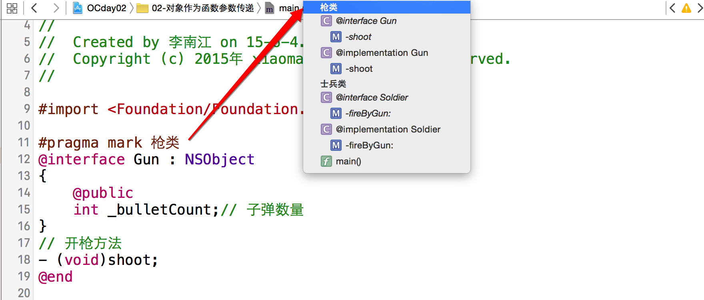
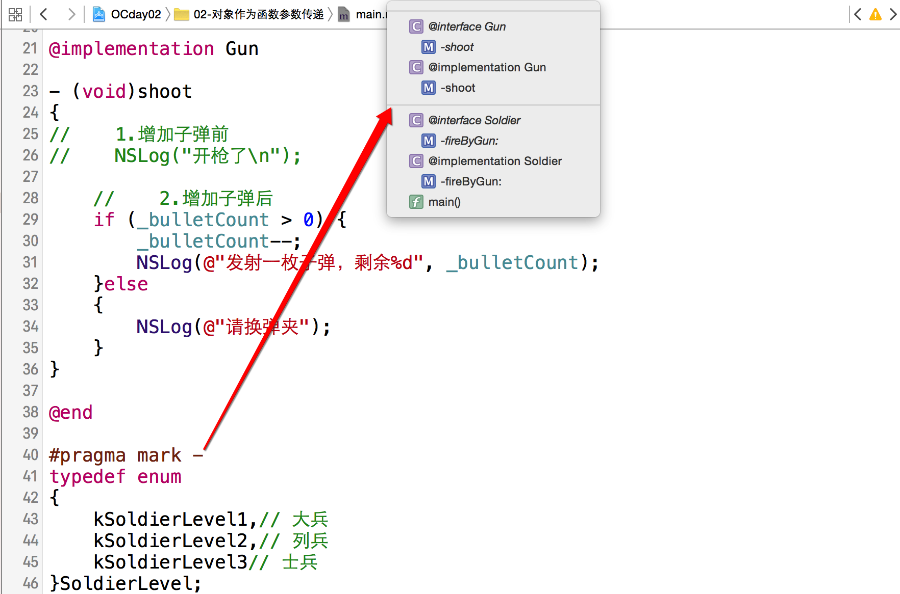
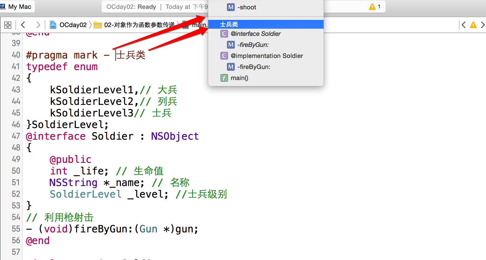

# \#pragma mark指令

---
###本小节知识点:
1. \#pragma mark指令的使用
2. \#pragma 处理编译器警告
3. \#pargma 更多相关知识


---

###1.\#pragma mark指令的使用

- 功能:简单来说就是对代码的分组,方便代码查找和导航用的 它们告诉Xcode编译器,要在编辑器窗格顶部的方法和函数弹出菜单中将代码分隔开。一些类(尤其是一些控制器类)可能很长,方法和函数弹出菜单可以便于代码导航。此时加入\#pragma 指令(\#pragma是一个编译指令)对代码进行逻辑组织很有效果。

- 一个类里我们总会有一些方法的功能与性质是相差不多的,你可能会有把方法们分组的想法。Xcode已经有了类似的支持,它就是 \#pragma mark。

    + 分组:   \#pragma mark 分组(标识)名称

  

    + 分隔线: #pragma mark -

  

    + 分割线加分组: #pragma mark - 分组(标识)名称

  


----

###2. \#pragma 处理编译器警告

- 首先, \#pragma 本质上也是声明，一般常用的功能就是打注释、尤其是分段注释, 但是#pragma 另外一个强大的功能就是处理编译器警告, 用的时候可能就没上一个功能用的那么多, 在代码中处理警告却是极其高效的方法。其中 `clang diagnostic` 便是`#pragma` 第一个功能常用的命令，步骤如下: 


```objectivec
#pragma clang diagnostic push
#pragma clang diagnostic ignored "-相关命令"
    // 你自己的代码
#pragma clang diagnostic pop
```

#####2.1 常见用法

- 方法弃用告警

```objectivec
#pragma clang diagnostic push  
   
#pragma clang diagnostic ignored "-Wdeprecated-declarations"      
[TestFlight setDeviceIdentifier:[[UIDevice currentDevice] uniqueIdentifier]];  
   
#pragma clang diagnostic pop
```

- 不兼容指针类型

```objectivec
#pragma clang diagnostic push   
#pragma clang diagnostic ignored "-Wincompatible-pointer-types"  
//  
#pragma clang diagnostic pop
```

- 循环引用


```objectivec
// completionBlock is manually nilled out in AFURLConnectionOperation to break the retain cycle.  
#pragma clang diagnostic push  
#pragma clang diagnostic ignored "-Warc-retain-cycles" 
    self.completionBlock = ^ {  
        ...  
    };  
#pragma clang diagnostic pop
```

- 未使用变量


```objectivec
#pragma clang diagnostic push   
#pragma clang diagnostic ignored "-Wunused-variable"  
  int a;   
#pragma clang diagnostic pop
```

---

###3.\#pargma 更多相关知识

- \#pargma 用法详情：

  [http://nshipster.cn/pragma/](http://nshipster.cn/pragma/)

  [http://nshipster.com/clang-diagnostics/](http://nshipster.com/clang-diagnostics/)

- 相关的命令列表

  [http://fuckingclangwarnings.com/](http://fuckingclangwarnings.com/)

- 进阶：

  [http://clang.llvm.org/docs/UsersManual.html#diagnostics_pragmas](http://clang.llvm.org/docs/UsersManual.html#diagnostics_pragmas)