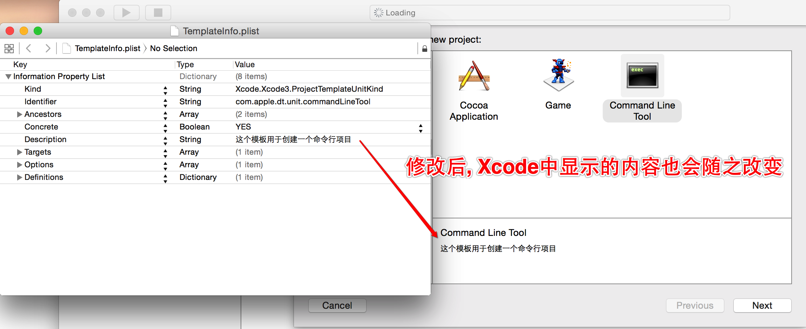
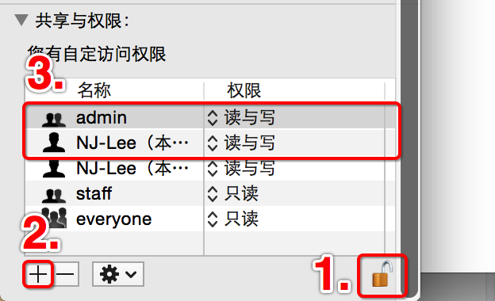

# Xcode模板修改
##本小节知识点:
1. 修改项目模板
2. 修改类的头部信息

---

##1.修改项目模板
- 项目模板就是创建工程的时候选择的某一个条目, Xcode会根据选择的条目生成固定格式的项目
    + 例如想创建一个命令行项目就选择Command Line Tool

- 如何修改项目模板
    + 1.应用程序中,找到Xcode, 右键"显示包内容"

    + 打开"/Applications/Xcode.app/Contents/Developer/Library/Xcode/Templates/Project\ Templates/Mac/Application" 文件夹
        * 在/Application文件夹中能够找到所有和OS X Application界面对应的文件夹

    + 修改Command Line Tool模板
        * 打开"Command Line Tool.xctemplate"文件夹, 发现和"改Command Line Tool模板"一一对应

        * 打开"TemplateInfo.plist文件"发现和"改Command Line Tool模板"中内容对应

        * 修改"TemplateInfo.plist文件"中的内容

- 注意:
    + 修改最好重启Xcode
    + 如果发现不能修改, 可以将文件拖到桌面后再修改, 或者修改文件的权限后再修改

- 练习: 修改main文件模板
    + 因为main文件是随着项目的创建自动创建的, 所以想要修改main文件的模板其实就是修改项目模板
    + 同样打开"TemplateInfo.plist文件"找到对应数据后直接修改重启Xcode即可

---

##2.修改类的头部信息

- 找到对应类对应的类文件模板. (因为类是创建项目之后手动创建的, 而不是随着项目的创建自动创建的, 所以修改类文件模板和项目模板并不是修改同一个文件)
+ 打开"/Applications/Xcode.app/Contents/Developer/Library/Xcode/Templates File  Templates/Source/Cocoa Class.xctemplate"文件夹

  

+ 找到继承Objective-C对应的文件夹
    
  

  + 修改对应的模板文件
  
  

---

