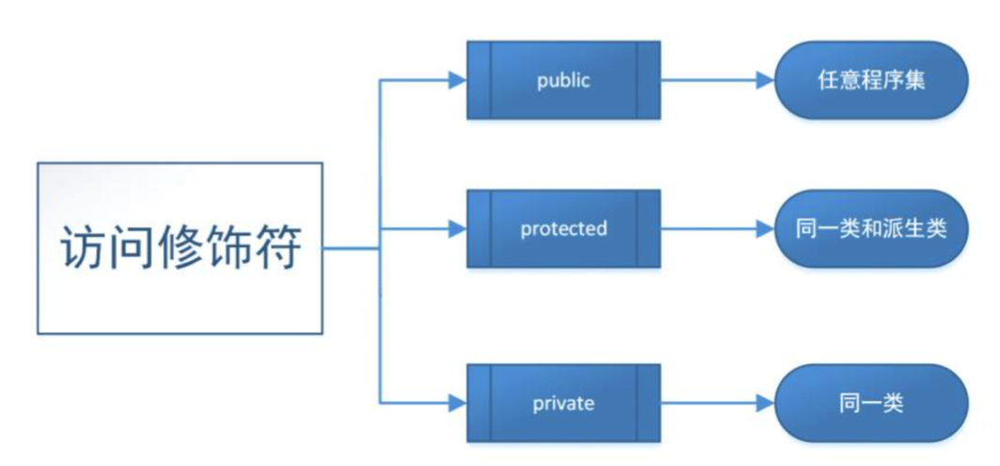

# 实例变量修饰符

##本小节知识点:
1. 【理解】实例变量的作用域
2. 【掌握】变量修饰符在子类中的访问
3. 【了解】实例变量作用域使用注意事项
---

##1.实例变量的作用域

- 1)@public (公开的)在有对象的前􏰀下,任何地方都可以直接访问。
- 2)@protected (受保护的)只能在当前类和子类的对象方法中访问
- 3)@private (私有的)只能在当前类的对象方法中才能直接访问
- 4)@package (框架级别的)作用域介于私有和公开之间,只要处于同一个框架中相当于@public,在框架外部相当于@private

---

##2.变量修饰符在子类中的访问
- 1)@private私有成员是能被继承,也不能被外部方法访问。
- 2)@public 公有成员能被继承,也能被外部方法访问。
- 3)@protected 保护成员能够被继承,不能够被外部方法访问。

---

##3.实例变量作用域使用注意事项
- (1)在@interface @end之间声明的成员变量如果不做特别的说明,那么其默认是protected 的。
- (2)一个类继承了另一个类,那么就拥有了父类的所有成员变量和方法,注意所有的成员变量它都拥有,只是有的它不能直接访问。例如@private的

---

