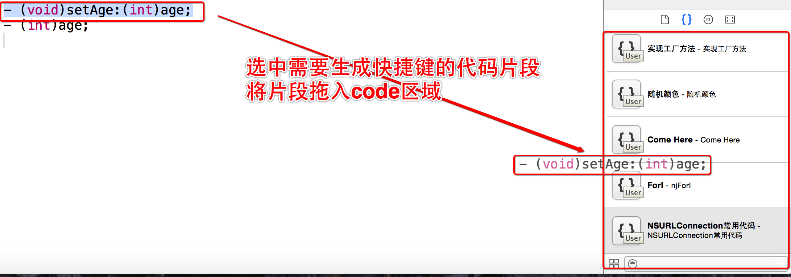
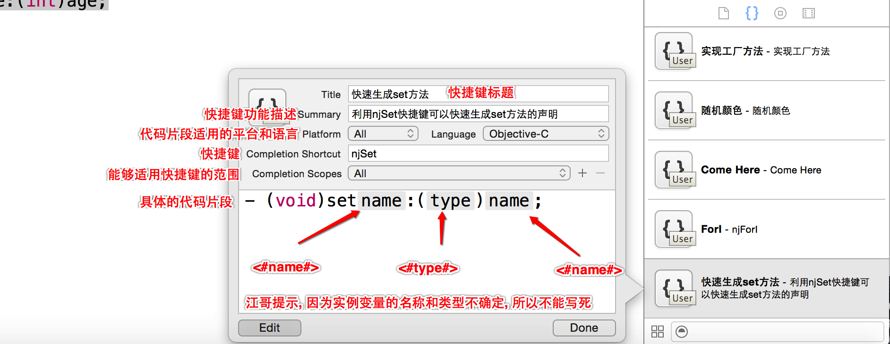
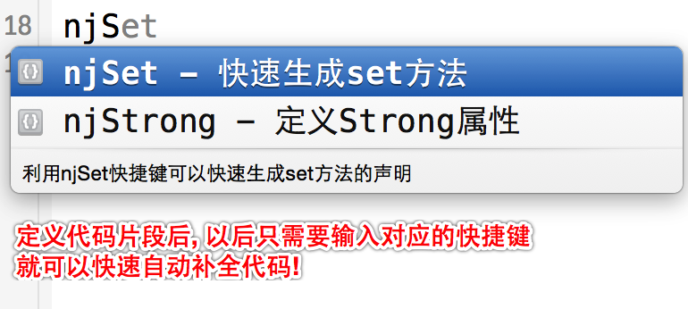
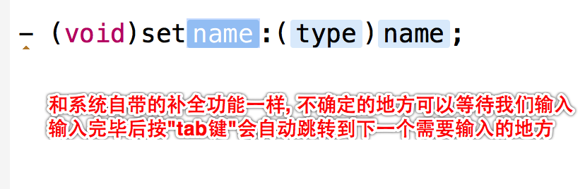
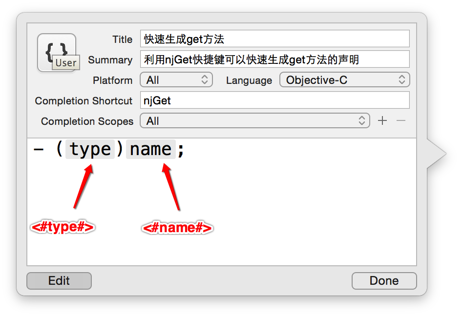
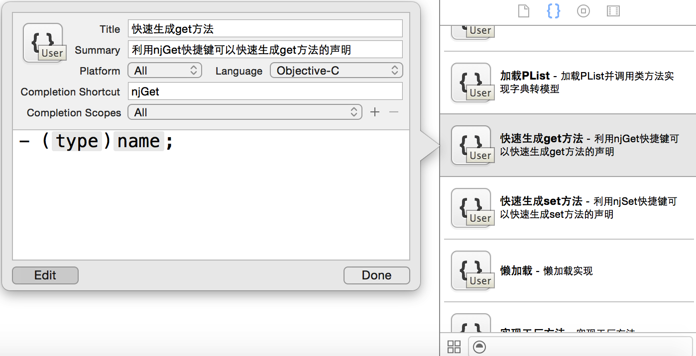
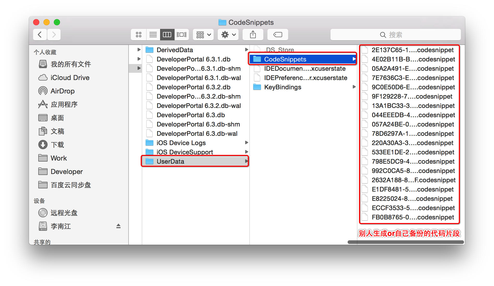

# 自定义代码段
##本小节知识点:
1. 如何自定义代码片段
2. 如何导入代码片段

---

##1.如何自定义代码片段
- 将代码拖拽到code区域

- 配置快捷键等信息

- 使用快捷键

- 练习, 自定义get方法快捷键

---

##2.如何导入代码片段
- 将下载好的代码片段拷贝到:`/Users/LNJ/Library/Developer/Xcode/UserData/CodeSnippets`下
    + 注意将`LNJ`换为自己的用户名
   
  

---

