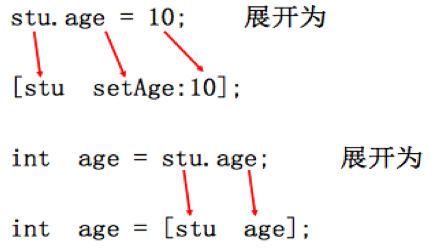

# 点语法

##本小节知识点:
1. 【掌握】点语法基本使用
2. 【掌握】点语法的本质
3. 【掌握】点语法注意

---
##1.点语法基本使用

---

##2.点语法的本质
- 其实点语法的本质还是方法调用
- 当使用点语法时，编译器会自动展开成相应的方法

  
- 当点语法使用在 “=“赋值符号左侧的时候，点语法会被展开为setter方法的调用，其他情况（等号右侧、直接使用）为点语法展开为getter方法的调用


---

##3.点语法注意
- 点语法的本质是方法的调用,而不是访问成员变量,当使用点语法时,编译器会自动展开成相应的方法调用。

- 切记点语法的本质是转换成相应的对setter和getter方法调用,如果没有set和get方法,则不能使用点语法。

- 不要在getter 与  setter方法中使用本属性的点语法

```objc
- (void) setAge:(int)age {
    // 下面的代码会引发死循环
    self.age = age;
        //编译器展开后 [self setAge:age]
}


- (int) age {
    // 下面的代码会引发死循环
    return self.age;
          // 编译器展开后 [self   age]
}

```

---


