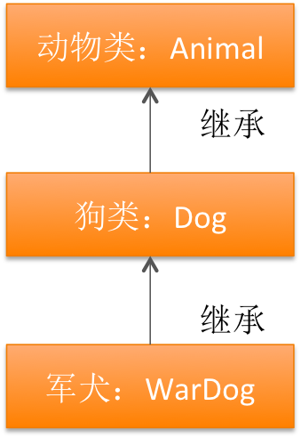

# 继承相关特性
##本小节知识点:
1. 方法重写
2. 继承中方法调用的顺序
3. 继承的注意事项

---
##1.方法重写
- 在子类中实现与父类中同名的方法，称之为方法重写；
- 重写以后当给子类发送这个消息的时候，执行的是在子类中重写的那个方法，而不是父类中的方法。
- 如果想在子类中调用被子类重写的父类的方法，可以通过super关键字
- 使用场景：当从父类继承的某个方法不适合子类,可以在子类中重写父类的这个方法。

##2.继承中方法调用的顺序
- 1、在自己类中找
- 2、如果没有,去父类中找
- 3、如果父类中没有,就去父类的父类中
- 4、如果父类的父类也没有,就还往上找,直到找到基类(NSObject)
- 5、如果NSObject都没有就报错了
    >+ 如果找到了就执行这个方法，就不再往后查找了

---

##3.继承的注意事项
- 子类不能定义和父类同名的成员变量，私有成员变量也不可以；因为子类继承父类，子类将会拥有父类的所有成员变量，若在子类中定义父类同名成员变量 属于重复定义。

- OC类支持单一继承,不支持多继承；也就是说一个类只能有一个直接父类

- OC类支持多层继承 ,如下图所示

