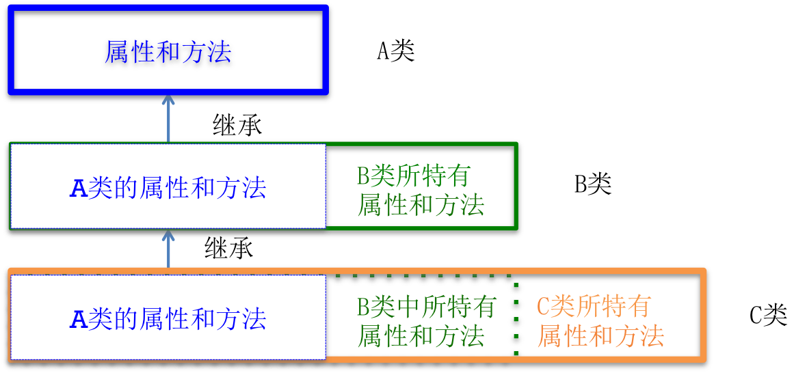

# 继承
##本小节知识点:
1. 继承基本概念
2. OC中的继承关系
3. OC中如何实现继承

---

##1.继承基本概念
- 现实生活中的继承


- 交通工具类是一个基类(也称做父类),通常情况下所有交通工具所共同具备的特性，如速度与额定载人的数量

- 按照生活常规,我们来继续给交通工具来细分类的时候,我们会分别想到有汽车类和飞机类等,汽车类和飞机类同样具备速度和额定载人数量这样的特性,而这些特性是所有交通工具所共有的,那么就可以让汽车或飞机类继承交通工具类，这样当建立汽车类和飞机类的时候我们无需再定义交通工具类（基类）中已经有的成员和方法,而只需要􏰁述汽车类和飞机类所特有的特性即可。

- 飞机类和汽车类的特性是由在交通工具类原有特性基础上增加而来的,那么飞机类和汽车类就是交通工具类的派生类(也称做子类)。以此类推,层层递增, 这种子类获得父类特性的概念就是继承


- 继承的重要性


---

##2.OC中的继承关系


- B类继承A类，那么B类将拥有A类的所有属性和方法，此时我们说A类是B类的父类，B类是A类的子类

- C类继承B类，那么C类将拥有B类中的所有属性和方法，包括B类从A类中继承过来的属性和方法，此时我们说B类是C类的父类，C类是B类的子类

- 注意:
    + 基类的私有属性能被继承,不能在子类中访问。
    + OC中的继承是单继承:也就是说一个类只能一个父类,不能继承多个父类
    + 子类与父类的关系也称为isA（是一个）关系，我们说 子类isA父类，也就是子类是一个父类，比如狗类继承动物类，那么我们说狗isA动物，也就是狗是一个动物。在如汽车继承交通工具，那么们说汽车isA交工工具，也就是汽车是一个交通工具
    + 继承的合理性:引用《大话西游》里的一句话来描述继承的。“人是人他妈生的,妖是妖他妈生的!”

---

##3.OC中如何实现继承
- 在声明子类的时候，在子类名称后面通过：父类名称方式来实现继承

```objc
@interface 子类名称 : 父类名称

@end

```

---


