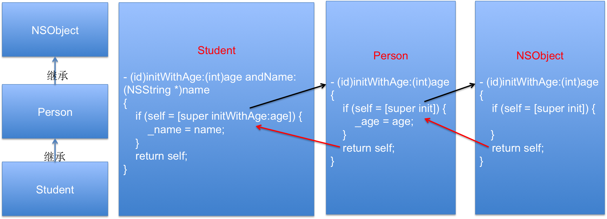

# 继承中的自定义构造方法
##本小节知识:
1. 【掌握】继承中的自定义构造方法
2. 【掌握】自定义构造方法的使用注意
---

##1.继承中的自定义构造方法

- 不能在子类访问父类私有变量

```objc
@interface Person : NSObject

@property int age;

- (id)initWithAge:(int)age;
@end


@interface Student : Person

@property NSString *name;

- (id)initWithAge:(int)age andName:(NSString *)name;
@end

@implementation Student

- (id)initWithAge:(int)age andName:(NSString *)name
{
    if (self = [super init]) {
//        这个_Age是父类中通过property自动在.m中生成的无法继承,不能直接访问
//        _age = age;
        [self setAge:age];
        _name = name;
    }
    return self;
}
@end
```

- 父类的属性交给父类的方法来处理

```objc
@interface Person : NSObject

@property int age;

- (id)initWithAge:(int)age;
@end


@interface Student : Person

@property NSString *name;

- (id)initWithAge:(int)age andName:(NSString *)name;
@end

@implementation Student

- (id)initWithAge:(int)age andName:(NSString *)name
{
    if (self = [super initWithAge:age]) {
        _name = name;
    }
    return self;
}
@end

```



---

##2.自定义构造方法的使用注意
- (1)自己做自己的事情
- (2)父类的属性交给父类的方法来处理,子类的方法处理子类自己独有的属性

- 自定义构造方法必须以intiWith开头,并且’W’必须大写

---

