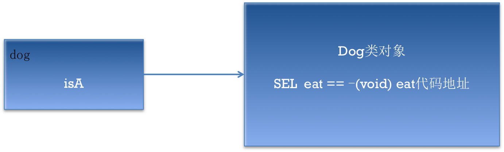
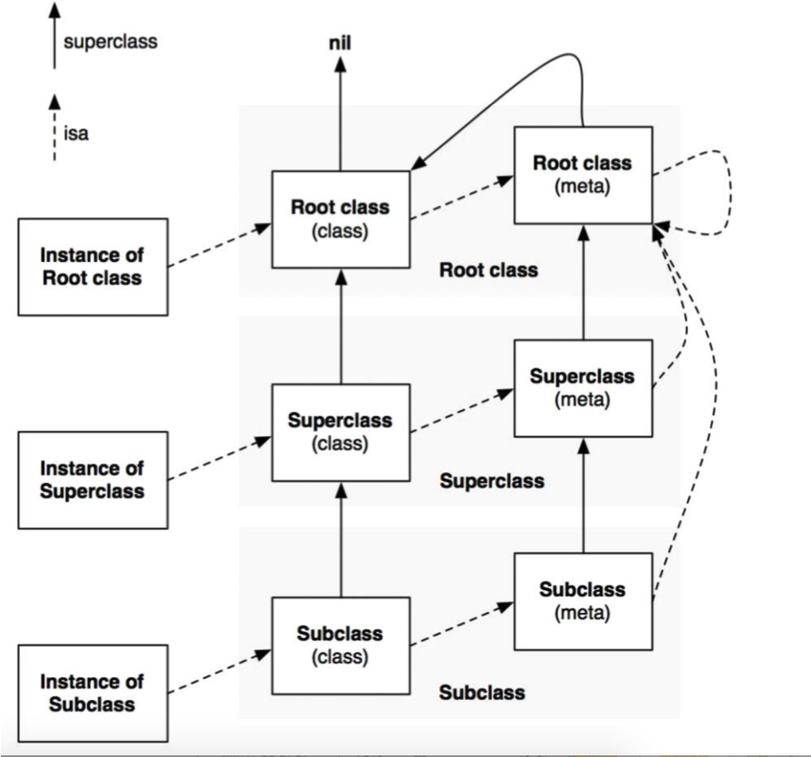

# SEL类型
##本小节知识:
1. 【理解】什么是SEL类型
2. 【掌握】SEL使用
3. 【理解】OC方法查找顺序

---

##1.什么是SEL类型
- SEL类型代表着方法的签名，在类对象的方法列表中存储着该签名与方法代码的对应关系
- 每个类的方法列表都存储在类对象中
- 每个方法都有一个与之对应的SEL类型的对象
- 根据一个SEL对象就可以找到方法的地址，进而调用方法
- SEL类型的定义
    + typedef struct objc\_selector 	\*SEL;


- 首先把test这个方法名包装成sel类型的数据
- 根据SEL数据到该类的类对象中，去找对应的方法的代码，如果找到了就执行该代码
- 如果没有找到根据类对象上的父类的类对象指针，去父类的类对象中查找，如果找到了，则执行父类的代码
- 如果没有找到，一直像上找，直到基类(NSObject)
- 如果都没有找到就报错。

- >注意：
    >+ 在这个操作过程中有缓存,第一次找的时候是一个一个的找，非常耗性能，之后再用到的时候就直接使用。


```objc
Dog *dog=[[Dog alloc] init];
[dog eat];
```



---

##2.SEL使用
- 定义普通的变量
    + 如：SEL sel = @selector(show);


- 作为方法实参与NSObject配合使用
- 检验对象是否实现了某个方法
    + \- (BOOL) respondsToSelector: (SEL)selector 判断实例是否实现这样方法
    + \+ (BOOL)instancesRespondToSelector:(SEL)aSelector;

```objc
    BOOL flag;
    // [类 respondsToSelector]用于判断是否包含某个类方法
    flag = [Person respondsToSelector:@selector(objectFun)]; //NO
    flag = [Person respondsToSelector:@selector(classFun)]; //YES

    Person *obj = [[Person alloc] init];

    // [对象 respondsToSelector]用于判断是否包含某个对象方法
    flag = [obj respondsToSelector:@selector(objectFun)]; //YES
    flag = [obj respondsToSelector:@selector(classFun)]; //NO

    // [类名 instancesRespondToSelector]用于判断是否包含某个对象方法
    // instancesRespondToSelectorr只能写在类名后面, 等价于 [对象 respondsToSelector]
    flag = [Person instancesRespondToSelector:@selector(objectFun)]; //YES
    flag = [Person instancesRespondToSelector:@selector(classFun)]; //NO
```

- 让对象执行某个方法
    + \- (id)performSelector:(SEL)aSelector;
    + \- (id)performSelector:(SEL)aSelector withObject:(id)object;
    + \- (id)performSelector:(SEL)aSelector withObject:(id)object1 withObject:(id)object2;

```objc
    Person *p = [Person new];
    SEL s1 = @selector(objectFun);
    [p performSelector:s1];

    SEL s2 = @selector(objectFun:);
    [p performSelector:s2 withObject:@"lnj"];

    SEL s3 = @selector(objectFun:value2:);
    [p performSelector:s3 withObject:@"lnj" withObject:@"lmj"];

    SEL s4 = @selector(classFun);
    [Person performSelector:s4];

    SEL s5 = @selector(classFun:);
    [Person performSelector:s5 withObject:@"lnj"];

    SEL s6 = @selector(classFun:value2:);
    [Person performSelector:s6 withObject:@"lnj" withObject:@"lmj"];
```

- 作为方法形参

```objc
@implementation Person

- (void)makeObject:(id) obj performSelector:(SEL) selector
{
    [obj performSelector:selector];
}
@end

int main(int argc, const char * argv[]) {

    Person *p = [Person new];
    SEL s1 = @selector(eat);
    Dog *d = [Dog new];
    [p makeObject:d performSelector:s1];

    return 0;
}
```

---

##3.OC方法查找顺序



- 1.给实例对象发送消息的过程(调用对象方法)
    + 根据对象的isA指针去该对象的类方法中查找，如果找到了就执行
    + 如果没有找到，就去该类的父类类对象中查找
    + 如果没有找到就一直往上找，直到跟类（NSObject）
    + 如果都没有找到就报错

- 2.给类对象发送消息(调用类方法)
    + 根据类对象的isA指针去元对象中查找，如果找到了就执行
    + 如果没有找到就去父元对象中查找
    + 如果如果没有找到就一直往上查找，直到根类（NSOject）
    + 如果都没有找到就报错

---


