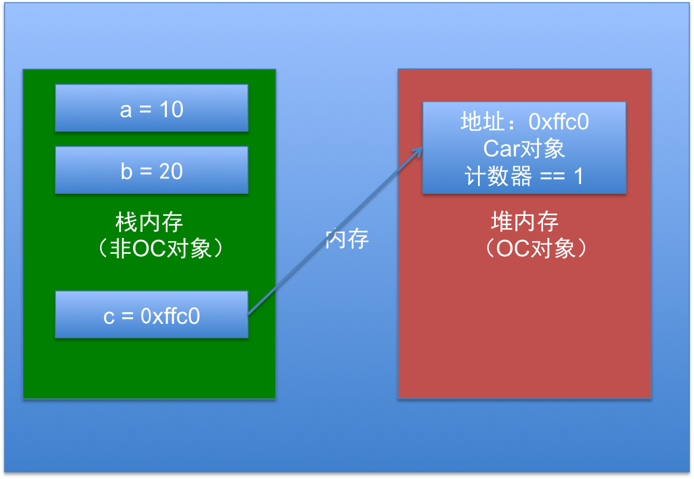

# 内存管理简介
##本小节知识点:
1. 【了解】内存管理的重要性
2. 【理解】什么是内存管理
3. 【掌握】堆和栈

---

##1.内存管理的重要性
- 移动设备的内存极其有限，每个app所能占用的内存是有限制的

- 下列行为都会增加一个app的内存占用
    + 创建一个OC对象
    + 定义一个变量
    + 调用一个函数或者方法

- 当app所占用的内存较多时，系统会发出内存警告，这时得回收一些不需要再使用的内存空间。比如回收一些不需要使用的对象、变量等

- 如果app占用内存过大, 系统可能会强制关闭app, 造成闪退现象, 影响用户体验

---

##2.什么是内存管理
- 如何回收那些不需要再使用的对象?
    + 那就得学会OC的内存管理

- 所谓内存管理, 就是对内存进行管理, 涉及的操作有:
    + 分配内存 : 比如创建一个对象, 会增加内存占用
    + 清除内存 : 比如销毁一个对象, 能减小内存占用

- 内存管理的管理范围
    + 任何继承了NSObject的对象
    + 对其他非对象类型无效(int、char、float、double、struct、enum等 )

- 只有OC对象才需要进行内存管理的本质原因
    + OC对象存放于堆里面
    + 非OC对象一般放在栈里面(栈内存会被系统自动回收)

---

##3.堆和栈
- 栈（操作系统）：由操作系统自动分配释放，存放函数的参数值，局部变量的值等。其操作方式类似于数据结构中的栈(先进后出)；

- 堆（操作系统）：一般由程序员分配释放，若程序员不释放，程序结束时可能由OS回收，分配方式类似于链表。

- 示例:

```objc

int main(int argc, const char * argv[])
{
    @autoreleasepool {
        int a = 10; // 栈
        int b = 20; // 栈
        // p : 栈
        // Person对象(计数器==1) : 堆
        Person *p = [[Person alloc] init];
    }
    // 经过上一行代码后, 栈里面的变量a\b\c都会被回收
    // 但是堆里面的Person对象还会留在内存中,因为它是计数器依然是1
    return 0;
}

```



[>>更多关于堆栈信息](http://baike.baidu.com/link?url=VJz-vKfY_ASVHCB17nWR_uQ4Adhuasl2WOrW4O7ZgFdgq5Tl_kBGfUYzbNSzkSBkHAbAH8qzfDpl5Wm4rxQ1Ka)


