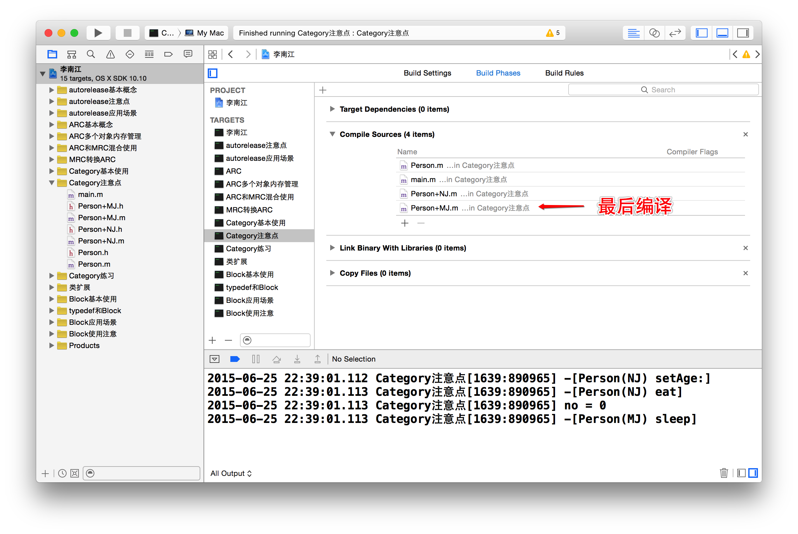

# Category注意事项
##本小节知识点:
1. 【理解】分类的使用注意事项
2. 【理解】分类的编译的顺序

---

##1.分类的使用注意事项
- 分类只能增加方法, 不能增加成员变量

```objc
@interface Person (NJ)
{
//    错误写法
//    int _age;
}
- (void)eat;
@end
```

- 分类中写property只会生成方法声明

```objc
@interface Person (NJ)
// 只会生成getter/setter方法的声明, 不会生成实现和私有成员变量
@property (nonatomic, assign) int age;
@end
```

- 分类可以访问原来类中的成员变量

```objc
@interface Person : NSObject
{
    int _no;
}
@end

@implementation Person (NJ)
- (void)say
{
    NSLog(@"%s", __func__);
    // 可以访问原有类中得成员变量
    NSLog(@"no = %i", _no);
}
@end

```

- 如果分类和原来类出现同名的方法, 优先调用分类中的方法, 原来类中的方法会被忽略

```objc
@implementation Person

- (void)sleep
{
    NSLog(@"%s", __func__);
}
@end

@implementation Person (NJ)
- (void)sleep
{
    NSLog(@"%s", __func__);
}
@end

int main(int argc, const char * argv[]) {
    Person *p = [[Person alloc] init];
    [p sleep];
    return 0;
}

输出结果:
-[Person(NJ) sleep]

```
---

##2.分类的编译的顺序
- 多个分类中有同名方法,则执行最后编译的文件方法(注意开发中千万不要这么干)

```objc
@implementation Person

- (void)sleep
{
    NSLog(@"%s", __func__);
}
@end

@implementation Person (NJ)
- (void)sleep
{
    NSLog(@"%s", __func__);
}
@end

@implementation Person (MJ)
- (void)sleep
{
    NSLog(@"%s", __func__);
}
@end

int main(int argc, const char * argv[]) {
    Person *p = [[Person alloc] init];
    [p sleep];
    return 0;
}

输出结果:
-[Person(MJ) sleep]
```




- 方法调用的优先级(从高到低)
    + 分类(最后参与编译的分类优先)
    + 原来类
    + 父类

---


