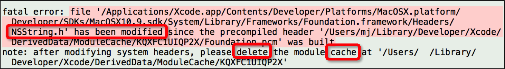

# Foundation框架介绍
##本小节知识点:
1. 【了解】Foundation框架介绍
2. 【掌握】Foundation框架常见错误

---

##1.Foundation框架介绍
- 什么是框架?
    + 众多功能\API的集合
    + 框架是由许多类、方法、函数、文档按照一定的逻辑组织起来的集合,以便使研发程序变得更容易,在OS X下的Mac操作系统中大约有80个框架,为所有程序开发奠定基础的框架称为Foundation 框架

- Foundation框架的作用
    + Foundation框架是Mac\iOS中其他框架的基础
    + Foundation框架包含了很多开发中常用的数据类型:
        * 结构体
        * 枚举
        * 类

- 如何使用Foundation框架
    + Foundation框架中大约有125个可用的头文件,作为一个简单的形式,可以简单地使用以下语句导入#import<Foundation/Foundation.h>因为Foundation.h文件实际上导入其他所有Foundation框架中的头文件

- Foundation框架中的类
    + Foundation框架允许使用一些基本对象,如数字和字符串,以及一些对象集合,如数组,字典和集合,其他功能包括处理日期和时间、内存管理、处理文件系统、存储(或归档)对象、处理几何数据结构(如点和长方形)
    + Foundation框架提供了非常多好用的类, 比如
```objc
NSString : 字符串
NSArray : 数组
NSDictionary : 字典
NSDate : 日期
NSData : 数据
NSNumber : 数字
```

- Foundation框架中的类都是以NS为前缀(Next Step的缩写)
    + 乔布斯于1976年创立苹果公司
    + 乔布斯于1985年离开苹果公司, 创立NeXT公司, 开发了Next Step操作系统
    + 在开发Next Step操作系统过程中产生了Foundation框架
    + 1997年, 苹果公司收购NeXT公司,   乔布斯重返苹果公司(Mac系统就是基于Next Step系统)
    + 2007年, 苹果公司发布了iOS系统(iOS系统基于Mac系统)

---

##2.Foundation框架常见错误
- 有时候会在不经意之间修改了系统自带的头文件, 比如NSString.h, 这时会出现以下错误:



- 解决方案很简单, 只需要删除Xcode的缓存即可
    + 缓存路径是/Users/用户名/Library/Developer/Xcode/DerivedData(默认情况下, 这是一个隐藏文件夹)

- 要想看到上述文件夹, 必须在终端敲指令显示隐藏文件夹, 指令如下
    + 显示隐藏文件 : defaults write com.apple.finder AppleShowAllFiles –bool true
    + 隐藏隐藏文件 : defaults write com.apple.finder AppleShowAllFiles –bool false
    + (输入指令后, 一定要重新启动Finder)


---


