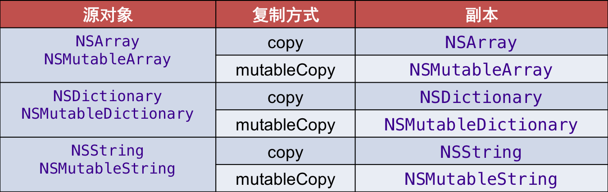

# Copy

---

##本小节知识点:
1. 【理解】copy基本概念c
2. 【理解】copy的使用
2. 【理解】copy快速入门

---

##1.copy基本概念
- 什么是copy
    + Copy的字面意思是“复制”、“拷贝”，是一个产生副本的过程

- 常见的复制有：文件复制
    + 作用：利用一个源文件产生一个副本文件
- 特点：
    + 修改源文件的内容，不会影响副本文件
    + 修改副本文件的内容，不会影响源文件

- OC中的copy
    + 作用：利用一个源对象产生一个副本对象
- 特点：
    + 修改源对象的属性和行为，不会影响副本对象
    + 修改副本对象的属性和行为，不会影响源对象


---

##2.Copy的使用
- 如何使用copy功能
    + 一个对象可以调用copy或mutableCopy方法来创建一个副本对象
    + copy : 创建的是不可变副本(如NSString、NSArray、NSDictionary)
    + mutableCopy : 创建的是可变副本(如NSMutableString、NSMutableArray、NSMutableDictionary)

- 使用copy功能的前提
    + copy : 需要遵守NSCopying协议，实现copyWithZone:方法

```objc
@protocol NSCopying
- (id)copyWithZone:(NSZone *)zone;
@end
```

- 使用mutableCopy的前提
    + 需要遵守NSMutableCopying协议，实现mutableCopyWithZone:方法

```objc
@protocol NSMutableCopying
- (id)mutableCopyWithZone:(NSZone *)zone;
@end
```

---

##2.深复制和浅复制
- 浅复制（浅拷贝，指针拷贝，shallow copy）
    + 源对象和副本对象是同一个对象
    + 源对象（副本对象）引用计数器+1,相当于做一次retain操作
    + 本质是：没有产生新的对象

```objc
    NSString *srcStr = @"cdh";
    NSString *copyStr = [srcStr copy];
    NSLog(@"src = %p, copy = %p", srcStr, copyStr);
```

- 深复制（深拷贝，内容拷贝，deep copy）
    + 源对象和副本对象是不同的两个对象
    + 源对象引用计数器不变,副本对象计数器为1（因为是新产生的）
    + 本质是：产生了新的对象

```objc
    NSString *srcStr = @"cdh";
    NSMutableString *copyStr = [srcStr mutableCopy];
    NSLog(@"src = %p, copy = %p", srcStr, copyStr);
    NSLog(@"src = %@, copy = %@", srcStr, copyStr);
    [copyStr appendString:@" cool"];
    NSLog(@"src = %@, copy = %@", srcStr, copyStr);
```

```objc
    NSMutableString *srcStr = [NSMutableString stringWithFormat:@"cdh"];
    NSString *copyStr = [srcStr copy];
    [srcStr appendString:@" cool"];
    NSLog(@"src = %p, copy = %p", srcStr, copyStr);
    NSLog(@"src = %@, copy = %@", srcStr, copyStr);
```

```objc
    NSMutableString *srcStr = [NSMutableString stringWithFormat:@"cdh"];
    NSMutableString *copyStr = [srcStr mutableCopy];
    [srcStr appendString:@" cool"];
    [copyStr appendString:@" 520it"];
    NSLog(@"src = %p, copy = %p", srcStr, copyStr);
    NSLog(@"src = %@, copy = %@", srcStr, copyStr);
```

- 只有源对象和副本对象都不可变时，才是浅复制，其它都是深复制




---


