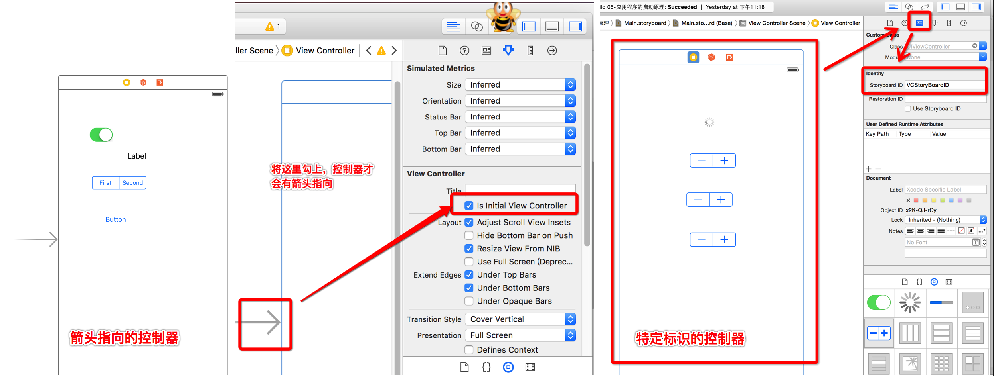

# 从StoryBoard加载控制器

- **1.创建窗口**

  ```objc
  self.window = [[UIWindow alloc] initWithFrame:[UIScreen mainScreen].bounds];
  ```

- **2.使用纯代码加载指定的 StoryBoard**
    - 先将info.plist文件中的Key : Main storyboard file base name对应的Value :Main删除

  ```objc
  UIStoryboard *storyBoard = [UIStoryboard storyboardWithName:@"Main" bundle:nil];
  //    UIStoryboard *storyBoard = [UIStoryboard storyboardWithName:@"MyStoryBoard" bundle:nil];
  ```

- **3. 从 storyboard 中加载指定的控制器**
    - **3.1 加载箭头所指向的控制器.**

  ```objc
  UIViewController *vc = [storyBoard instantiateInitialViewController];
  ```

    - **3.2 加载指定标识的控制器.**

  ```objc
  UIViewController *vc = [storyBoard instantiateViewControllerWithIdentifier:@"VCStoryBoardID"];
  ```
  
  
  
- **4.设置窗口根控制器**

  ```objc
  self.window.rootViewController = vc;
  ```
  
- **5.显示窗口**

  ```objc
  [self.window makeKeyAndVisible];
  ```
  


