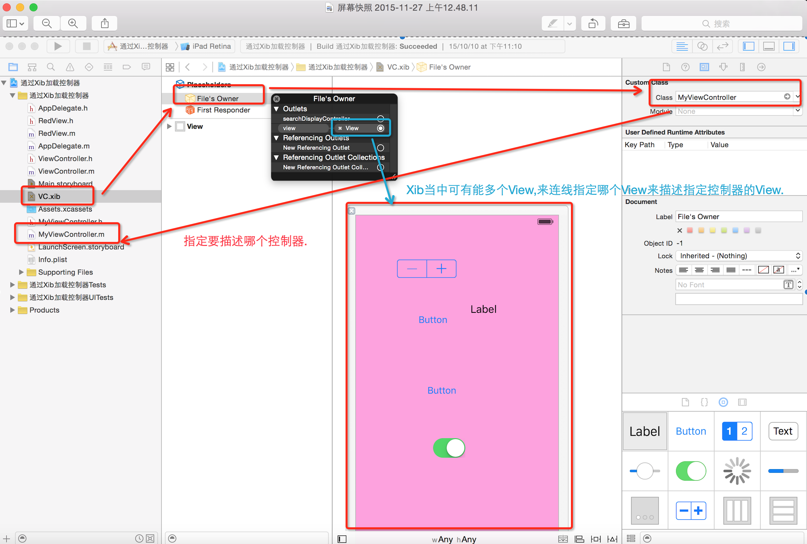

# 通过Xib加载控制器的View
<br/>

- **通过 xib 加载控制器view的流程**
    - 一、先将 info.plist 文件中的 Key : Main storyboard file base name 对应的 Value :Main 删除
    - 在 UIApplication 的加载完毕时会调用的代理方法`- (BOOL)application:didFinishLaunchingWithOptions:`中创建窗口/创建控制器, 
    - 同时在创建控制器的时候指定控制器的 view 是通过加载 xib 文件中的 view
    - 给窗口设置根控制器, 并显示窗口

  ```objc
  // 1.创建窗口
  self.window = [[UIWindow alloc] initWithFrame:[UIScreen mainScreen].bounds];

  // 2.设置窗口的根控制器.
  // 2.1从Xib当中加载控制器.
  //    MyViewController 这个自定控制器类
  MyViewController *vc =  [[MyViewController alloc] initWithNibName:@"VC" bundle:nil];
  //MyViewController *vc =  [[MyViewController alloc] initWithNibName:nil bundle:nil];
  //控制器的init方法会调用initWithNibName:方法.
  //MyViewController *vc =  [[MyViewControlleralloc] init];
  // 2.3设置窗口的根控制器
  self.window.rootViewController = vc;

  3.显示窗口
  [self.window makeKeyAndVisible];
  ```

<br/>

- **其中通过 xib 描述控制器的 view时, 在 xib 中做两件事**
    - 第一步，告诉 xib，描述的是哪个控制器
    - 第二步，告诉 xib 使用其中哪个 View 来描述控制器的 view
    <br/><br/>

  

<br/>

- **使用initWithNibName: 方法加载控制器的 View：**
    - 1.如果指定了名称,那么它就会加载指定名称的xib
    - 2.如果没有指定名称为nil,那么它会默认去加载跟它同名的Xib(RootViewController.xib)
    - 3.如果没有跟它跟同名的xib,那么它还会去加载跟它相同名称去掉Controller的Xib(RootView.xib)
    - 4.如果以上三种都没有则会创建一个空白（透明色）的 View 作为控制器的 View
<br/><br/>

  

<br/>

- **注意： 在 Xcode 7.0 以前这个优先级顺序是不一样的：（同Xcode7.0 之后中的2和3 顺序调换）**
    - 1.如果指定了名称,那么它就会加载指定名称的xib
    - 2.如果没有跟它跟同名的xib,那么它还会去加载跟它相同名称去掉Controller的Xib(RootView.xib)
    - 3.如果没有指定名称为nil,那么它会默认去加载跟它同名的Xib(RootViewController.xib)
    - 4.如果以上三种都没有则会创建一个空白（透明色）的 View 作为控制器的 View


---
<br/>