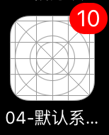
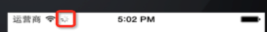
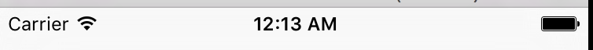
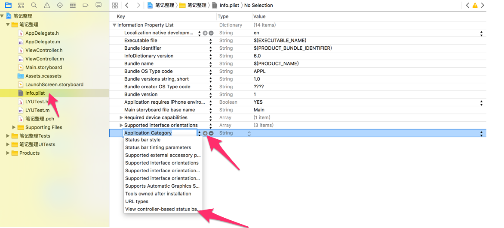
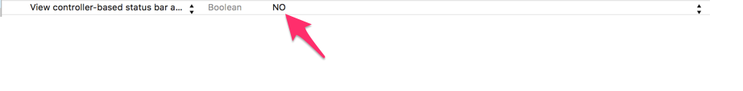

# UIApplication

<br/>
##本节知识点:
1. UIApplication 单例
2. UIApplication 功能
3. UIApplication 代理

---
<br/>

##1. UIApplication 单例

- **什么是UIApplication?**
    - UIApplication对象是应用程序的象征.
    - 每一个应用都有自己的UIApplication对象,这个对象是系统自动帮我们创建的, 它是一个单例对象.
    - 一个iOS程序启动后创建的第一个对象就是UIApplication对象
    - 我们只能通过[UIApplication sharedApplication]获得这个单例对象,不能够手动去创建它.
    - **注意**：也就是如果使用 alloc/init 创建的话程序是运行不起来。


- **UIApplication作用?**
    - 利用UIApplication对象，能进行一些应用级别的操作.
    - 可以设置应用程序图标右上角的红色提醒数字
    - 设置联网指示器的可见性
    - 可以设置应用程序的状态栏
    - 进行应用之间的跳转.

  ```objc
  // 注意点1:一般以share开头的方法都是创建一个单例,也就是说app和app1的内存地址是一样的
  UIApplication * app = [UIApplication sharedApplication];
  UIApplication * app1 = [UIApplication sharedApplication];

  //注意点2:单例不能通过alloc和init来创建,报错如下:
  //reason: 'There can only be one UIApplication instance.'
  ```

- **简单模仿UIApplication单例**
    - 要求:程序一启动就创建创建对象.
    - 创建的对象只能通过share的方式获取对象.
    - 不能够进行alloc 操作,当执行alloc时, 程序发生崩溃
    - 自定义单例(单例的步骤是怎么实现的):
        - 1.程序一启动的时候就创建对象.当类被加载到内存的时候就会调用load的方法,它会比main优先调用
        - 2.保证调用alloc时会产生异常.重写系统的是alloc方法
        - 3.提供创建单例的方法.通过share方式获取对象

    - **注意: **这里只是简单说明单例模式详细内容见后面<<单例模式>>的介绍

  ```objc
  //1.程序一启动的时候就创建对象.
  //当类被加载到内存的时候就会调用load的方法,它会比main优先调用
  static Persion *_instance;

  +(void)load{  //第一步:程序一启动就创建一个对象(load方法的调用时间点为:该类被加载到内存时调用)
       // 想要保存创建的对象, 要用成员属性,但是现在是类方法, 没有办法访问成员属性.
       // 所以搞了一个static的静态变量进行保存
       // 创建对象
       _instance = [[self alloc] init];
  }
  ```
  ```objc
  //2.保证调用alloc时会产生异常.
  //重写系统的是alloc方法
  +(instancetype)alloc{
      // 当调用alloc方法时,先查看一下_instance有没有值,如果已经有值的话,直接抛出异常.
      if(_instance){
          NSException *exception = [NSException exceptionWithName:
          @"NSInternalInconsistencyException"
          reason:
          @"There can only be one Persion instance." userInfo:nil];
          // 抛出异常
          [exception raise];
      }
      // 保持系统的做法：如果没有值则调用父类方法床架一个对象.
      return [super alloc];
  }
  ```
  ```objc
  //3.通过share方式获取对象
  +(instancetype)sharePersion{
       return _instance
  }
  ```


---
<br/>
##2. UIApplication 功能

- **设置应用提醒数字**

    
    
  ```objc
  // 获取UIApplication对象
  UIApplication *ap = [UIApplication sharedApplication];
  // 在设置之前, 要注册一个通知,从ios8之后,都要先注册一个通知对象.才能够接收到提醒.
  UIUserNotificationSettings *notice = [UIUserNotificationSettings  settingsForTypes:UIUserNotificationTypeBadge categories:nil];
  // 注册通知对象
  [ap registerUserNotificationSettings:notice];
  // 设置提醒数字
  ap.applicationIconBadgeNumber = 10;
  ```

- **设置连网状态**

  

  ```objc
  ap.networkActivityIndicatorVisible = YES;  //小菊花会转
  ```


- **设置状态栏**
    
    - 应用程序的状态栏,默认是交给控制器来管理的.
    - 控制器提供的方法,可以直接重写这个方法
    - **在控制器当中设置状态栏样式**

  ```objc
  -(UIStatusBarStyle)preferredStatusBarStyle{
      // 状态栏默认是显示的字体是黑色，现在变为白色
      return UIStatusBarStyleLightContent;  
  }
  ```
  ```objc
  //返回NO时为不隐藏
  //返回YES时为显示
  -(BOOL)prefersStatusBarHidden{
      return NO; // 不隐藏
  }
  ```

    - **通过UIApplication来管理状态**

  ```objc
  //1.获取UIApplication
  UIApplication *ap = [UIApplication sharedApplication];
  //2.设置状态栏样式.
  ap.statusBarStyle = UIStatusBarStyleLightContent;
  //3.设置状态的隐藏
  ap.statusBarHidden = YES;
  ```

    - **注意: 想要让应用程序管理状态栏, 不需要在info.plist当中进行配置**
        - 添加一个key值:是最后一个,View controller-based status bar appearance
        - 设置为NO.就是应用程序来管理了.
        - 同时要禁止系统管理状态栏,操作如下:

  
  


- **跳转网页**

  ```objc
  UIApplication *ap = [UIApplication sharedApplication];
  //URL:协议头://域名
  //应用程序通过协议头的类型,去打开相应的软件.
  NSURL *url =[NSURL URLWithString:@"http://www.520it.com"];
  [ap openURL:url];

  //打电话
  [application openURL:[NSURL URLWithString:@"tel://10086"]];
  //发短信
  [app openURL:[NSURL URLWithString:@"sms://10086"]];
  ```

---
<br/>
##3. UIApplication 代理


>所有的移动操作系统都有个致命的缺点：app很容易受到打扰。  
>比如一个来电或者锁屏会导致app进入后台甚至被终止  
>还有很多其它类似的情况会导致app受到干扰，在app受到干扰时，会产生一些系统事件，这时UIApplication会通知它的delegate对象，让delegate代理来处理这些系统事件

- **delegate可处理的事件包括：**
    - 应用程序的生命周期事件(如程序启动和关闭)
    - 系统事件(如来电)
    - 内存警告
    - ...


- **UIApplication会在程序一启动时候创建一个遵守UIApplicationDelegate代理.**
    - 这个就是我们程序一创建时的AppDelegate类.AppDelegate就是遵守了UIApplicationDelegate协议.
    - 在这个类中定义很多监听系统事件的方法.同时也定义了一些应用程序的生命周期方法.


- **主要的代理方法有**:
    - 应用程序的生命周期

  ```objc
  //应用程序启动完成的时候调用
  - (BOOL)application:(UIApplication *)application didFinishLaunchingWithOptions:(NSDictionary *)launchOptions {
      NSLog(@"%s",__func__);
      return YES;
  }
  ```
  ```objc
  //当我们应用程序即将失去焦点的时候调用
  - (void)applicationWillResignActive:(UIApplication *)application {
      NSLog(@"%s",__func__);
  }
  ```
  ```objc
  //当我们应用程序完全进入后台的时候调用
  - (void)applicationDidEnterBackground:(UIApplication *)application{
      NSLog(@"%s",__func__);
  }
  ```
  ```objc
  //当我们应用程序即将进入前台的时候调用
  - (void)applicationWillEnterForeground:(UIApplication *)application {
      NSLog(@"%s",__func__);
  }
  ```
  ```objc
  //当我们应用程序完全获取焦点的时候调用
  //只有当一个应用程序完全获取到焦点,才能与用户交互.
  - (void)applicationDidBecomeActive:(UIApplication *)application {
      NSLog(@"%s",__func__);
  }
  ```
  ```objc
  //当我们应用程序即将关闭的时候调用
  - (void)applicationWillTerminate:(UIApplication *)application {
      NSLog(@"%s",__func__);
  }
  ```


---
<br/>

