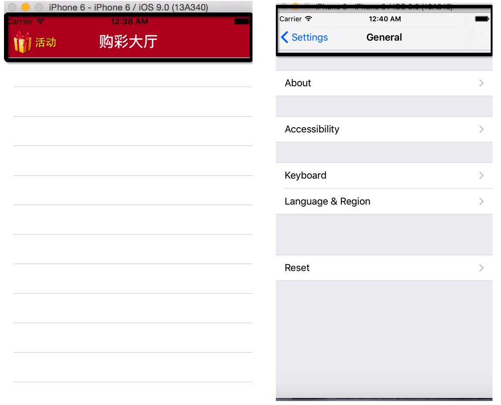
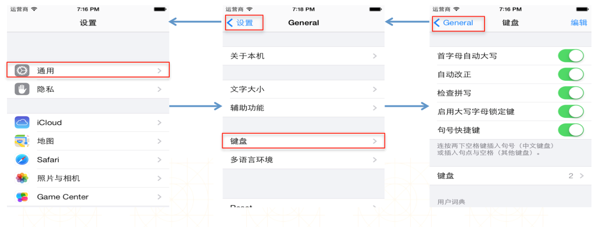
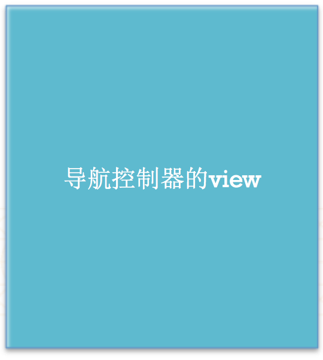
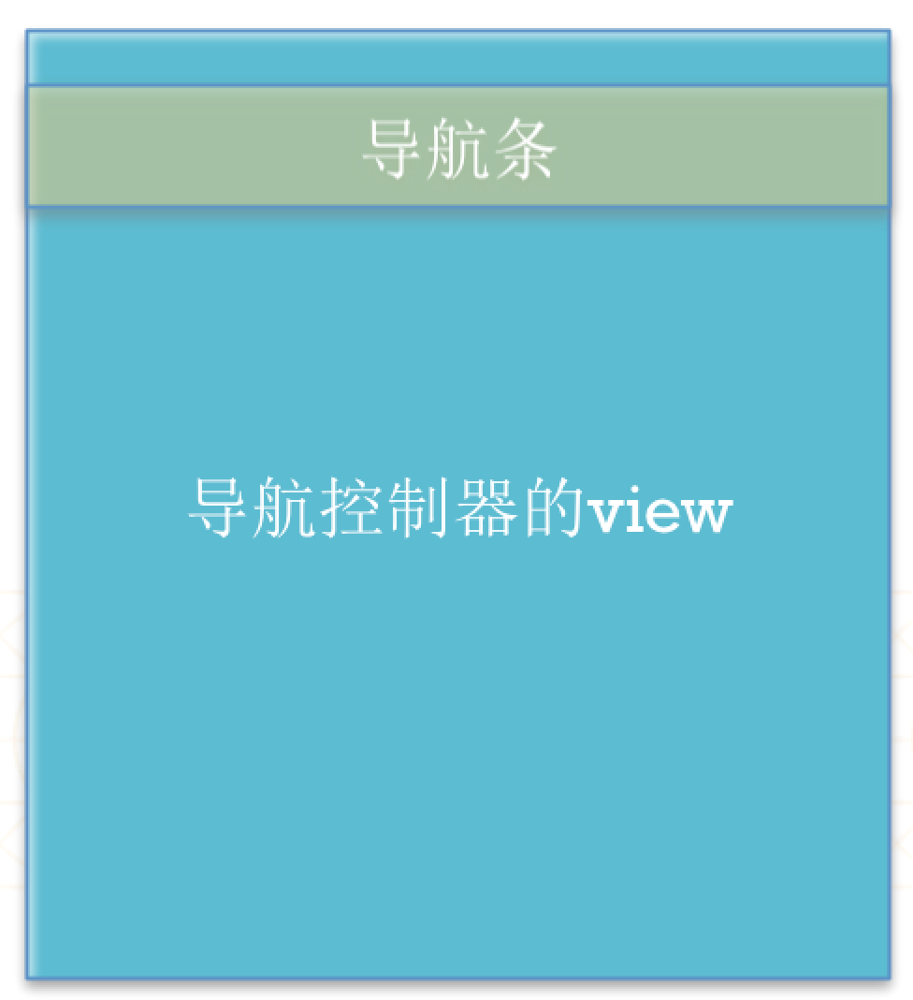
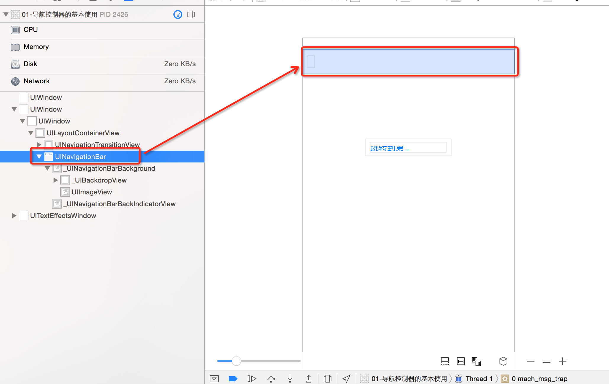
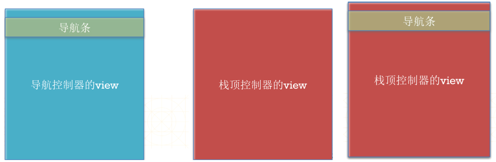
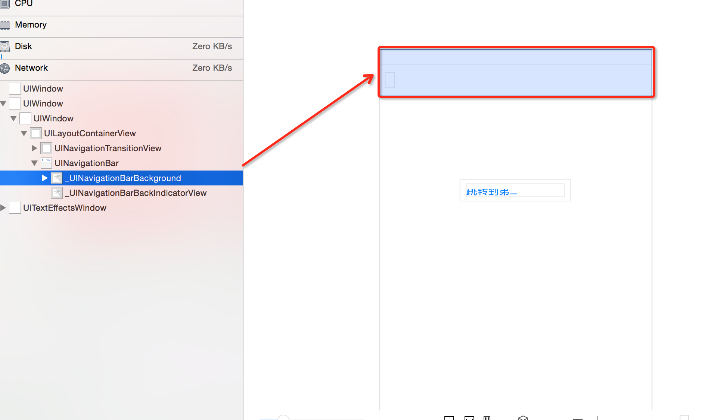

# UINavigationController
<br/>
##本节知识点
1. 导航控制器简介
2. 导航控制器View的结构
3. 导航控制器的使用
4. 导航控制器管理原则
5. 设置导航条内容

---
<br/>
##1. 导航控制器简介
- 在ios当中提供了两个比较特殊的控制器.是专门给我们用来管理控制器用的.
- UINavigationController.
- UITabBarController.
  

- UINavigationController.(导航控制器)系统的设置界面就是一个典型的导航控制器.只要看到上部有一个条, 就是一个导航控制器.
- 在多控制器开发当中, 第一个界面都是一个控制器.导航控制器可以轻松的完成控制器之间的切换.


---
<br/>
##2. 导航控制器View的结构
  
- 导航控制器它是一个控制器,它肯定有一个自己的View.
  
  
- 导航控制器标志, 就是上面一个条.这个条, 我们叫它导航条.这个导航条它是显示到导航控制器View的上面.
- 导航条的Y值是20的位置开始显示,上面20是状态栏的2位置.导航条的高度是44.
  
  
- 导航控制器的View当中,还有一个专门存放子控制器的View.
  
  

- 导航控制器的View上面有两(个子控件)层:最外面那一层是一个导航条,导航条下面是一个存放子控制器的View.

- 导航条的Y值是20,高度是44,但是我们看到的导航条有一个半透明的效果,它是从0位置开始的.
- 它其实是导航条内部的一个子控件,它超过了导航条的高度,子控件超过父控件也是能够显示的.
  
  
---
<br/>
##3. 导航控制器的使用
- 如果程序一进入时,就要让窗口的根控制器是一个导航控制器.
    1. 新建窗口
    2. 创建导航控制器.并设置导航控制器的根控制器
    3. 把导航控制器设为窗口的根控制器.
    4. 显示窗口.


  ```objc
  //1.创建窗口
  self.window = [[UIWindow alloc] initWithFrame:[UIScreen mainScreen].bounds];
  //2.设置窗口根控制器.
  //设置导航控制器为窗口的根控制器
  //给导航控制器添加子控制器(作为导航控制器的根控制器).
  RootViewController *vc = [[RootViewController alloc] init];
  UINavigationController *nav = [[UINavigationController alloc] initWithRootViewController:vc];
  //initWithRootViewController方法底层会调用push方法.
  [nav pushViewController:vc animated:YES];
  //设置窗口根控制器.
  self.window.rootViewController = nav;
  //3.显示窗口.
  [self.window makeKeyAndVisible];
  ```

- 可以通过push方法给导航控制器添加子控制器.
    - 导航控制器会把子控制器的View添加到导航控制器专门存放子控制器的View上面.
    - 导航控制器的initWithRootViewContorller:设置导航控制器的根控制器.
    - 它其实底层调用的就是导航控制器的push方法,把传入的控制器子,添加为导航控制器的子控制器.

- **注意:导航控制器有且仅有一个根控制器.**
    - 导航控制器的根控制器.就是导航控制器的子控制器.
    - 导航控制器当中有一个childsViewControllers数组,数组当中存放的都是导航控制器的子控制器.

  ```objc
  - (void)pushViewController:(UIViewController *)viewController animated:(BOOL)animated;
  ```

- 在每一个控制器当中都能拿到它当前所在的导航控制器.因为当前的控制器是导航控制器的子控制器.

  ```objc
   TwoViewController *twoVC = [[TwoViewController alloc] init];
   [self.navigationController pushViewController:twoVC animated:YES];
  ```

- 导航控制器是以栈的形式管理子控制器的,也就是一个数组.
- 里面有两个一个是ViewControllers和ChildViewControllers两个, 都是数组, 保存的都是导航控制器的子控制器.
- 使用push方法就是把某个控制器压入到栈当中.
- 使用pop方法可以移除控制器.


- 将栈顶的控制器移除

  ```objc
  - (UIViewController *)popViewControllerAnimated:(BOOL)animated;
  ```

- 回到指定的子控制器
    - 指定的控制器必须是导航控制器栈里面的控制器.

  ```objc
  - (NSArray *)popToViewController:(UIViewController *)viewController animated:(BOOL)animated;
  ```

- 回到根控制器（栈底控制器）

  ```objc
  - (NSArray *)popToRootViewControllerAnimated:(BOOL)animated;
  ```

---
<br/>
##4. 导航控制器管理原则

- **说明**:
   - 当设置导航控制器的根控制器时,也就是initWithRootViewController,
       - 它底层其实是调用了导航控制器的push方法.把该控制器添加为导航控制器的子控制器.
       - 并且它会把该控制器的View添加到导航控制器专门存放子控制器的View上面.
   - 把导航控制器设为窗口的根控制器时,它就会把导航控制器的View添加到窗口的View上面.
       - 所以程序一运行时, 我们看到的就是一个导航控制器的View.
       - 导航控制器的View内部默认有两个子view.一个是导航条, 一个是转专存放子控制器的View.
       - 现在专门存放子控制器的View里面存放的就是导航控制器根控制器的View.
   - 导航控制器的子控制器都是存放到一个栈中.也就是一个数组当中.
       - 当调用导航控制器的push方法时, 就会把一个控制器压入到导航控制器的栈中.
       - 那么刚压入栈中的这个导航控制器就在栈的最顶部.
       - 它就会把原来导航控制器View当中存放的子控制器View的内容移除,
       - 然后把导航控制器栈顶控制器的View添加到导航控制器专门存放子控制器View当中.


- **注意**:
    - 只是把控制器的View从导航控制器存放子控制器的View当中移除,并没有把控制器从栈中移除.所以上一个控制器还在.
    - 当调用pop当方法时, 就会把导航控制器存放子控制器View当中控制器的View移除,并且会把该控制器从栈里面移除.
    - 此时该控制器就会被销毁.接着它就会把上一个控制器的View添加到导航控制器专门存放子控制器的View当中.


         
           
    
---
<br/>
##5. 设置导航条内容
- 设置导航条的内容,由栈顶控制器的NavgationItem决定.
    - 导航控制器必须要有根控制器.目的设置导航条的内容.
    - 如果设置了导航条的标题, 那么下一个push的子控制器的返回按钮就是上一个控制器的标题.


- UINavigationItem有以下属性影响着导航栏的内容

```objc
//左上角的返回按钮
@property(nonatomic,retain) UIBarButtonItem *backBarButtonItem;

//中间的标题视图
@property(nonatomic,retain) UIView *titleView;

//中间的标题文字
@property(nonatomic,copy)   NSString  *title;

//左上角的视图
@property(nonatomic,retain) UIBarButtonItem *leftBarButtonItem;

//右上角的视图
@property(nonatomic,retain) UIBarButtonItem *rightBarButtonItem;
```

- **例如:**

```objc
//设置导航条标题
self.navigationItem.title = @"导航条标题"

//导航条上面的子控件位置由系统决定,我们自己只能决定控件的尺寸
UIView *view = [[UIView alloc] initWithFrame:CGRectMake(0, 2000, 200, 35)];
view.backgroundColor = [UIColor redColor];
//导航条的标题可以是一个自定义的UIView.
self.navigationItem.titleView = view;

//设置导航条左边的内容为标题.
/*
Title:设置的标题
style:样式,从ios7之后,这个地方设置什么都没有用了, 所以让它默认,它是一个枚举,直接可以写0.
target: action: 点击时调用哪个对象的哪个方法.
*/
UIBarButtonItem *item = [[UIBarButtonItem alloc] initWithTitle:@"返回" style:0 target:self action:@selector(back)];

//设置左边的内容为图片
/*
initWithImage:要显示的图片.
style:样式,从ios7之后,这个地方设置什么都没有用了, 所以让它默认,它是一个枚举,直接可以写0.
target: action: 点击时调用哪个对象的哪个方法.
*/
UIBarButtonItem *item1 = [[UIBarButtonItem alloc] initWithImage:image style:UIBarButtonItemStyleDone target:nil action:nil];

//显示多张图片,不同状态,用按钮
UIButton *btn = [UIButton buttonWithType:UIButtonTypeCustom];
//设置按钮正常状态下显示的图片
[btn setImage:[UIImage imageNamed:@"navigationbar_friendsearch"] forState:UIControlStateNormal];
//设置按钮高亮状态下显示的图片
[btn setImage:[UIImage imageNamed:@"navigationbar_friendsearch_highlighted"] forState:UIControlStateHighlighted];

//按钮自适应,根据当中的图片标题自动计算尺寸
[btn sizeToFit];
//让导航条左侧或者右侧显示一个UIView.
initWithCustomView:要显示的View.
UIBarButtonItem *item = [[UIBarButtonItem alloc] initWithCustomView:btn];

//可以设置左右的内容为多个Item.
self.navigationItem.rightBarButtonItems = @[item,item1,item2];
```

---
<br/>
