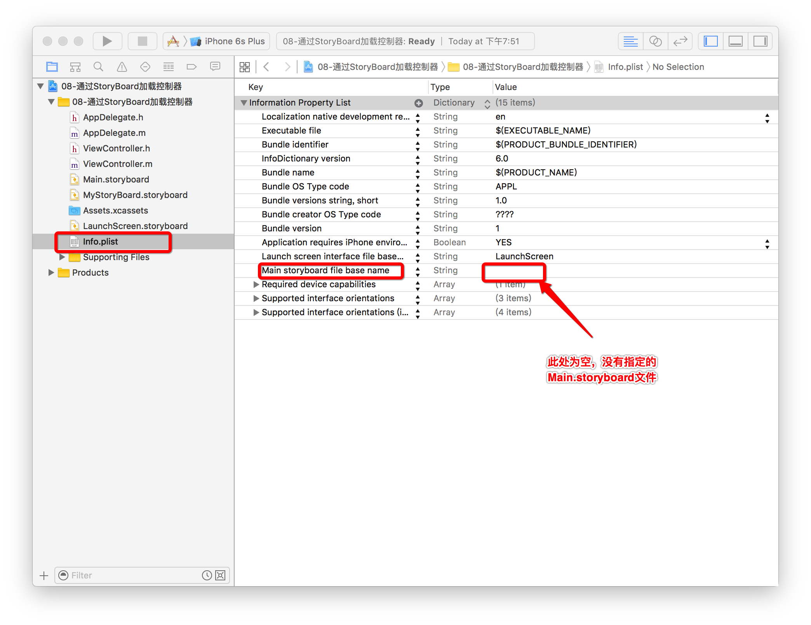

# UIWindow基本概念
<br/>
- UIWindow是一种特殊的UIView，通常在一个app中至少有一个UIWindow
- iOS程序启动完毕后，创建的第一个视图控件就是UIWindow，接着创建控制器的view，
- 再将控制器的view添加到UIWindow上，于是控制器的view就显示在屏幕上了
- 一个iOS程序之所以能显示到屏幕上，完全是因为它有UIWindow

  
  
- 加载info.plist.加载配置文件.判断一下info.plist文件当中与 key 为 Main storyboard file base name 对应的 value 是否有值, 这个值就是对应的后缀名为 .storyboard 的文件名称
    - 如果有就做以下操作: 
        - 1.创建一个窗口
        - 2.加载 这个 key 对应的 value 的 storyboard文件,,初始化一个控制器
        - 3.把初始化出来的控制器设置为窗口的根控制器.让窗口显示到屏幕上.
    - 如果没有,那么应用程序也会加载完毕.但是就不会有显示窗口
        - 这时候显示窗口就要在 UIApplication 的加载完毕时会调用的代理方法`- (BOOL)application:didFinishLaunchingWithOptions:`中创建, 同时注意要给窗口添加一个根控制器
        - 在开发当中,通常都是手动去创建窗口.

    - 下面在AppDelegate.m 文件中的 应用程序启动完成的时候调用 的方法中手动创建窗口

  ```objc
  #import "AppDelegate.h"

  @interface AppDelegate ()

  /** <#name#> */
  @property (nonatomic, strong) UIWindow  *window1;

  @end

  @implementation AppDelegate

  - (BOOL)application:(UIApplication *)application didFinishLaunchingWithOptions:(NSDictionary *)launchOptions {

      //应用程序默认情况下键盘和状态栏都是窗口

      // 1. 创建窗口
      self.window = [[UIWindow alloc]initWithFrame:[UIScreen mainScreen].bounds];

      // 2. 设置根控制器
      UIViewController *vc = [[UIViewController alloc]init];
      vc.view.backgroundColor = [UIColor blueColor];
      self.window.rootViewController = vc;

      // 3. 显示窗口
      [self.window makeKeyAndVisible];

      //iOS9之后, 如果一个应用程序手动添加多个窗口,控制器会把它的状态栏隐藏
      //（注意这里特意写了 y值为20 就是为了不把状态栏挡住，造成误解）
      // 解决办法,让应用程序管理窗口(注意要修改 info.plist 文件)
      self.window1 = [[UIWindow alloc]initWithFrame:CGRectMake(0, 20, [UIScreen mainScreen].bounds.size.width, 30)];

      UIViewController *vc1 = [[UIViewController alloc]init];
      vc1.view.backgroundColor = [UIColor greenColor];
      self.window1.rootViewController = vc1;

      [self.window1 makeKeyAndVisible];

      //在程序当中,状态栏和键盘,它都属性是一个窗口.可以通过打印的方式来验证.
      //设置window的层级.UIWindowLevelNormal它是一个CGFloat类型.
  //    self.window1.windowLevel = UIWindowLevelStatusBar;
  //    self.window.windowLevel = UIWindowLevelAlert;
      self.window.windowLevel = UIWindowLevelStatusBar;
      self.window1.windowLevel = UIWindowLevelAlert;

      //级别大小.
      //UIWindowLevelAlert > UIWindowLevelStatusBar > UIWindowLevelNormal
      // 注意：级别大的窗口在前面，即是可能将级别小的窗口挡住

      //弹出键盘
      UITextField *textF = [[UITextField alloc]init];
      [textF becomeFirstResponder];
      //要想让键盘弹出来, 就必须把UITextField添加到一个View上.
      [vc.view addSubview:textF];

      return YES;
  }

  @end
  ```

    - 其中显示窗口`[self.window makeKeyAndVisible];`的底层实现:
        - 1.让窗口成为显示状态.
        - 2.把控制器的View添加到窗口上面.
        - 3.把当前窗口设置成应用程序的主窗口

  ```objc
  // 1.让窗口成为显示状态.
  //   窗口默认是隐藏的.hidden = yes.
  //   底层做的事件就是:
  self.window.hidden = NO;

  // 2.把控制器的View添加到窗口上面.
  [self.window addSubView:rootViewController.view];
  // 3.把当前窗口设置成应用程序的主窗口
  application.keyWindow = self.window //获得应用程序的主窗口.
  ```