# 项目中常见的文件

<br/>
##本节知识点:
1. 项目中常见的文件(LaunchScreen)
2. 项目中常见的文件(info.plist)
3. 项目中常见的文件(PCH)
4. 图片尺寸大小的补充


---
<br/>
##1. 项目中常见的文件(LaunchScreen)

<br/>
###1.1 Xcode5与Xcode7的不同点:

- **frameworks:**
    - Xcode5中有frameworks,用于存放用到的框架
    - Xcode7中没有frameworks,但是Xcode7会自动导入框架


- **启动界面:**
    - Xcode5中没有启动界面(下面会说明不使用启动界面来添加启动图片的方法)
    - Xcode7中有launchScreen.storyboard(启动界面),用于保存app的启动图片


- **info.plist的命名方式:**
    - Xcode5中,配置文件是以工程名称命名的
    - Xcode7中直接以info.plist命名


- **PCH文件:**
    - Xcode5中会自动创建PCH文件,
    - Xcode7中舍弃了PCH文件


- **Xcode6拓展:**
    - Xcode6与Xcode7只有第2点不同,Xcode6中的启动界面命名为launchStoryboard.xib


- **区别图示: **
    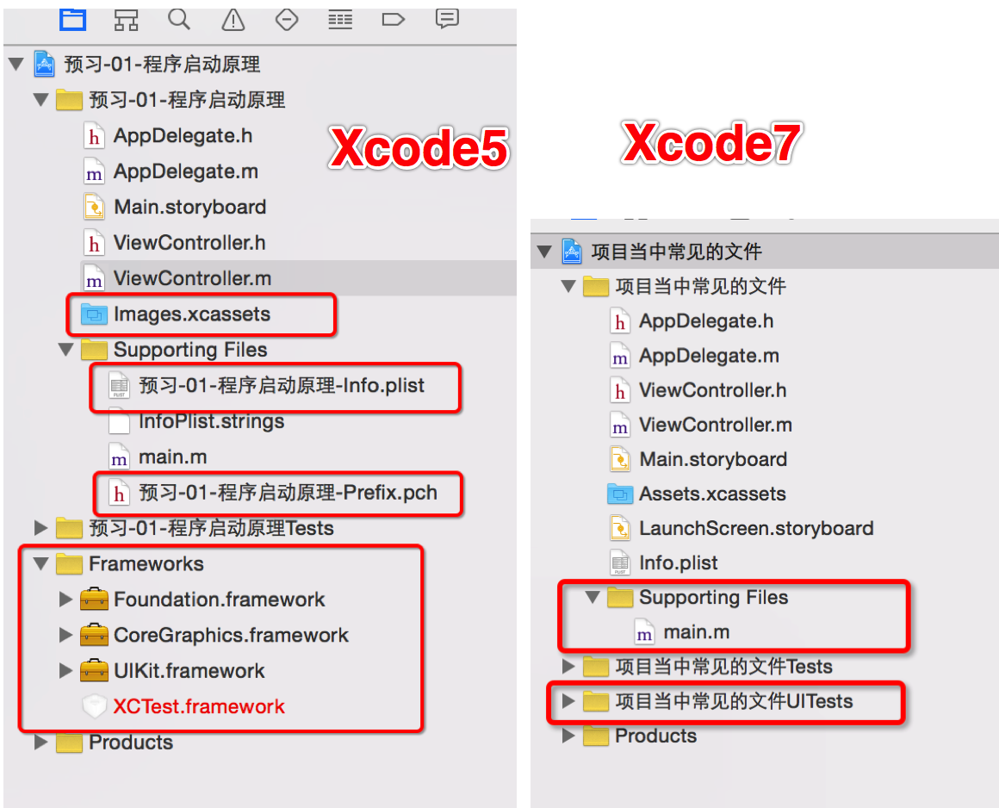


<br/>
###1.2 LaunchScreen
- **Xcode5**

    - 框架是苹果事先已经导入进去的.在项目的结构当中就能够看到导入的框架.
    - Images.xcassets 中有个LaunchImage :用来设置启动界面.


- **Xcode6**
    - 会自动导入一些觉见的框架.在项目结构当中,看不到已经导入的框架.
    - LaunchScreen.xib:用来设置启动界面.


- **Xcode7**
    - 会自动导入一些觉见的框架.在项目结构当中,看不到已经导入的框架.
    - LaunchScreen.storyBoard:用来设置启动界面.


- **LaunchScreen原理:**
    - 会自动加载LaunchScreen是因为在Target当中,指定了Launch Screen file,
    - Xcode也可以添加通过修改配置Launch Images Source  中的选项之后，在 Assets.xcassets 会出现个 Brand Assets 组将对应像素的图片添加进去（接下来的操作基本和 Xcode 5 类似）
    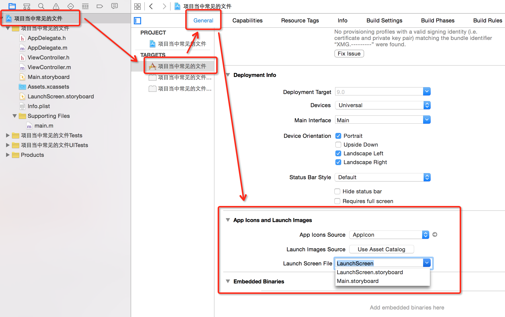

    - 可以进入沙盒当中查看LaunchScreen启动图片
        - 查看方法,找到应用程序根目录.
        - 获取方法: NSLog(@"%@",NSHomeDirectory());
        - 打印出来,后前往文件夹.找到Library->Caches->Snapshots目录下面.最后一层就是程序自动生成的图片.

    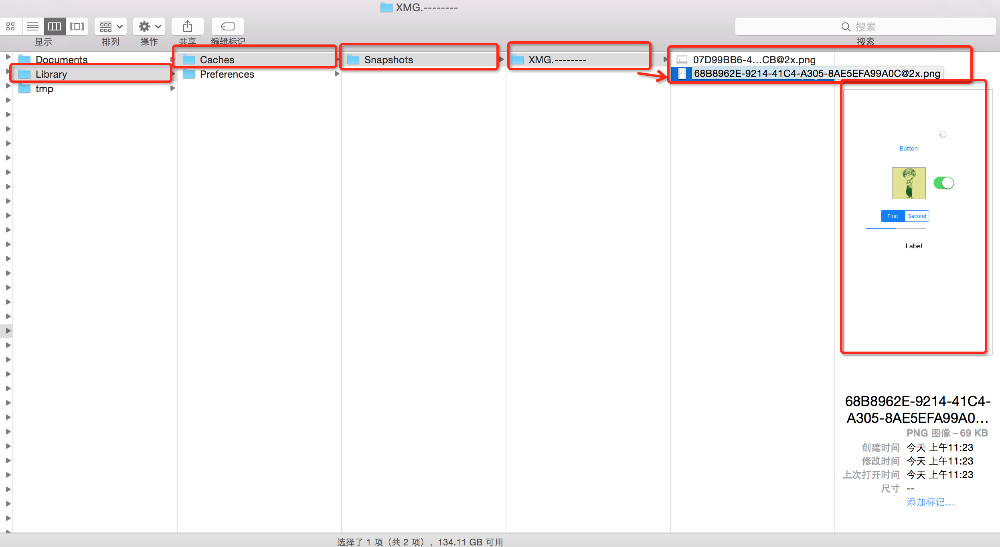

- **注意点：**
    - 如果在配置中即设置了 Launch Screen File 又设置了Launch Images Source （上面提出的更改为 Xcode5 的模式 ）则这时候系统会默认选择使用 Launch Screen File 中的（这里一般是工程创建时就有的 LaunchScreen.storyboard ）
    - 如果使用 Brand Assets 设置的话，每一个对应的图片（坑）最好都要有图片，只有相对应的图片才能适配相对应的硬件屏幕，如果屏大，图小最后导致应用软件的整个显示视图变小（如下面提到的）
    - 如果设置了启动图片为 4s 对应的尺寸的图片,没有设置6s启动图片, 然后使用6s模拟器, 则默认的尺寸大小是4s的尺寸大小.(可以打印屏幕尺寸验证.)
    - 模拟器默认的尺寸是由启动界面决定的.
    - 它的底层实现其实把LaunchScreen上的东西,生成了一张图片,然后把这张图片设为程序的启动图片.(LaunchScreen.storyboard 也可以自定义，再通用配置文件中修改 Launch Screen File 为自己自定义的 LaunchScreen.storyboard 的名称即可，如果 改为自己自定义的名称：MyLaunchScreen.storyboard)

    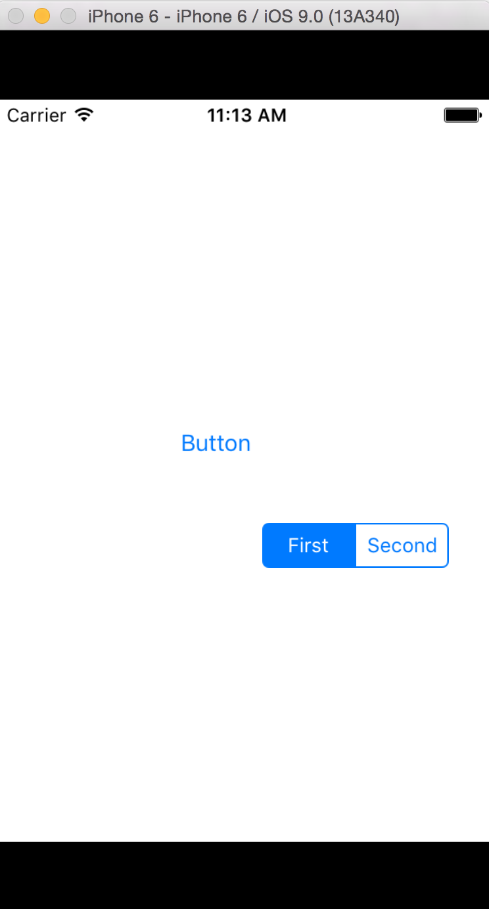


###1.3 应用程序各个图标大小
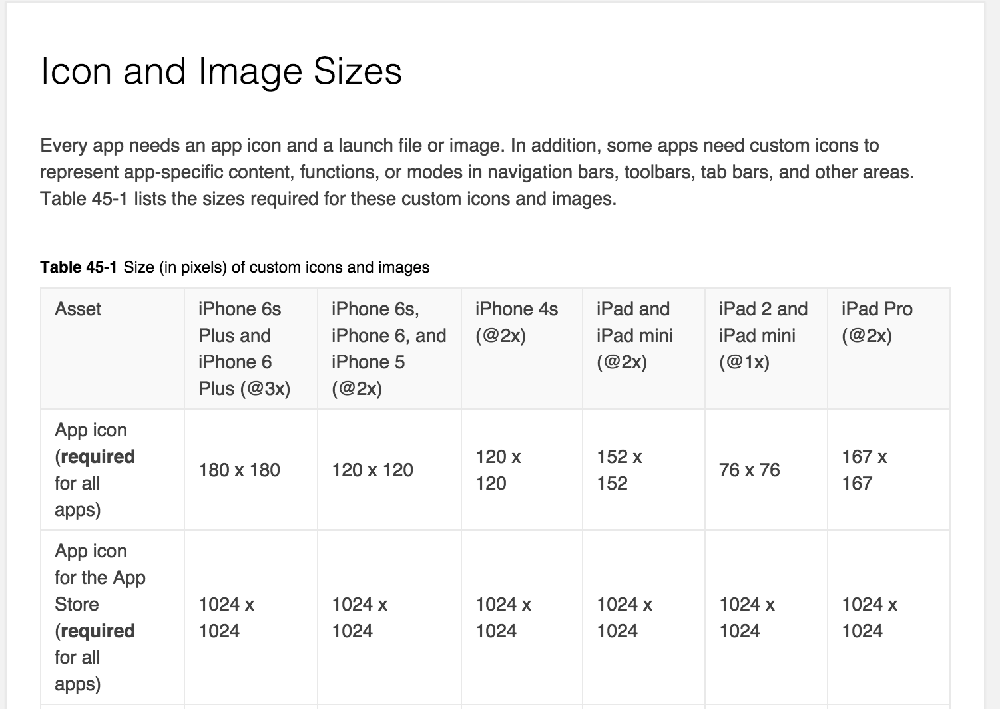
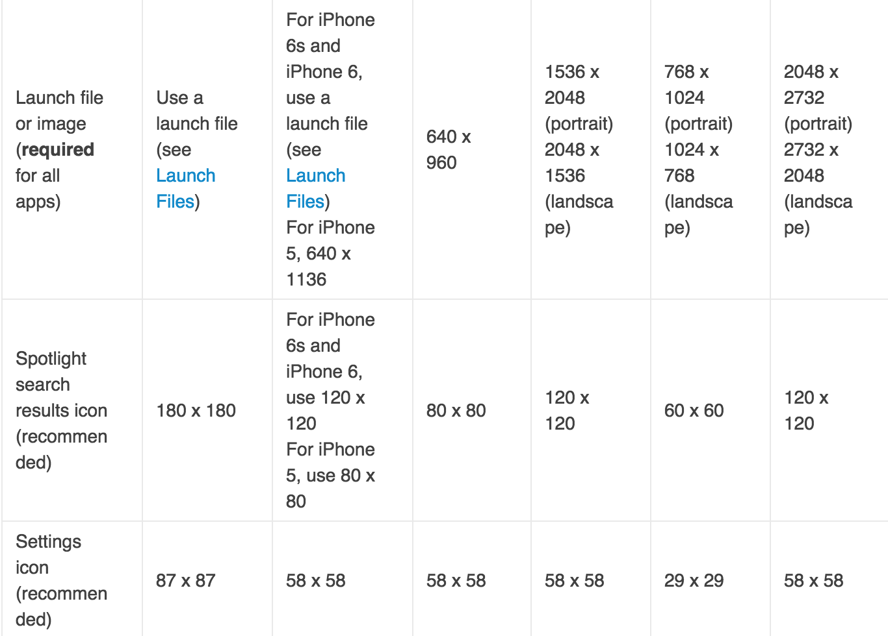
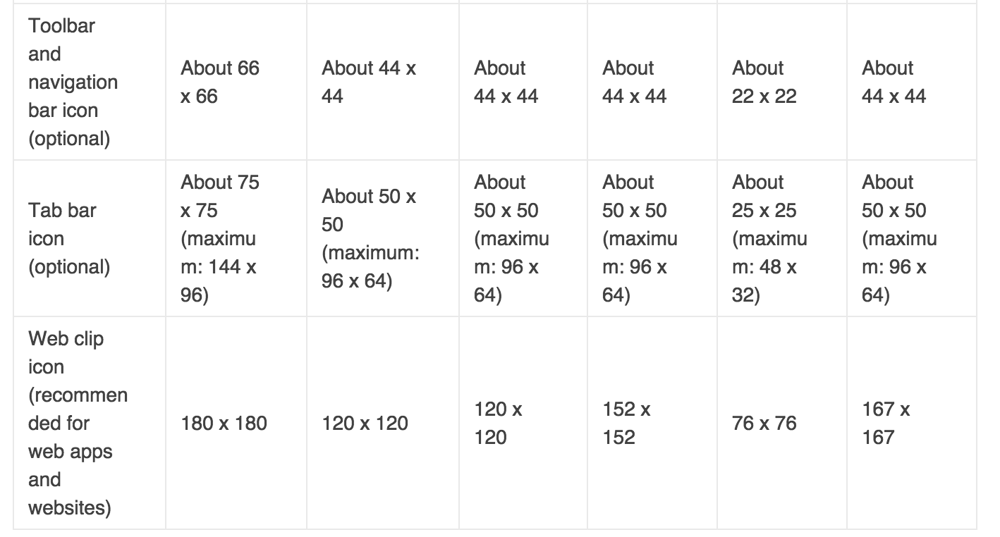


---
<br/>
##2. 项目中常见的文件(info.plist)

- Supporting file 一般都是放些资源文件,像一些plist这些等.
- xcode5当中也有info.plist,它的名字很长.是工程的名称.
- Xcode7当中直接命名为 info.plist 

- info.plist当中保存着整个应用当中基本的配置.它是一个字典.查看它的类型.

    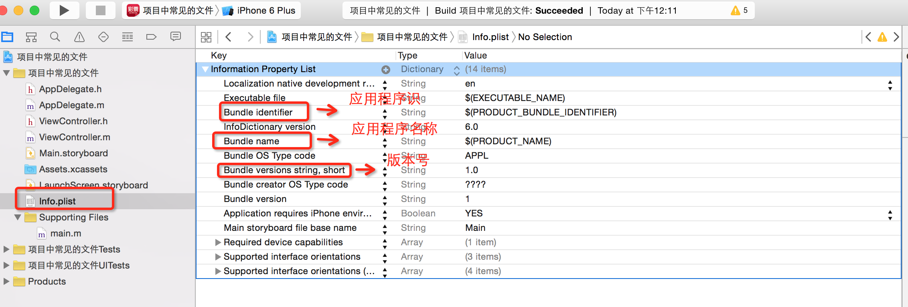

- **主要掌握四个Key**
    - **Bundle identifier**:应用程序标识符.保证应用程序的唯一性,
        - 如果两个应用同一个标识符, 那么之前的那个应用会被顶替掉.
        - 作用:上传到AppStore的时候必须得要有标识符.也就是必须得要有 Bundle identifier
    - **Bundle Name**:应用程序的名称.
    - **Bundle version string,short**:应用程序的版本.在开发当中都是迭代开发.苹果要求下一次提交的版本必须得要比上一次提交的版本要高.
    - **Bundle Version**:应用程序编译的版本, 主要用于和苹果审核打交道.


- **bundle Version与short Version的区别:**
    - 如果一个app在上传至appStore的过程中上传了5次还没有审核通过,那么bundle Version会变更了五次,而short Version仍然是当初的那个short Version


- **补充：在通用的配置文件中 要设置版本适配**
    - Deployment Target :  (这里目前一般选择7.0 以上，这样高版本可以兼容低版本)Targets对应着 info.plist.文件.
    
    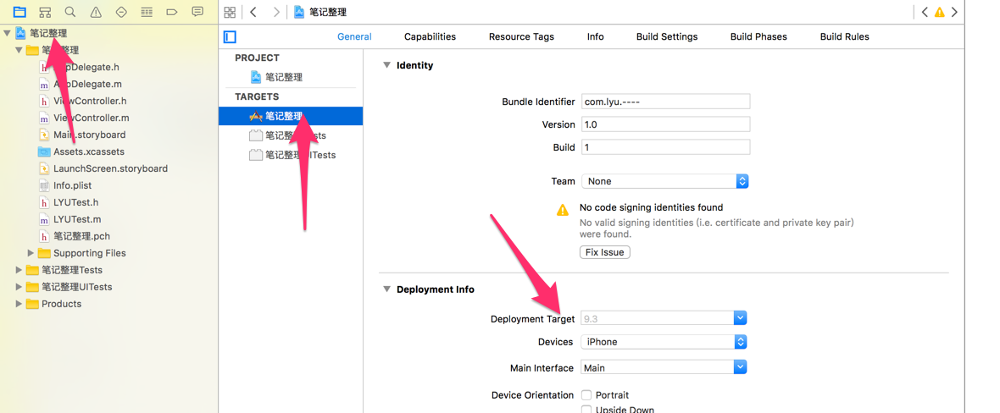

---
<br/>
##3. 项目中常见的文件(PCH)


- **PCH文件**: 一般PCH的名称跟项目的名称相同.
- **PCH的作用**:
    - 只要在pch当中定义的东西, 会被整个应用程序共享.
    - PCH它是一个预编译文件,要告诉系统要提前编译它.要去做一些配置.
    - 存放一些公用的宏.系统的版本号的宏和一些屏幕的宏.
    - 存放一些公用的文件.分类的头文件
    - 存放一些自定义的 Log
    - 存放一些条件编译的内容

- **例如:**

    ```objc
    // 在宏当中,三个点...表示可变参数.
    // 在函数当中,表示可变参数用:__VA_ARGS__
    XMGLog(...) NSLog(__VA__ARGS__)

    // 自定义Log(自定义输出): 
    // 如果只想在调试阶段打印东西, 在编译阶段不打印某些内容, 
    // 则可以使用条件编译的宏来做, 如下
    #ifdef DEBUG // 调试阶段

    #define LYULOG(...) NSLog(__VA_ARGS__)

    #else  // 其他阶段 如编译阶段

    #define LYULOG(...)

    #endif
    ```

- 如何更改程序所处的阶段?如下:

    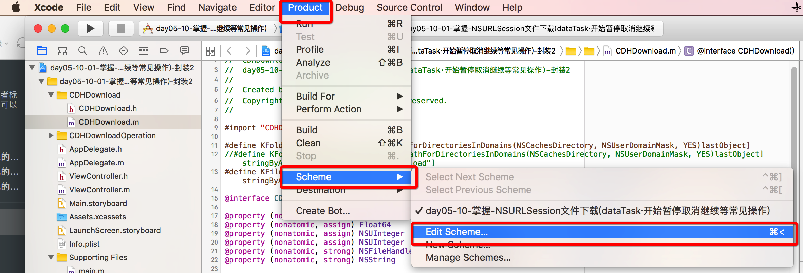
    

- 在xcode5当中,会自动生成一个pch文件,在Xcode6当中不会帮我们生成PCH文件.

- **在Xcode7中手动创建PCH文件与导入:**
- 创建PCH文件, 一般以工程项目名称命名
    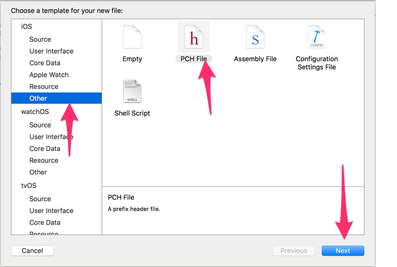
    
- 修改precompile Prefix Header选择为yes代表允许提前编译头文件(默认为NO)

    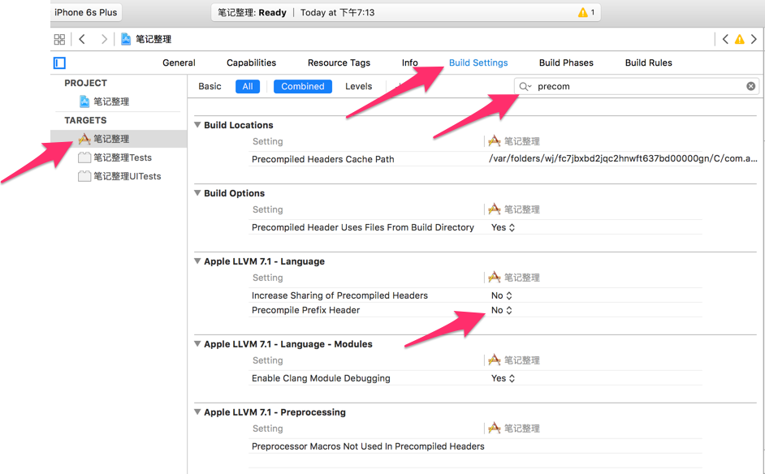

- 在Buld Setting 当中找perfix 找到Precomplie prefix Header 为yes允许提前编译头文件(默认为NO)
    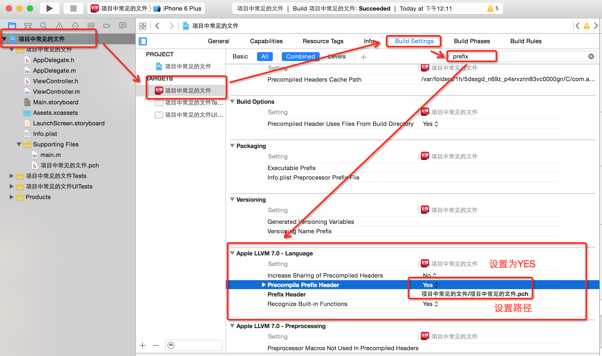

- 设完这些后,再进行prefix Header的路径配置.路径从根层开始.(注意,这个路径要填写相对路径哦)
    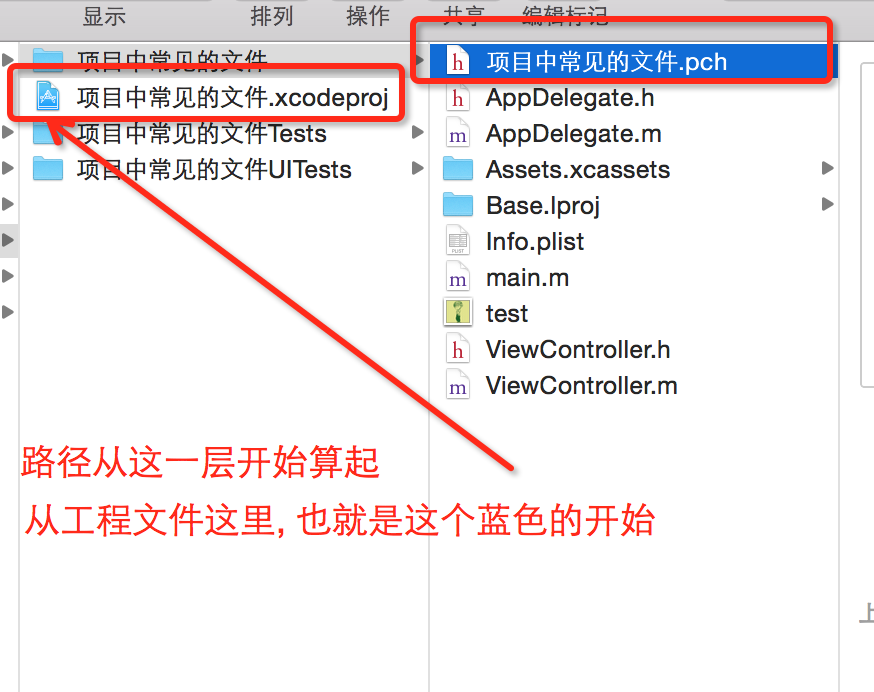


---
<br/>

##4. 图片尺寸大小的补充

- **@2X @3X的作用(重点):**
    - 苹果手机3gs和4s的屏幕物理尺寸都是320 \* 480,但4s的每个点有4个像素(@2X)Retina,而3gs的每个点只有1个像素(@1X) 非 Retina
    - 理解:3gs上一张50 \* 50的图片与4s上一张100 \* 100的图片大小是相同的


- **系统加载图片的顺序:**
    - 如果需要的图片是@2X的图片, 则先寻找@2X图片,如果在对应的@2X中找不到图片,那么系统会去@1X中寻找
    - 如果需要的图片是@3X的图片,则先寻找@3X图片,如果找不到寻找@2X图片, 如果找不到图片,那么系统会去@1X中寻找


---
<br/>