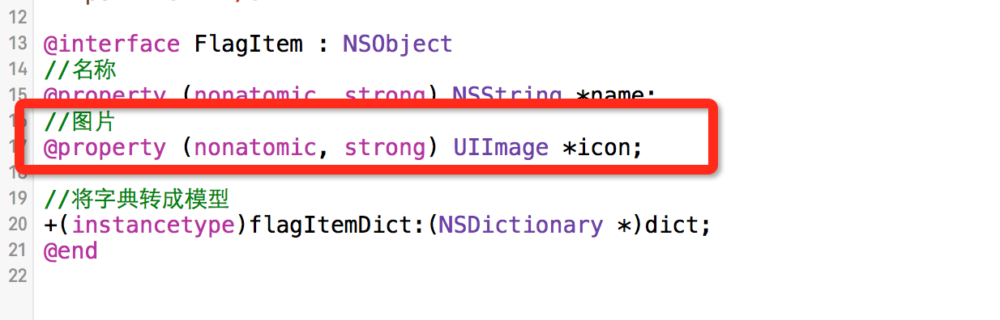

# KVC模型改进-自定义国旗键盘

- 在给 FlagView成员属性赋值的时候,发现在这里还得要自己去写UIImage,自己手动去创建UIImage
- 一般在模型当中保存的就是控件最想要的东西.那个这个地方.我们最好在模型当中提供的是一张图片

  ```objc
  -(void)setFlagItem:(FlagItem *)flagItem{
      _flagItem = flagItem;
      //给属性赋值.
      //设置名称
      self.name.text = flagItem.name;
      //设置图片.
      self.imageV.image = [UIImage imageNamed:flagItem.icon];
  }
  ```

- 所以在这里进行改进模型,让模型当中存放的就是用户最想要的东西.
  
- 改过之后会导致一个问题,在KVC给属性赋值的时候,字典当中给的是一个字符串.这样在转的过程当中就会造成类型不匹配.发生错误.
- 这个时候我们就要看一下KVC的底层实现原理,看过后,然后通过它的特性,去避免这一问题


- **setValue:forKeyPath:的底层实现:**
    - 1.它会调用这个属性的set方法.
    - 2.如果没有set方法,它会去判断有没有跟key值同名的成员属性.如果有,就直接赋值,icon = obj.
    - 3.如果没有,那么它还会去判断有没有跟key值名相同带有下划线的成员属性,如果有,就直接赋值,\_icon = obj.
    - 4.如果都没有, 就直接报错.找不到对应的成员属性.

  ```objc
  // 这个是最初的字典转模型的方法.
  +(instancetype)flagItemDict:(NSDictionary *)dict{
      //创建对象
      FlagItem *item = [[self alloc] init];
      //通过KVC给对象的属性赋值.
      [item setValuesForKeysWithDictionary:dict];
      //返回一个赋值好属性的对象.
      return item;
  }
  /*
  通过KVC,调用对象的[item setValuesForKeysWithDictionary:dict]
  setValuesForKeysWithDictionary:底层实现
  便利字典当中的所有Key Value值.给对应的key,value赋值
  [dict enumerateKeysAndObjectsUsingBlock:^(id  _Nonnull key, id  _Nonnull obj, BOOL * _Nonnull stop) {
        给对应的key,value赋值
       [item setValue:obj forKeyPath:key];
  }];
  */
  ```


- **利用KVC会调用调用属性的set方法.**
    - 当给icon属性赋值时,把传进来的字符串当作图片的名称,创建一个图片,再给图片进行赋值.
    - 这里的参数,类型是可以改的

  ```objc
  // 重写 setting 方法
  - (void)setIcon:(NSString *)icon{
      UIImage *image = [UIImage imageNamed:icon];
      _icon = image;
  }
  ```
  ```objc
  // 重写 setting 方法
  - (void)setIcon:(UIImage *)icon{
      // 判断是否是 字符串类型，如果是则转化成 UIImage类型
      if ([icon isKindOfClass:[NSString class]]) {
          // 强制类型转换
          _iconName = (NSString *)icon;
          _icon = [UIImage imageNamed:_iconName];
      }else{
          // 如若不是字符串,则是UIImage ,则直接赋值
          _icon = icon;
      }
  }
  ```
  ```objc
  //那在View当中就可以直接赋值图片了.
  -(void)setFlagItem:(FlagItem *)flagItem{
      _flagItem = flagItem;
      //给属性赋值.
      //设置名称
      self.name.text = flagItem.name;
      //设置图片.
      //self.imageV.image = [UIImage imageNamed:flagItem.icon];
      //模型当中保存的应该是最想的东西,所以在模型当中保存的应该是图片.
      self.imageV.image = flagItem.icon;
  }
  ```

---
<br/>