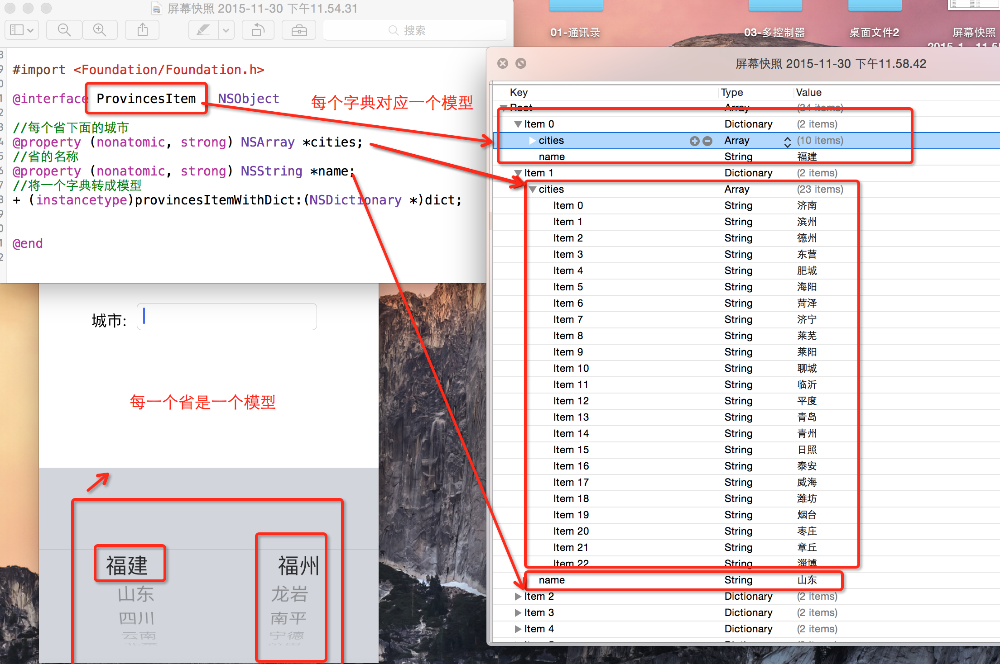
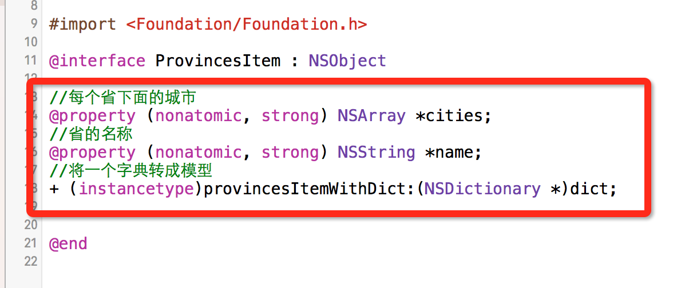
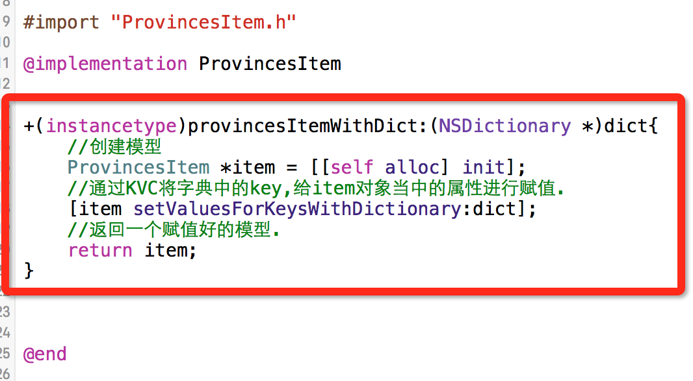

# 自定义城市键盘

- **实现代码**

  ```objc
  #import <UIKit/UIKit.h>
  //注意:这里继承的是UITextField
  @interface CityTextField : UITextField

  @end
  ```
  ```objc
  #import "CityTextField.h"
  //省模型
  #import "ProvincesItem.h"
  @interface CityTextField()<UIPickerViewDataSource,UIPickerViewDelegate>

  //省份数组.里面装的都是ProvincesItem模型.
  @property(nonatomic,strong) NSMutableArray *provincesDataArray;

  //记录当前选中的是哪一个省份的角标.
  @property(nonatomic, assign) NSInteger curProIndex;

  @end
  ```
  
- **加载数据**
    - 数据内容对应的模型图:

  
    - 数组当中保存的都是字典.我们看到字典就会它转成模型.
    - 所以新建了一个 ProvincesItem模型, ProvincesItem每一个属性,都对应着字典当中的key值.

  
  
  
  ```objc
  //懒加载省份数据
  -(NSMutableArray *)provincesDataArray{

      if (_provincesDataArray == nil) {
          //创建数组
          _provincesDataArray = [NSMutableArray array];
          //获取plist文件的路径
          NSString *filePath =  [[NSBundle mainBundle] pathForResource:@"provinces.plist" ofType:nil];
          //从plist文件当中加载数据
          NSArray *tempArray = [NSArray arrayWithContentsOfFile:filePath];
          //遍历数组当中的每一个元素.每一个元素都是一个字典,把字典转成模型
          for (NSDictionary *dict in tempArray) {
              //创建省份模型对象.快速的将字典转成模型
              ProvincesItem *item =  [ProvincesItem provincesItemWithDict:dict];
              //把转好的对象保存到数组当中.
              [_provincesDataArray addObject:item];
          }
      }
      return _provincesDataArray;
  }

  // 初始化
  -(void)awakeFromNib{
      //初始化.
      [self setUp];
  }
  - (instancetype)initWithFrame:(CGRect)frame{
      if (self = [super initWithFrame:frame]) {
          //初始化.
          [self setUp];
      }
      return self;
  }
  //初始化.
  - (void)setUp{
      //创建UIPickerView
      UIPickerView *pickV = [[UIPickerView alloc] init];
      //设置代理
      pickV.delegate = self;
      //设置数据源.
      pickV.dataSource = self;
      //设置弹出键盘是一个UIPickerView
      self.inputView = pickV;
  }
  ```

- **实现代理协议方法**

  ```objc
  //总共有多少组
  - (NSInteger)numberOfComponentsInPickerView:(UIPickerView *)pickerView{
      // 总共有两组
      return 2;
  }

  //每一组有多少行
  - (NSInteger)pickerView:(UIPickerView *)pickerView numberOfRowsInComponent:(NSInteger)component{
      //第一组展示多少行,有省份数组解定, 数组当中有多少个省份模型,第一组就有多少行.
      if (component == 0) {
        return self.provincesDataArray.count;
      }else{
          //第二组展示多少行,有当前选中的省份决定,当前选中哪个省份.哪个省份下面的城市数组决定.
          //所以要先获取当前先中的是哪一个省.
          ProvincesItem *proItem = self.provincesDataArray[self.curProIndex];
          //返回当前省份下城市的个数
          return proItem.cities.count;
      }
  }

  //返回每一行展示的标题
  - (NSString *)pickerView:(UIPickerView *)pickerView titleForRow:(NSInteger)row forComponent:(NSInteger)component{

      //如果是第0列,就是省份,返回省份的名称
      if (component == 0) {
          ProvincesItem *proItem = self.provincesDataArray[row];
          return proItem.name;
      }else{
          //先取出选中的省份.
          ProvincesItem *proItem = self.provincesDataArray[self.curProIndex];
          //返回先中省份下,每一个城市.
          return proItem.cities[row];
      }
  }

  //选中某一列的某一行时会调用这个方法
  - (void)pickerView:(UIPickerView *)pickerView didSelectRow:(NSInteger)row inComponent:(NSInteger)component{
      //当是第0列的时候.(省份列)
      if(component == 0){
          //记录当前选中的省份的角标
          self.curProIndex = row;
          //刷新列表.
          [pickerView reloadAllComponents];
          //让第1列的第0行成为选中状态.(让城市列每次刷新时,都选中第一个)
          [pickerView selectRow:0 inComponent:1 animated:YES];
      }
      //把选中的省份,城市显示到文本框当中.
      //获取选中的省.
      ProvincesItem *proItem = self.provincesDataArray[self.curProIndex];
      //获取省份的名称
      NSString *province = proItem.name;
      //获取第一列选中的行号.(城市列)
      NSInteger seleRow = [pickerView selectedRowInComponent:1];
      //获取当前选中省下面选中的城市名称.
      NSString *city =  proItem.cities[seleRow];
      //显示数据
      self.text = [NSString stringWithFormat:@"%@ %@",province,city];
  }
  ```


