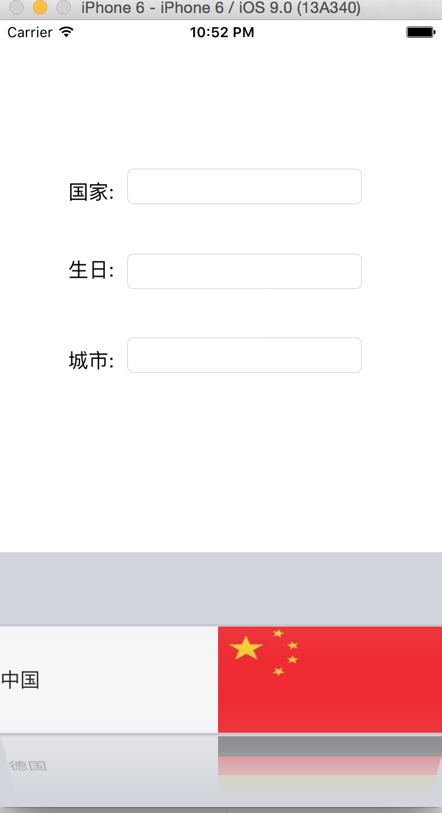
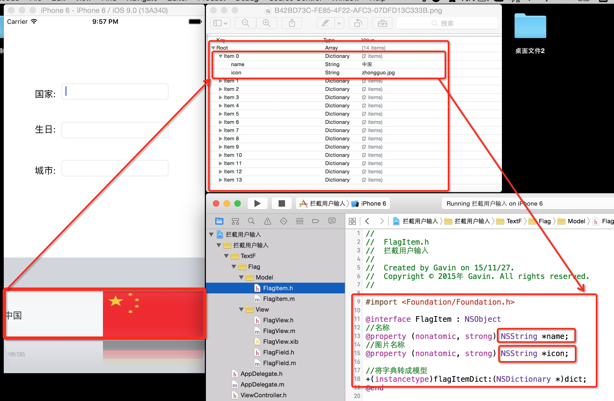
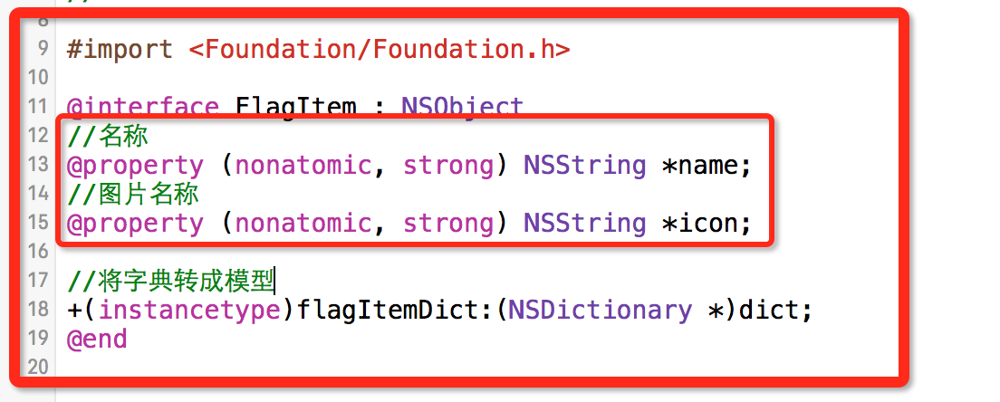
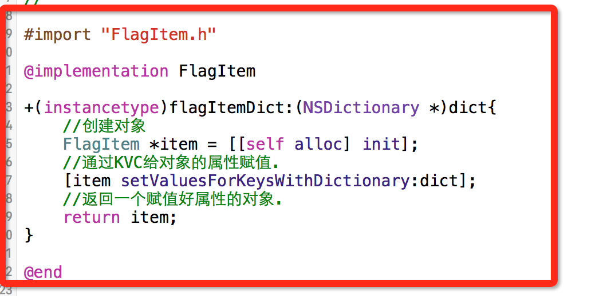
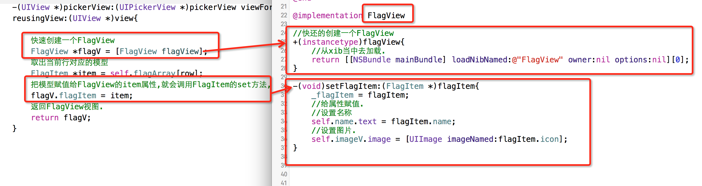

# 自定义国旗键盘

- **运行示例效果:**
    - 点击文本输入框是弹出的是一个国旗选择键盘.

  


- **实现这种效果采取的方案是自定义一个TextField.修改它的弹出键盘为一个UIPickView.**

  ```objc
  #import <UIKit/UIKit.h>

  //注意:这里继承的是UITextField
  @interface FlagField : UITextField

  @end
  ```
  ```objc
  //这个是自定义的pickView每一行的一个UIView.
  #import "FlagView.h"
  //这个是每一行对应的模型.
  #import "FlagItem.h"
  @interface FlagField()<UIPickerViewDataSource,UIPickerViewDelegate>
  //保存加载数据的数组.
  @property(nonatomic,strong) NSMutableArray *flagArray;

  @end
  ```


- **加载数据**
    - 数据内容对应的模型图:
        - 数组当中保存的都是字典.我们看到字典就会它转成模型.
        - 所以新建了一个 FlagItem模型,FlagItem每一个属性,都对应着字典当中的key值.

  
  
  

  ```objc
  //懒加载数据
  -(NSMutableArray *)flagArray{

      if (_flagArray == nil) {

          加载plist文件路径
         NSString *filePath = [[NSBundle mainBundle] pathForResource:@"flags.plist" ofType:nil];
          根据路径从plist文件当中加载数组
         NSArray *dictArray  = [NSMutableArray arrayWithContentsOfFile:filePath];
          创建数组
          _flagArray = [NSMutableArray array];
          遍历数组当中的每一个元素,数组当中保存的都是字典.
          for (NSDictionary *dict in dictArray) {
              把字典转成FlagItem模型
              FlagItem *item = [FlagItem flagItemDict:dict];
              把模型添加到数组当中
              [_flagArray addObject:item];
          }
      }
      return _flagArray;
  }
  ```

- **初始化**

  ```objc
  //注意:这个地方做了两个初始化,目的是为了不论别人使用这个FlagField是从xib创建,还是从代码创建,都让它做初始化.
  //从xib 或者 storyboard 中加载
  -(void)awakeFromNib{
      初始化.
      [self setUp];
  }

  //从代码创建
  - (instancetype)initWithFrame:(CGRect)frame{
      if (self = [super initWithFrame:frame]) {
          初始化.
          [self setUp];
      }
      return self;
  }

  //初始化.
  - (void)setUp{
      创建UIPickerView
      UIPickerView *pick = [[UIPickerView alloc] init];
      设置代理
      pick.delegate = self;
      设置数据源
      pick.dataSource = self;
      自定义键盘, 让弹出的键盘是一个UIPickerView.(自定义的键盘是不需要设置尺寸的.)
      self.inputView = pick;
  }
  ```

- **实现数据源方法**

  ```objc
  总共有多少列.
  -(NSInteger)numberOfComponentsInPickerView:(UIPickerView *)pickerView{
      return 1;
  }

  总共有多少行
  -(NSInteger)pickerView:(UIPickerView *)pickerView numberOfRowsInComponent:(NSInteger)component{
      看数组当中有多少个模型,就有多少行.
       return  self.flagArray.count;
  }
  设置每一行的高度
  -(CGFloat)pickerView:(UIPickerView *)pickerView rowHeightForComponent:(NSInteger)component{
      这个高度就是xib当中描述的View的高度
      return 90;
  }
  返回每一行的控件.这里的控件是一个UIView.通过Xib描述的模型.
  -(UIView *)pickerView:(UIPickerView *)pickerView viewForRow:(NSInteger)row forComponent:(NSInteger)component reusingView:(UIView *)view{

      快速创建一个FlagView
      FlagView *flagV = [FlagView flagView];
      取出当前行对应的模型
      FlagItem *item = self.flagArray[row];
      把模型赋值给FlagView的item属性,就会调用FlagItem的set方法,在set方法当中给FlagItem当中的子控件进行赋值.
      flagV.flagItem = item;
      返回FlagView视图.
      return flagV;
  }
  ```


- **执行结构图:**

  
  
---
<br/>