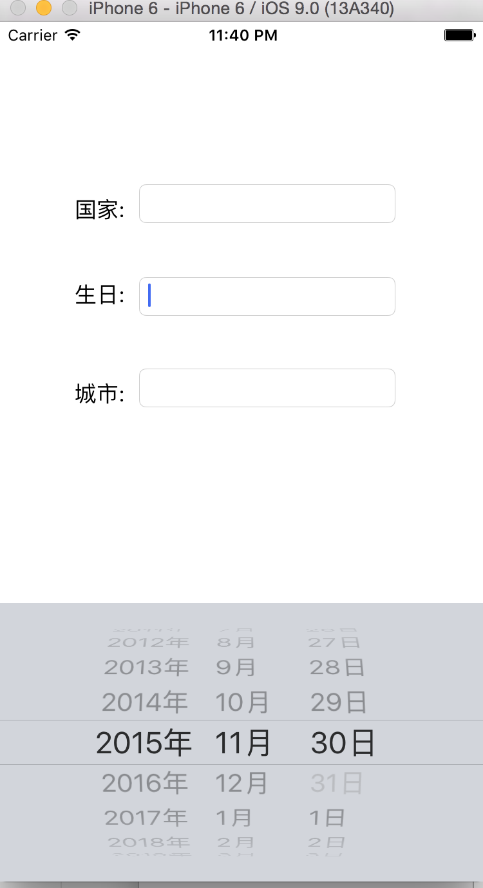

# 自定义生日键盘

- **运行示例效果:**点击生日UITextField时弹出的是一个日期键盘.
  

- **实现这种效果采取的方案是自定义一个TextField.修改它的弹出键盘为一个 UIDatePicker.**

  ```objc
  #import <UIKit/UIKit.h>
  //注意:这里继承的是UITextField
  @interface BirthDayField : UITextField

  @end
  ```
  ```objc
  #import "BirthDayField.h"

  @implementation BirthDayField
  // 注意:这个地方做了两个初始化
  // 目的是为了不论别人使用这个FlagField是从xib创建,还是从代码创建,都让它做初始化.
  //从xib当中创建
  -(void)awakeFromNib{
      //初始化.
      [self setUp];
  }
  //从代码创建
  - (instancetype)initWithFrame:(CGRect)frame{
      if (self = [super initWithFrame:frame]) {
          //初始化.
          [self setUp];
      }
      return self;
  }
  //初始化.
  - (void)setUp{
      //创建UIDatePicker(日期键盘)
      UIDatePicker *pick = [[UIDatePicker alloc] init];
      pick.datePickerMode = UIDatePickerModeDate;
      //ISO 639语言编码 (中国zh  -zhongwen)
      NSLocale *local = [NSLocale localeWithLocaleIdentifier:@"zh"];
      pick.locale = local;
      //UIDatePicker没有代理方法
      //监听UIDatePicker的值改变.
      [pick addTarget:self action:@selector(dateChange:) forControlEvents:UIControlEventValueChanged];
      //自定义键盘, 让弹出的键盘是一个UIPickerView.(自定义的键盘是不需要设置尺寸的.)
      self.inputView = pick;
  }

  //当日期改变时调用
  - (void)dateChange:(UIDatePicker *)datePick{
      //把日期转成字符串.
      NSDateFormatter *fmt = [[NSDateFormatter alloc] init];
      //设置日期格式
      fmt.dateFormat = @"yyyy-MM-dd";
      //格式化日期.
      NSString *dateString =  [fmt stringFromDate:datePick.date];
      //给日期文本框赋值.
      self.text = dateString;
  }

  @end
  ```

---
<br/>