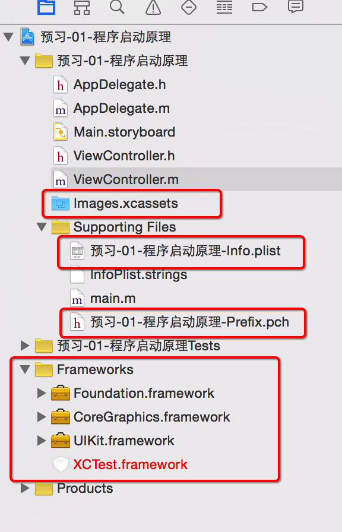
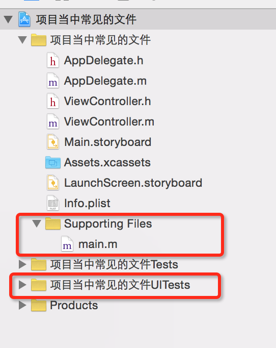

# 01-项目中常见的文件(LaunchScreen)

- Make by:弓_虽_子
- Mender  by：德豪

##Xcode5与Xcode7的不同点:

- 第一点frameworks:Xcode5中有frameworks,用于存放用到的框架,Xcode7中没有frameworks,但是Xcode7会自动导入框架
- 第二点启动界面:Xcode7中有launchScreen.storyboard(启动界面),用于保存app的启动图片,而Xcode5中没有启动界面(下面会说明不使用启动界面来添加启动图片的方法)
- 第三点info.plist的命名方式:Xcode5中,配置文件是以工程名称命名的,Xcode7中直接以info.plist命名
- 第四点PCH文件:Xcode5中会自动创建PCH文件,Xcode7中舍弃了PCH文件

- Xcode6拓展:Xcode6与Xcode7只有第2点不同,Xcode6中的启动界面命名为launchStoryboard.xib

- Xcode5
    
框架是苹果事先已经导入进去的.在项目的结构当中就能够看到导入的框架.
 Images.xcassets 中有个LaunchImage :用来设置启动界面.

Xcode6
会自动导入一些觉见的框架.在项目结构当中,看不到已经导入的框架.
LaunchScreen.xib:用来设置启动界面.
Xcode7
会自动导入一些觉见的框架.在项目结构当中,看不到已经导入的框架.
LaunchScreen.storyBoard:用来设置启动界面.

LaunchScreen原理:
会自动加载LaunchScreen是因为在Target当中,指定了Launch Screen file,

Xcode也可以添加通过修改配置Launch Images Source  中的选项之后，在 Assets.xcassets 会出现个 Brand Assets 组将对应像素的图片添加进去（接下来的操作基本和 Xcode 5 类似）

注意点：

- 如果在配置中即设置了 Launch Screen File 又设置了Launch Images Source （上面提出的更改为 Xcode5 的模式 ）则这时候系统会默认选择使用 Launch Screen File 中的（这里一般是工程创建时就有的 LaunchScreen.storyboard ）
- 如果使用 Brand Assets 设置的话，每一个对应的图片（坑）最好都要有图片，只有相对应的图片才能适配相对应的硬件屏幕，如果屏大，图小最后导致应用软件的整个显示视图变小（如下面提到的）
- 如果没有设置启动图片,模拟器默认的尺寸大小是4s的尺寸大小.(可以打印屏幕尺寸验证.)

模拟器默认的尺寸是由启动界面决定的.

4. 它的底层实现其实把LaunchScreen上的东西,生成了一张图片,然后把这张图片设为程序的启动图片.(LaunchScreen.storyboard 也可以自定义，再通用配置文件中修改 Launch Screen File 为自己自定义的 LaunchScreen.storyboard 的名称即可，如果 改为自己自定义的名称：MyLaunchScreen.storyboard)
可以进入沙盒当中查看,
查看方法,找到应用程序根目录.
获取方法: NSLog(@"%@",NSHomeDirectory());
打印出来,后前往文件夹.找到Library->Caches->Snapshots目录下面.最后一层就是程序自动生成的图片.

应用程序各个图标大小

