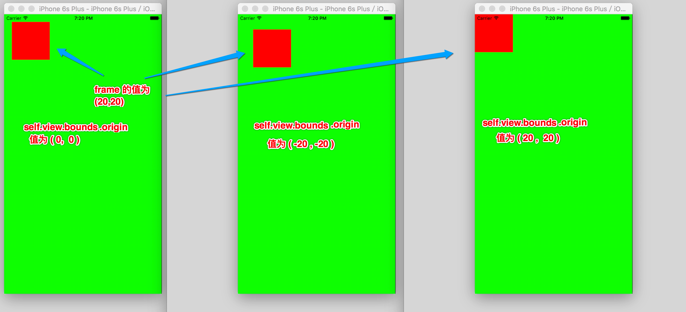
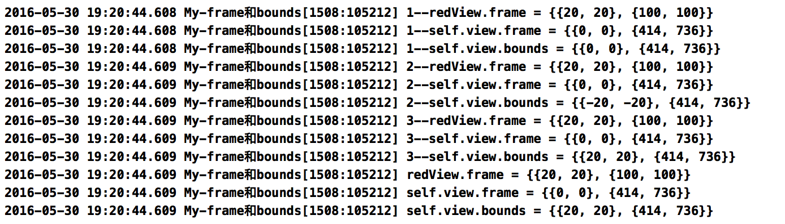

# 补充02: frame和bounds


```objc
//
//  ViewController.m
//  My-frame和bounds
//
//  Created by Dwight on 16/5/30.
//  Copyright © 2016年 chendehao. All rights reserved.
//

#import "ViewController.h"

@interface ViewController ()

@end

@implementation ViewController

- (void)viewDidLoad {
    [super viewDidLoad];
    
    // 自己的 bounds 坐标系的原点(0 , 0)点,就是自己内部子控件的 frame 坐标系的原点(0 , 0)点;
    // 如果修改自己的 bounds值 是不会影响上面的其他子控件坐标值,但影响了实际位置
    //（打印子控件的位子坐标还是原来设定的值）
    // 如果修改了自己的 bounds 的值,即是修改了自己的 bounds 坐标系的原点,
    // 也就修改了子控件的 frame 坐标系的原点的位置,而子控件的坐标值如果没有变化,
    // 则会根据坐标值与 frame 的坐标原点相匹配找到自己的实际位置

    UIView *redView = [[UIView alloc]initWithFrame:CGRectMake(20, 20, 100, 100)];
    redView.backgroundColor = [UIColor redColor];
    [self.view addSubview:redView];
    
    NSLog(@"1--redView.frame = %@",NSStringFromCGRect(redView.frame));
    NSLog(@"1--self.view.frame = %@",NSStringFromCGRect(self.view.frame));
    NSLog(@"1--self.view.bounds = %@",NSStringFromCGRect(self.view.bounds));

    // 例1: 将坐标 (-20 , -20) 赋值给 self.view.bounds 则 self.view 内部子控件都整体向右下移动
    //      默认 self.view 以自己左上角为 bounds坐标系的原点 (0 , 0) 点;同时也是相对于子控件的 frame 的坐标系原点(0 , 0)
    //      此时 self.view 的 左上角的 bounds 坐标改为了(-20 , -20),
    //      也就改变了自己的 bounds 坐标系的原点位置,也就改变了 self.view 中的子控件的 frame 坐标系的原点位置
    //      self.view 与父控件(窗口)的 frame 坐标系上(0 , 0)对应的是 self.view.bounds 的左上角,
    //      即是现在更改后的bounds 坐标(-20,-20)对应
    //      此时 self.view 在以父控件的左上角(frame)坐标系上的坐标位置没有发生变化,
    //      只是修改了self.view 自己的 bounds 坐标的原点;
    //      self.view 中的子控件的 frame 坐标系的坐标原点(0 , 0)就是 self.view 的 bounds坐标系的 (0 , 0)点,
    //      然而其 frame 的坐标原点已经被更改,所以 self.view 上的子控件 redView 坐标值没有变化,但实际位置发生了变化
    //      即是此时的 redView 坐标位置还是原来设置的{20, 20},但实际位置在原来的(40 , 40)处,

    self.view.bounds = CGRectMake(-20 , -20, self.view.frame.size.width, self.view.frame.size.height);
    NSLog(@"2--redView.frame = %@",NSStringFromCGRect(redView.frame));
    NSLog(@"2--self.view.frame = %@",NSStringFromCGRect(self.view.frame));
    NSLog(@"2--self.view.bounds = %@",NSStringFromCGRect(self.view.bounds));

    
    // 例2: 将坐标 (20 , 20) 赋值给 self.view.bounds 则 self.view 内部子控件都整体向左上移动
    //      默认 self.view 以自己左上角为 bounds坐标系的原点 (0 , 0) 点;同时也是相对于子控件的 frame 的坐标系原点(0 , 0)
    //      此时 self.view 的 左上角的 bounds 坐标改为了(20 , 20),
    //      也就改变了自己的 bounds 坐标系的原点位置,也就改变了 self.view 中的子控件的 frame 坐标系的原点位置
    //      self.view 与父控件(窗口)的 frame 坐标系上(0 , 0)对应的是 self.view.bounds 的左上角,
    //      即是现在更改后的bounds 坐标(20,20)对应
    //      此时 self.view 在以父控件的左上角(frame)坐标系上的坐标位置没有发生变化,
    //      只是修改了self.view 自己的 bounds 坐标的原点;
    //      self.view 中的子控件的 frame 坐标系的坐标原点(0 , 0)就是 self.view 的 bounds坐标系的 (0 , 0)点,
    //      然而其 frame 的坐标原点已经被更改,所以 self.view 上的子控件 redView 坐标值没有变化,但实际位置发生了变化
    //      即是此时的 redView 坐标位置还是原来设置的{20, 20},但实际位置在原来的(0 , 0)处
    
    self.view.bounds = CGRectMake(20, 20, self.view.frame.size.width, self.view.frame.size.height);
    NSLog(@"3--redView.frame = %@",NSStringFromCGRect(redView.frame));
    NSLog(@"3--self.view.frame = %@",NSStringFromCGRect(self.view.frame));
    NSLog(@"3--self.view.bounds = %@",NSStringFromCGRect(self.view.bounds));
    
    self.view.backgroundColor = [UIColor greenColor];
    
    NSLog(@"redView.frame = %@",NSStringFromCGRect(redView.frame));
    NSLog(@"self.view.frame = %@",NSStringFromCGRect(self.view.frame));
    NSLog(@"self.view.bounds = %@",NSStringFromCGRect(self.view.bounds));

}

@end
```


