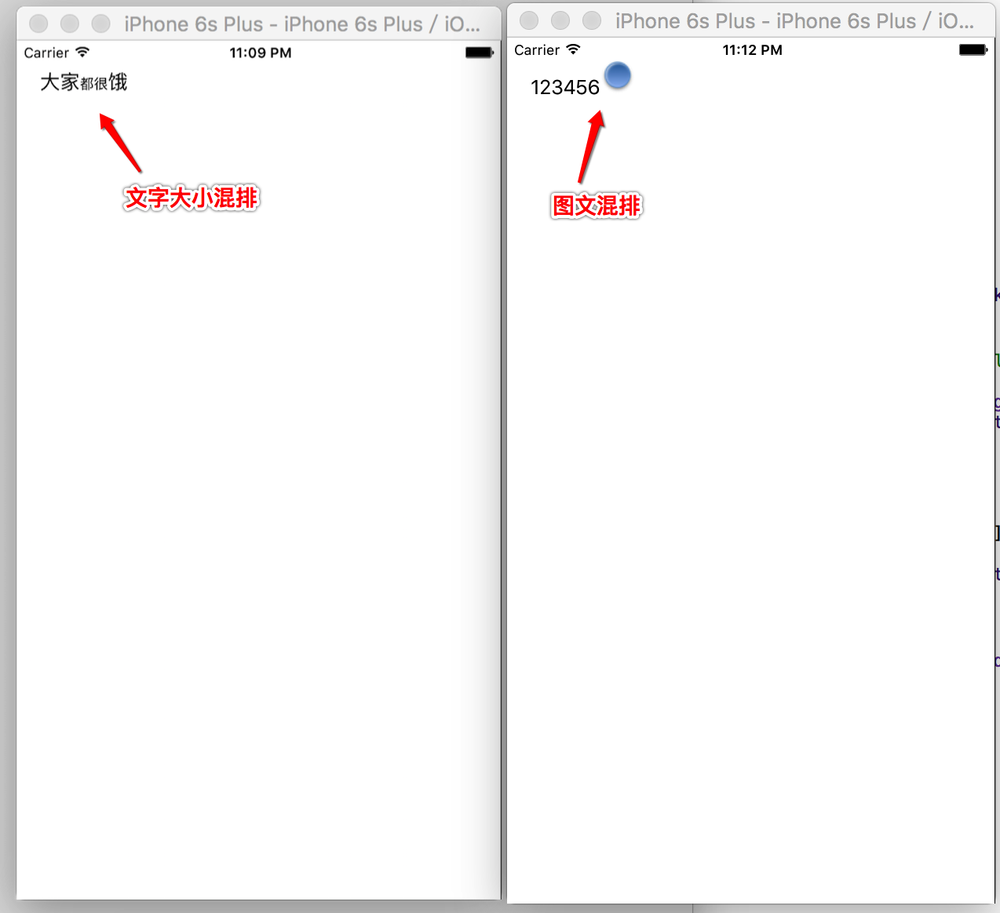

# 补充3: 文字大小混排/图文混排


- **文字大小混排**

```objc
    UILabel *titleLabel = [[UILabel alloc]initWithFrame:CGRectMake(20, 20, 100, 30)];
    [self.view addSubview:titleLabel];
```

```objc
//    1. 设置文字大小混排
    NSString *str1 = @"大家都很饿";
//    NSAttributedString *attributeStr = [[NSAttributedString alloc]initWithString:str1];
//  [attributeS
    NSMutableAttributedString *str2 = [[NSMutableAttributedString alloc]initWithString:str1];
    NSDictionary *dict = @{NSFontAttributeName:[UIFont systemFontOfSize:12]};
    [str2 addAttributes:dict range:NSMakeRange(2, 2)];
    titleLabel.attributedText = str2;
```

- **图文混排**

```objc
    UILabel *titleLabel = [[UILabel alloc]initWithFrame:CGRectMake(20, 20, 100, 30)];
    [self.view addSubview:titleLabel];
```

```objc
//    2.设置图文混排
//    2.1创建对象
    NSTextAttachment *attachMent = [[NSTextAttachment alloc]init];
    attachMent.image = [UIImage imageNamed:@"test"];
    NSAttributedString *atttr1 = [NSAttributedString attributedStringWithAttachment:attachMent];
//    titleLabel.attributedText = atttr1;
    
//    2.2创建一个可变的带属性的字符串
    NSMutableAttributedString *showString = [[NSMutableAttributedString alloc]initWithString:@"123456"];
    [showString appendAttributedString:atttr1];
    titleLabel.attributedText = showString;
```




---

