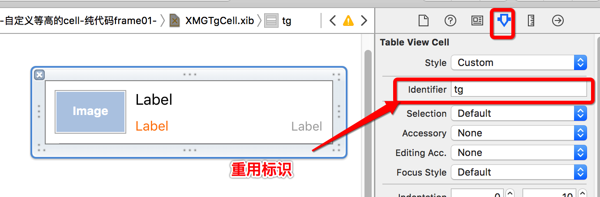
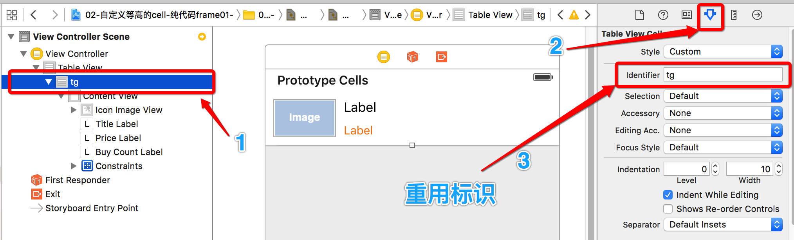
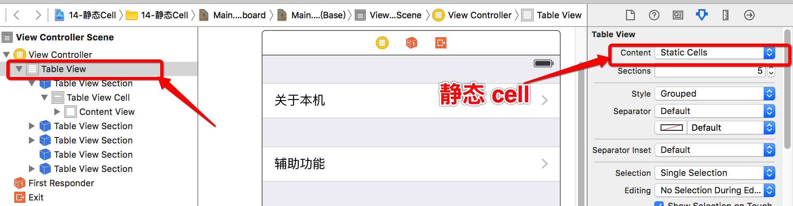

# UITableViewCell的基本使用

<br/>

## 知识点:
1. UITableViewCell的常见设置
2. UITableViewCell的注册
3. 静态 cell

---
<br/>

##1. UITableViewCell的常见设置

- **设置右边的指示样式**
```objc
// 这是个枚举值, 可以点击进入头文件查看
cell.accessoryType = UITableViewCellAccessoryDisclosureIndicator;
```

- **设置右边的指示控件**
```objc
cell.accessoryView = [[UISwitch alloc] init];
```

- **设置cell的选中样式**
```objc
cell.selectionStyle = UITableViewCellSelectionStyleNone;
```

- **设置背景色**
```objc
cell.backgroundColor = [UIColor redColor];
```

- **设置背景view**
```objc
UIView *bg = [[UIView alloc] init];
bg.backgroundColor = [UIColor blueColor];
cell.backgroundView = bg;
// cell.backgroundColor = [UIColor redColor];
```

- **设置选中的背景view**
```objc
UIView *selectedBg = [[UIView alloc] init];
selectedBg.backgroundColor = [UIColor purpleColor];
cell.selectedBackgroundView = selectedBg;
// 注意: 这个例子创建的 selectedBg 没有尺寸, 可能不是显示成为我们下面设置的颜色效果
//      因此也一定要给他加上尺寸, 一般设置尺寸为 cell 的大小, 
cell.selectedBackgroundView = [[UIView alloc] initWithFrame:cell.frame];
cell.selectedBackgroundView.backgroundColor = [UIColor purpleColor];
```

---
<br/>
##2. UITableViewCell的注册

- **UITableViewCell的注册有性能优化效果**
    - iOS 设备的内存有限，如果用UITableView显示成千上万条数据，就需要成千上万个UITableViewCell对象的话，那将会耗尽iOS设备的内存。要解决该问题，需要重用UITableViewCell对象


- **性能优化的具体实现**
    - 当滚动列表时，部分UITableViewCell会移出窗口，UITableView会将窗口外的UITableViewCell放入一个对象池中，等待重用
    - 当UITableView要求dataSource返回UITableViewCell时，dataSource会先查看这个对象池，如果池中有未使用的UITableViewCell，dataSource会用新的数据配置这个UITableViewCell，然后返回给UITableView，重新显示到窗口中，从而避免创建新对象


- **dequeueReusableCellWithIdentifier:这个方法内部**
    - 首先去缓存池中找可循环利用的cell;     
    - 如果没有,会判断有没有注册;
    - 如果有注册,会创建这种类型的cell,并且绑定这个标识返回;
    - 如果没有注册,会自动去storyboard找有没有ID这种标识的cell;
    - 如果有,会加载这种标识的cell,并且绑定ID这个标识返回.


- **有三种注册方式**
    - class 注册
    - xib 注册
    - storyboard 注册
    - 注册的好处: 在 tableView 使用 cell 的时候可以将 cell 放入到重用池中
    - **注意点:注册的方式设置不了cell的样式**


- **传统写法**
    - 有重用标识, 但没有通过注册的方式

  ```objc
  //每当一个cell要进入视野范围就会调用这个方法
  - (UITableViewCell *)tableView:(UITableView *)tableView cellForRowAtIndexPath:(NSIndexPath *)indexPath
  {
      // 1.定义一个重用标识
      static NSString *ID = @"cell";
      // 2.去缓存池取可循环利用的cell
      UITableViewCell *cell = [tableView dequeueReusableCellWithIdentifier:ID];
      // 3.缓存池如果没有可循环利用的cell,自己创建
      if (cell == nil) {
          cell = [[UITableViewCell alloc] initWithStyle:UITableViewCellStyleDefault reuseIdentifier:ID];
          // 建议:所有cell都一样的设置,写在这个大括号中;所有cell不都一样的设置写在外面
         cell.backgroundColor = [UIColor redColor];
      }
      // 4.设置数据
      cell.textLabel.text = [NSString stringWithFormat:@"第%zd行数据",indexPath.row];

      return cell;
  }
  ```

<br/>
####2.1 类名注册 cell
- **一般用于自定义的 cell**

  ```objc
  NSString *ID = @"cell";

  - (void)viewDidLoad {
      [super viewDidLoad];
      // 根据ID这个标示注册对应的cell类型
      // UITableViewCell (系统默认类型)
      [self.tableView registerClass:[UITableViewCell class] forCellReuseIdentifier:ID];
      // CDHTableViewCell (自定义类型)
  //    [self.tableView registerClass:[CDHTableViewCell class] forCellReuseIdentifier:ID];
  }
  ```
  ```objc
  - (UITableViewCell *)tableView:(UITableView *)tableView cellForRowAtIndexPath:(NSIndexPath *)indexPath
  {
      // 1. dequeueReusableCellWithIdentifier:这个方法内部首先会去缓存池中取可循环利用的cell;
      // 如果缓存池中没有可循环利用的cell,会判断当初有没有根据ID这个标识注册对应的Cell类型,
      // 如果有注册,会创建这种类型的cell,并且绑定这个标识返回
      UITableViewCell *cell = [tableView dequeueReusableCellWithIdentifier:ID];
  //    CDHTableViewCell *cell = [tableView dequeueReusableCellWithIdentifier:ID];
      // 2.设置数据
      cell.textLabel.text = [NSString stringWithFormat:@"%zd行的数据", indexPath.row];

      return cell;
  }
  ```
<br/>

####2.2 xib 注册 cell
- **注意: 在 xib 的工具栏的标识设置要和代码中的重用标识保持一致**

  ```objc
  NSString *ID = @"tg";
  ```
  ```objc
  // 根据ID注册一个XIB文件
  [self.tableView registerNib:[UINib nibWithNibName:NSStringFromClass([CDHTgCell class]) bundle:nil] forCellReuseIdentifier:ID];
  //    [self.tableView registerNib:[UINib nibWithNibName:@"CDHTgCell" bundle:nil] forCellReuseIdentifier:ID];
  ```
  ```objc
  // 访问缓存池
  CDHTgCell *cell = [tableView dequeueReusableCellWithIdentifier:ID];
  ```
  

<br/>

####2.3 storyboard 注册 cell

- **注意:**
    - **storyboard 不需要再前面另外注册 cell **
    - storyboard 的工具栏中一定要写上标识,并且与代码中的重用标识保持一致

  ```objc
  // 访问缓存池
  static NSString *ID = @"tg";
  // dequeueReusableCellWithIdentifier:这个方法内部首先去缓存池中找可循环利用的cell;
  // 如果没有,会判断有没有注册;如果没有注册,会自动去storyboard找有没有ID这种标识的cell;
  // 如果有,会加载这种标识的cell,并且绑定ID这个标识返回.
  CDHTgCell *cell = [tableView dequeueReusableCellWithIdentifier:ID];
  ```
  


---

<br/>
##3. 静态 cell
- 其他设置都和动态 cell 基本一样
- **注意: 在做静态 cell 的布局等操作之前一定要在工具栏先选中为 Content 为: Static Cells**

  

