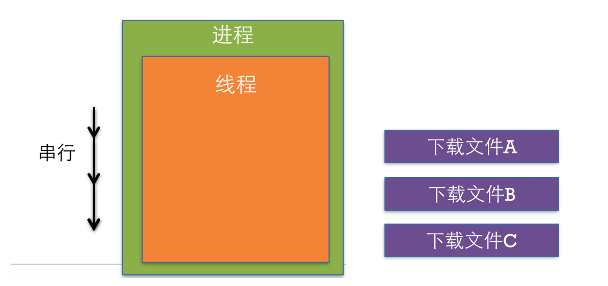
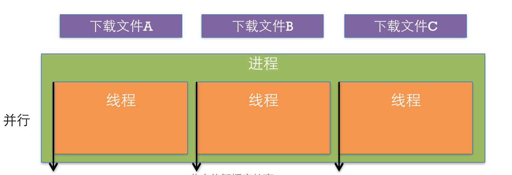
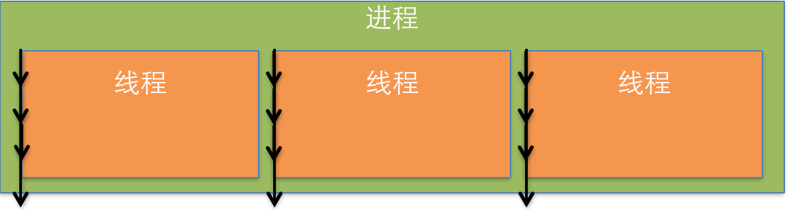

# 多线程的基本概念

---

##0. 本节知识点:
1. 进程
2. 线程
3. 进程与线程的区别
4. 多线程
5. 多线程的优缺点

---
 

##1. 进程
- 进程是指在系统中正在运行的一个应用程序。
- 程序是一个没有生命的实体，只有处理器赋予程序生命时，它才能成为一个活动的实体，我们称其为进程。
- 每个进程之间是独立的，每个进程均运行在其专用且受保护的内存空间内。
  

- **比如: **同时打开QQ、Xcode，系统就会分别启动2个进程
- 通过“活动监视器”可以查看Mac系统中所开启的进程

    

---
 
##2. 线程
- **基本概念**
    - 通常在一个进程中可以包含若干个线程，它们可以利用进程所拥有的资源。(每1个进程至少要有1条线程)；
    - 线程是进程的基本执行单元，一个进程(程序)的所有任务都在线程中执行。
      
    - **比如: **使用酷狗播放音乐、使用迅雷下载电影，都需要在线程中执行
    

 

- **线程的串行**
    - 1个线程中任务的执行是串行的;
    - 如果要在1个线程中执行多个任务，那么只能一个一个地按顺序执行这些任务;
    - 也就是说，在同一时间内，1个线程只能执行1个任务。
      
    - 比如在1个线程中下载3个文件（分别是文件A、文件B、文件C）,因此，也可以认为线程是进程中的1条执行路径
    

---
 
##3. 线程和进程的区别

>1. 常在一个进程中可以包含若干个线程，它们可以利用进程所拥有的资源。在引入线程的操作系统中，通常都是把进程作为分配资源的基本单位，而把线程作为独立运行和独立调度的基本单位。由于线程比进程更小，基本上不拥有系统资源，故对它的调度所付出的开销就会小得多，能更高效的提高系统内多个程序间并发执行的程度。

>2. 线程和进程的区别在于，子进程和父进程有不同的代码和数据空间，而多个线程则共享数据空间，每个线程有自己的执行堆栈和程序计数器为其执行上下文。多线程主要是为了节约CPU时间，发挥利用，根据具体情况而定。线程的运行中需要使用计算机的内存资源和CPU。

- **线程与进程的特点区别归纳**：
    - **地址空间和其它资源：**进程间相互独立，同一进程的各线程间共享。某进程内的线程在其它进程不可见。
    - **通信：**进程间通信IPC，线程间可以直接读写进程数据段（如全局变量）来进行通信——需要进程同步和互斥手段的辅助，以保证数据的一致性。
    - **调度和切换：**线程上下文切换比进程上下文切换要快得多。
    - 在多线程OS中，进程不是一个可执行的实体。
    
--- 
 
##4. 多线程
- **基本概念**
    - 即1个进程中可以开启多条线程，每条线程可以并发(同时)执行不同的任务。

 

- **线程的并行**
    - 并行即同时执行。比如同时开启3条线程分别下载3个文件(分别是文件A、文件B、文件C)。

    

- **多线程并行执行的原理**
    - 在同一时间里，CPU只能处理1条线程，只有1条线程在工作(执行);
    - 多线程并并行(同时)执行，其实是CPU快速地在多条线程之间调度(切换)，如果CPU调度线程的时间足够快，就造成了多线程并行执行的假象;

    

---
 
##5. 多线程优缺点
- **优点**
    - 能适当提高程序的执行效率。
    - 能适当提高资源利用率(CPU、内存利用率)

- **缺点**
    - 开启线程需要占用一定的内存空间(默认情况下，主线程占用1M，子线程占用512KB)，如果开启大量的线程，会占用大量的内存空间，降低程序的性能。
    - 线程越多，CPU在调度线程上的开销就越大。
    - 程序设计更加复杂：比如线程之间的通信、多线程的数据共享

---
 

