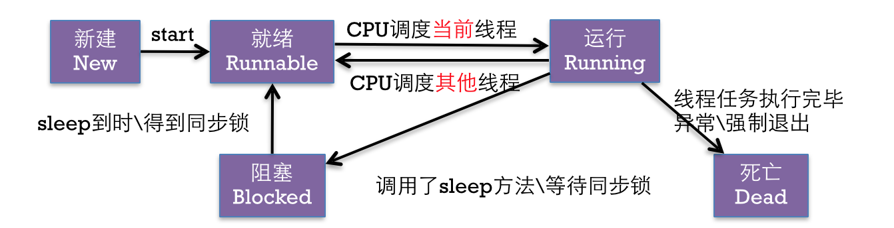
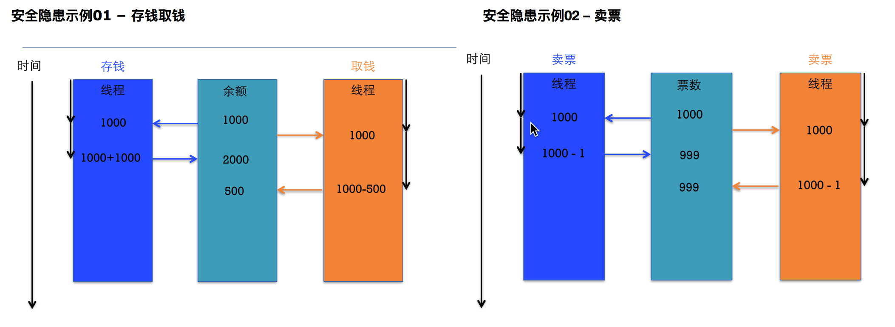
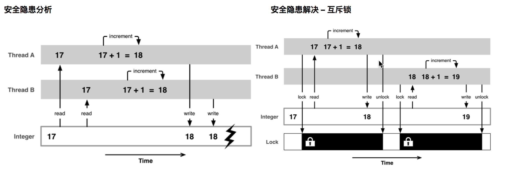

# 线程的状态和安全

---

##0. 本节知识点:
1. 线程状态
2. 线程安全


--- 


##1. 线程状态
- **线程的几种状态**
    - 新建
    - 就绪
    - 运行
    - 阻塞
    - 死亡

  
  

```objc
// 创建新线程
NSThread *thread = [[NSThread alloc] initWithTarget:self selector:@selector(run) object:nil];
// 开启线程
[thread start];
```

- **注意点**
    - 了解线程状态间切换过程
    - 线程死亡之后不能重新开启


-  **控制线程的状态**
    - 开启线程: 
        - ` - (void)start;`
    - 阻塞线程
        - `+ (void)sleepForTimeInterval:(NSTimeInterval)ti;`
        - `+ (void)sleepUntilDate:(NSDate *)date;`
    - 退出线程
        - `+ (void)exit;强制退出线程`
        - `break`和`return`让任务结束退出线程
        
--- 

        
##2. 线程安全
- **安全隐患**
    - 问题产生的原因：多个线程访问同一块资源会发生数据安全问题
    - 案例：银行存钱
    - 案例：卖票问题
        




- **线程安全问题代码演示**
    - 三条线程同时卖票产生线程安全问题
    - 采用加互斥锁的方式来解决线程安全问题
    - 加锁的注意点
        - 必须使用同一把锁
        - 建议使用Self
        - 注意加锁的位置
        - 加锁耗费性能，不要乱加

```objc
@synchronized(锁对象) { 
    // 需要锁定的代码 
    // 注意：锁定1份代码只用1把锁，用多把锁是无效的, 建议使用 self
}
```

- **专业术语-线程同步**
    - 线程同步的意思是：多条线程在同一条线上执行（按顺序地执行任务）
    - 互斥锁，就是使用了线程同步技术


- **原子和非原子属性**
    - 区别
        - atomic会对setter方法加锁,线程安全，需要消耗大量的资源
        - noatomic不会对Setter方法加锁, 非线程安全，适合内存小的移动设备
    - iOS开发的建议
        - 所有属性都声明为nonatomic
        - 尽量避免多线程抢夺同一块资源
        - 尽量将加锁、资源抢夺的业务逻辑交给服务器端处理，减小移动客户端的压力
