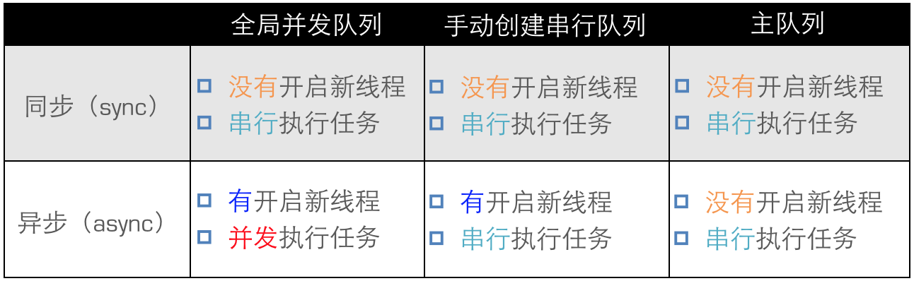
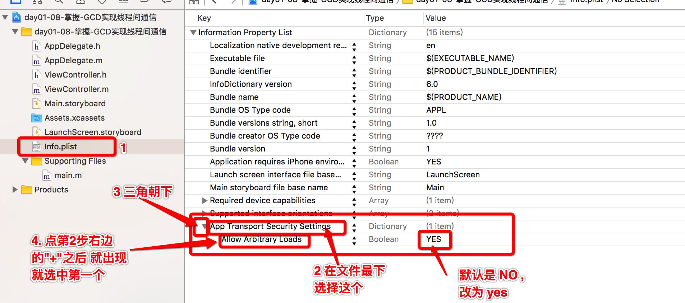

# GCD基本知识


---

##0. 本节知识点:
1. 简单介绍
2. 核心概念
3. 基本使用
4. 线程间通信
5. 补充知识

<br/>

--- 


##1. 简单介绍
- **什么是GCD**

    - 全称是Grand Central Dispatch，可译为“牛逼的中枢调度器”
    - 纯C语言，提供了非常多强大的函数


- **GCD的优势**

    - GCD是苹果公司为多核的并行运算提出的解决方案
    - GCD会自动利用更多的CPU内核（比如双核、四核）
    - GCD会自动管理线程的生命周期（创建线程、调度任务、销毁线程）
    - 程序员只需要告诉GCD想要执行什么任务，不需要编写任何线程管理代码

<br/>

---

##2. 核心概念
- **队列**: 用来存放任务
    - **GCD的队列可以分为2大类型**
    - 1、**并发队列**（DISPATCH_QUEUE_CONCURRENT）
        - 可以让多个任务并发（同时）执行（自动开启多个线程同时执行任务）
        - 并发功能只有在异步（dispatch_async）函数下才有效
    - 2、**串行队列**（DISPATCH_QUEUE_Serial）
        - 让任务一个接着一个地执行（一个任务执行完毕后，再执行下一个任务）

    - **还可以分为全局并发队列/主队列/自己创建的队列**
    - **全局并发队列**
        - 四种优先级对应的全局并发队列,默认就已经存在了
    - **主队列**
        - 凡是添加到主队列中的任务一律放在主线程中执行
        - 该队列是默认存在的
        - 主队列在调度任务之前会先检查主线程当前状态,如果主线程忙则暂停调度
    - **自己创建的并发队列**
    - **自己创建的串行队列**


- **任务**: 执行什么操作
    - **GCD中有2个用来执行任务的常用函数**
        - 同步函数 
        - `dispatch_sync(dispatch_queue_t queue, dispatch_block_t block);`
            - queue：队列
            - block：任务
        - 异步函数 
        - `dispatch_async(dispatch_queue_t queue, dispatch_block_t block);`
    - **同步和异步的区别**
        - 同步：需要等待执行完毕才能返回, 只能在当前线程中执行任务，不具备开启新线程的能力
        - 异步：不需要等待执行完毕立即返回, 可以在新的线程中执行任务，具备开启新线程的能力
        

- **GCD多线程编程步骤**
    - 定制任务
    - 确定想做的事情
    - 将任务添加到队列中
    - GCD会自动将队列中的任务取出，放到对应的线程中执行
    - 任务的取出遵循队列的FIFO原则：先进先出，后进后出
    - **注意**:需要理解任务的先进先出


- **容易混淆的术语**
    - 有4个术语比较容易混淆：同步、异步、并发、串行
    - **同步和异步决定了要不要开启新的线程**
        - 同步：等待任务完成
        - 异步：不等待任务完成，立即返回
    - **并发和串行决定了任务的执行方式**
        - 并发：多个任务并发（同时）执行
        - 串行：一个任务执行完毕后，再执行下一个任务


- **相关代码**

  ```objc
  //1.获取全局并发队列
  //GCD默认已经提供了全局的并发队列，供整个应用使用，不需要手动创建
  /*
   第一个参数:队列的优先级
   第二个参数:留给未来使用 传0
   *
   * 系统内部默认提供4个全局并发队列的优先级如下: 
   #define DISPATCH_QUEUE_PRIORITY_HIGH 2  // 高 
   #define DISPATCH_QUEUE_PRIORITY_DEFAULT 0 // 中
   #define DISPATCH_QUEUE_PRIORITY_LOW (-2)  // 低
   #define DISPATCH_QUEUE_PRIORITY_BACKGROUND INT16_MIN // 后台
   */
  // 获去全局并发队列(系统已启动就有)
  dispatch_queue_t queue1 = dispatch_get_global_queue(DISPATCH_QUEUE_PRIORITY_DEFAULT, 0);
  ```
  ```objc
  //2.获得主队列
  dispatch_queue_t queue2 = dispatch_get_main_queue();
  ```
  ```objc
  //3.创建队列
  /**
   *  注意 GCD 是 C 语言语法
   *  dispatch_queue_create 是 C 语言函数
   *  第一个参数:C语言的字符串,给队列起一个名字或者是标识
   *  第二个参数:队列的类型
   *  DISPATCH_QUEUE_CONCURRENT  并发队列
   *  DISPATCH_QUEUE_Serial      串行队列
   *  @return dispatch_queue_t 类型的队列对象
   */
  dispatch_queue_t queue3 = dispatch_queue_create("chendehao", DISPATCH_QUEUE_CONCURRENT);
  ```
  ``` objc
  // 同步函数
  dispatch_sync(queue, ^{
      NSLog(@"1----%@",[NSThread currentThread]);
  });
  // 异步函数
  dispatch_async(queue, ^{
      NSLog(@"2----%@",[NSThread currentThread]);
  });
  ```


---

##3. 基本使用
  

- **同步函数+串行队列**
    - 不会开线程，所有的任务串行执行

  ```objc
  //同步函数+串行队列:不会开启新的线程,所有的任务在当前线程中串行执行
  -(void)syncSerial
  {
      //1.创建队列
      dispatch_queue_t queue = dispatch_queue_create("com.520it.www.Download", DISPATCH_QUEUE_SERIAL);

      //2.使用函数封装任务并且把任务添加到队列中
      dispatch_sync(queue, ^{
          NSLog(@"1----%@",[NSThread currentThread]);
      });

      dispatch_sync(queue, ^{
          NSLog(@"2----%@",[NSThread currentThread]);
      });

      dispatch_sync(queue, ^{
          NSLog(@"3----%@",[NSThread currentThread]);
      });
  }
  ```
  

- **同步函数+并发队列**
    - 不会开线程，所有的任务串行执行

  ```objc
  //同步函数+并发队列:不会开启新的线程,所有的任务在当前线程中串行执行

  -(void)syncConCurrent
  {
      //1.创建队列
      dispatch_queue_t queue = dispatch_queue_create("com.520it.www.Download", DISPATCH_QUEUE_CONCURRENT);

      //2.使用函数封装任务并且把任务添加到队列中
      dispatch_sync(queue, ^{
          NSLog(@"1----%@",[NSThread currentThread]);
      });

      dispatch_sync(queue, ^{
          NSLog(@"2----%@",[NSThread currentThread]);
      });

      dispatch_sync(queue, ^{
          NSLog(@"3----%@",[NSThread currentThread]);
      });
  }
  ```


- **异步函数+串行队列**
    - 会开启一条线程，所有的任务串行执行

  ```objc
  //异步函数+串行队列:有且开起了一条子线程,队列里面的任务是串行执行的(按照代码从上往下顺序执行)
  //               如果传入的不是串行队列而是主队列则不会开子线程
  -(void)asyncSerial
  {
      //1.创建队列
      dispatch_queue_t queue = dispatch_queue_create("com.520it.www.Download", DISPATCH_QUEUE_SERIAL);

      //2.使用函数封装任务并且把任务添加到队列中

      dispatch_async(queue, ^{
          NSLog(@"1----%@",[NSThread currentThread]);
      });

      dispatch_async(queue, ^{
          NSLog(@"2----%@",[NSThread currentThread]);
      });

      dispatch_async(queue, ^{
          NSLog(@"3----%@",[NSThread currentThread]);
      });
  }
  ```


- **异步函数+并发队列**
    - 会开启多条线程，所有的任务并发执行

  ```objc
  //异步函数+并发队列:会开多条子线程,队列中的任务是并发执行的
  /*
   说明:
   1)GCD内部开多少条线程是根据系统当前的情况自行决定,是无法控制的
   2)并不是有多少个任务就开多少条线程
   */
  -(void)asyncConCurrent{
      //1.创建队列
      dispatch_queue_t queue = dispatch_queue_create("chendehao", DISPATCH_QUEUE_CONCURRENT);

      //2.使用函数封装任务并且把任务添加到队列中
      dispatch_async(queue, ^{
          NSLog(@"1----%@",[NSThread currentThread]);
      });

      dispatch_async(queue, ^{
          NSLog(@"2----%@",[NSThread currentThread]);
      });

      dispatch_async(queue, ^{
          NSLog(@"3----%@",[NSThread currentThread]);
      });

      dispatch_async(queue, ^{
          NSLog(@"4----%@",[NSThread currentThread]);
      });

      dispatch_async(queue, ^{
          NSLog(@"5----%@",[NSThread currentThread]);
      });
  }
  ```


- **异步函数+主队列**
    - 不会开线程，所有的任务在主线程中串行执行

  ```objc
  //主队列+异步函数:不会开启新的线程,所有的任务都在主线程中串行执行
  //              只要添加在主队列中的都在主线程中执行
  -(void)asyncMain
  {
      //1.获得主队列
      dispatch_queue_t queue = dispatch_get_main_queue();

      //2.添加任务
      dispatch_async(queue, ^{
          NSLog(@"1----%@",[NSThread currentThread]);
      });

      dispatch_async(queue, ^{
          NSLog(@"2----%@",[NSThread currentThread]);
      });

      dispatch_async(queue, ^{
          NSLog(@"3----%@",[NSThread currentThread]);
      });
  }
  ```


- **同步函数+主队列**
    - 重点理解产生死锁的原因(并且在开发中避免出现死锁)

  ```objc
  //主队列+同步函数:(注意避免死锁的情况)
  //              创建的任务都被添加到主队列中,
  //              主队列在调度任务的时候,会先检查主线程的状态, 如果发现主线程在忙, 则暂停调度
  //              同步函数是要求任务(下面: 小任务)立即执行
  //              然而这个方法如果实在主队列中执行, (下面: 大任务)
  //              这个方法中小任务要求立即执行, 但主线程要先执行大任务,但是小任务在队列中排在大任务后面,
  //              这样小任务就无法被执行, 那么大任务也就无法执行完, 这样就形成死锁.
  -(void)syncMain
  {
      NSLog(@"---%s",__func__);

      //1.获得主队列
      dispatch_queue_t queue = dispatch_get_main_queue();

      //2.添加任务
      dispatch_sync(queue, ^{
          NSLog(@"1----%@",[NSThread currentThread]);
      });

      dispatch_sync(queue, ^{
          NSLog(@"2----%@",[NSThread currentThread]);
      });

      dispatch_sync(queue, ^{
          NSLog(@"3----%@",[NSThread currentThread]);
      });
  }
  ```

---


##4. 线程间通信
- **开子线程下载图片，当图片下载完成之后回到主线程刷新UI**

  ```objc
  //    1. 开启线程下载图片 (全局队列)
  dispatch_async(dispatch_get_global_queue(DISPATCH_QUEUE_PRIORITY_DEFAULT, 0), ^{
      //    2. url
      NSURL *url = [NSURL URLWithString:@"http://dimg06.c-ctrip.com/images/tg/161/023/909/de45d234ba8147a0ace4880a92c23994_C_640_640.jpg"];
      //    3. 下载二进制数据到本地
      NSData *imageData = [NSData dataWithContentsOfURL:url];
      //    4. 转换格式
      UIImage *image = [UIImage imageWithData:imageData];
      //    打印是当前线程
      NSLog(@"%@",[NSThread currentThread]);
      //    5. 回到主线程设置UI
      dispatch_async(dispatch_get_main_queue(), ^{
          self.imageView.image = image;
          NSLog(@"%@",[NSThread currentThread]);
      });
  });
  ```


- **注意**: 这里使用的是 `http` 头的协议, 因此还要修改配置文件 info.plist 文件, 修改如下:

  


- **回到主线程使用同步函数+主队列  |  异步函数+主队列区别**

    - 同步函数+主队列
        - 不会开新线程, 任务都是在主线程中串行执行(同步,上一个执行完下一个才能被执行)
        - 重点理解产生死锁的原因(并且在开发中避免出现死锁)<br/><br/>

    - 异步函数+主队列
        - 不会开新线程, 任务都是在主线程中串行执行(异步,上一个开始被执行(可能没有被执行完),下一个也就可以开始被执行)
        - 不会出现死锁现象

---


##5. 补充知识

- **使用Create函数创建的并发队列和全局并发队列的主要区别：**
    - 1）全局并发队列在整个应用程序中本身是默认存在的并且对应有高优先级、默认优先级、低优先级和后台优先级一共四个并发队列，我们只是选择其中的一个直接拿来用。而Create函数是实打实的从头开始去创建一个队列。
    - 2）在iOS6.0之前，在GCD中凡是使用了带Create和retain的函数在最后都需要做一次release操作。而主队列和全局并发队列不需要我们手动release。当然了，在iOS6.0之后GCD已经被纳入到了ARC的内存管理范畴中，即便是使用retain或者create函数创建的对象也不再需要开发人员手动释放，我们像对待普通OC对象一样对待GCD就OK。
    - 3）在使用栅栏函数的时候，苹果官方明确规定栅栏函数只有在和使用create函数自己的创建的并发队列一起使用的时候才有效（没有给出具体原因）
    - 4）其它区别涉及到XNU内核的系统级线程编程，不一一列举。
    - 5）给出一些参考资料（可以自行研究）：

- GCDAPI:
[https://developer.apple.com/library/ios/documentation/Performance/Reference/GCD_libdispatch_Ref/index.html#//apple_ref/c/func/dispatch_queue_create](https://developer.apple.com/library/ios/documentation/Performance/Reference/GCD_libdispatch_Ref/index.html#//apple_ref/c/func/dispatch_queue_create)
        
- Libdispatch版本源码：
[http://www.opensource.apple.com/source/libdispatch/libdispatch-187.5/](http://www.opensource.apple.com/source/libdispatch/libdispatch-187.5/)


