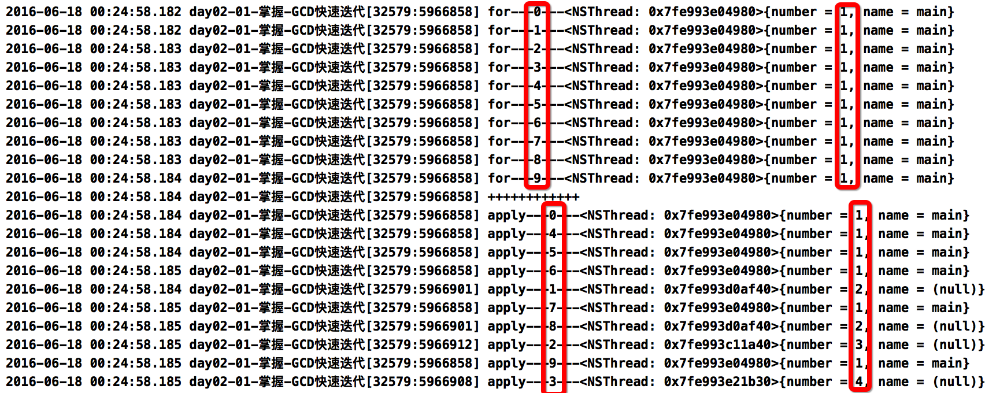
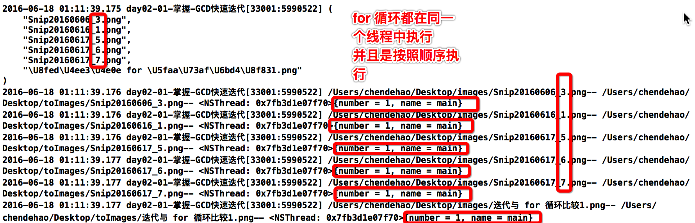
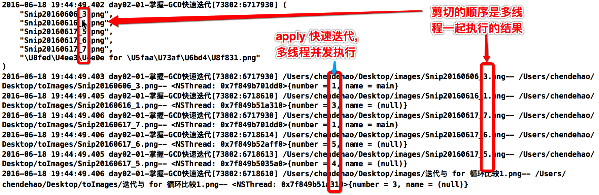

# GCD常用函数

---

##本节知识点:
1. 栅栏函数
2. 一次性函数
3. 延迟执行
4. 快速迭代
5. 队列组的使用

---

##1. 栅栏函数
- **栅栏函数可以用来控制任务的执行顺序**
- **任务执行顺序**: 
    - 栅栏函数之前的任务(执行完毕)--> 栅栏函数的任务(执行完毕)--> 栅栏函数之后的任务
- **注意**：
    - 不能使用全局并发队列(如果使用了是起不到控制顺序的效果)
    - 所有要通过栅栏控制顺序的任务要放在同一个队列中
    > `If the queue you pass to this function is a serial queue or one of the global concurrent queues, this function behaves like the dispatch_async function.`
- 如果要使用主队列, 则要注意不要在主线程执行含有同步函数子任务(加入到主队列)的方法, 否则死锁

```objc
dispatch_barrier_async(queue, ^{
    NSLog(@"--dispatch_barrier_async-");
});
```
```objc
// 创建队列  // 注意队列创建时不需要加 "*"
dispatch_queue_t queue =  dispatch_queue_create("cdh", DISPATCH_QUEUE_CONCURRENT);

dispatch_async(queue, ^{
    for (int i = 0; i < 1000; ++i) {
        NSLog(@"1---%@",[NSThread currentThread]);
    }
});
dispatch_async(queue, ^{
    for (int i = 0; i < 1000; ++i) {
        NSLog(@"2---%@",[NSThread currentThread]);
    }
});
//栅栏函数控制顺序:必须等任务1和2执行完毕之后才能执行任务3和任务4
//    这里使用同步异步的栅栏函数效果一样
//    栅栏函数之前的任务(执行完毕)--> 栅栏函数的任务(执行完毕)--> 栅栏函数之后的任务
//    dispatch_barrier_async(queue, ^{
//        for (int i = 0; i < 10; ++i) {
//            NSLog(@"+++++++++");
//        }
//    });
dispatch_barrier_sync(queue, ^{
    for (int i = 0; i < 10; ++i) {
        NSLog(@"+++++++++");
    }
});
dispatch_async(queue, ^{
    for (int i = 0; i < 1000; ++i) {
        NSLog(@"3---%@",[NSThread currentThread]);
    }
});
dispatch_async(queue, ^{
    for (int i = 0; i < 1000; ++i) {
        NSLog(@"4---%@",[NSThread currentThread]);
    }
});
```


--- 


##2. 一次性函数
- **特点:**
    - 能够保证在整个程序运行过程中,一次性函数里面block中的代码段只会被执行一次
    - 保证线程安全


- **应用**: 单例模式
- **注意**: 不能把一次性代码放到懒加载中
    
```objc
static dispatch_once_t onceToken;
dispatch_once(&onceToken, ^{
    NSLog(@"1111");
    // 只执行1次的代码(这里面默认是线程安全的)
});
```

---


##3. 延迟执行
- **注意: 延迟执行, 是指线程被暂停执行任务**
- **三种延时执行的方法**
    - performSelector...afterDelay 主循环的延迟的方法
    - scheduledTimerWithTimeInterval..定时器(NSTimer)
    - dispatch_after... GCD的 C 语言函数


- **方法一**: 使用主循环的延迟的方法

```objc
// afterDelay 延迟的时间 秒为单位  2.0秒
[self performSelector:@selector(task) withObject:nil afterDelay:2.0];
```

- **方法二**: 使用定时器

```objc
// 注意: 使用定时器延时方法的最后一个参数, repeats: 是否要重复执行, 
// 时间以秒为单位
[NSTimer scheduledTimerWithTimeInterval:2.0 target:self selector:@selector(task) userInfo:nil repeats:NO];
```


- **方法三**: 使用 GCD 的延时函数
    - GCD延迟执行的原理是,延迟把block内容提交到队列而非直接添加到队列后延迟调度
    - GCD可以通过设置队列来控制block在哪个线程中调用
    - dispatch_after方法本身是异步的

```objc
//GCD
//dispatch_get_main_queue() 主队列
//dispatch_get_global_queue(0, 0) 全局队列
/*
 第一个参数:delayInSeconds 要延迟的时间 GCD的时间是以纳秒为单位 (精准度极高)
 第二个参数:队列  决定block中的任务在哪个线程中执行, 本例子是在主队列中(只要在主队列就一定在主线程中才被执行)
 */
dispatch_after(dispatch_time(DISPATCH_TIME_NOW, (int64_t)(2.0 * NSEC_PER_SEC)), dispatch_get_main_queue(), ^{
    NSLog(@"GCD----%@",[NSThread currentThread]);
});
```

```objc
-(void)task{
    NSLog(@"---task---");
}
```

---


##4. 快速迭代

- 主线程和子线程一起执行迭代任务
- 所有的任务是在多个线程(包含主线程)中并发执行
- **注意：使用快速迭代的时候队列不能使用主队列**
<br/>

- **`for`循环和`dispatch_apply`的区别**
    -  一个 for 循环, 不管循环多少次都在一个线程中执行, 并且是按照顺序执行
    -  dispatch_apply 迭代则可以在多个线程并行执行

```objc
//for循环和apply的区别
- (void)test{
    //迭代----遍历
    //在当前线程中执行,所有的任务是串行执行的
    for (int i = 0; i < 10; ++i) {
        NSLog(@"for---%zd---%@",i,[NSThread currentThread]);
    }

    NSLog(@"++++++++++++");
    /*
     第一个参数:要迭代的次数,相当于 for 循环中的判断限制
     第二个参数:队列 (注意点:不能使用主队列)
     第三个参数:blocks(设置索引) 就等同于 for 循环中的 i
     */
    dispatch_apply( 10,dispatch_get_global_queue(0, 0) , ^(size_t index) {
        NSLog(@"apply---%zd---%@",index,[NSThread currentThread]);
    });
}
```
  
  


- **for循环和迭代移动文件**
    - 如何得到文件路径下的所有文件(subpathsAtPath:
    - 如何拼接文件全路径(stringByAppendingPathComponent
    - NSFileManager的基本使用(获得路径下面所有子路径&剪切文件)
    - **注意**:快速迭代不能使用主队列

```objc
- (void)moveFiles{
    // 1. 获得文件原始路径
    NSString *fromPath = @"/Users/chendehao/Desktop/images";
    // 2. 获得文件的目标路径
    NSString *toPath = @"/Users/chendehao/Desktop/toImages";
    // 3. 得到文件路径下的所有文件
    NSArray *subPaths = [[NSFileManager defaultManager] subpathsAtPath:fromPath];
    NSLog(@"%@",subPaths);
    NSInteger count = subPaths.count;
    // 4. 快速迭代
    dispatch_apply(count, dispatch_get_global_queue(0, 0), ^(size_t index) {

        // 4.1 拼接路径
        NSString *fromFullPath = [fromPath stringByAppendingPathComponent:subPaths[index]];
        NSString *toFullPath = [toPath stringByAppendingPathComponent:subPaths[index]];
        // 4.2 执行文件剪切操作
        [[NSFileManager defaultManager]moveItemAtPath:fromFullPath toPath:toFullPath error:nil];
        NSLog(@"%@-- %@-- %@", fromFullPath ,toFullPath,[NSThread currentThread]);
    });
}
```





---

##5. 队列组的使用
- **队列组的使用需求**:
    - 有 N 个任务,要求所有的任务都在子线程中并发执行
    - 当 N - M 个的任务都执行完毕的时候需要你打印end
    - 另外 M 任务也依然还是和 N - M 个任务是并发执行(即是所有的任务依然都是并发执行)
    - 这是就不能再使用栅栏函数, 因为栅栏函数的执行顺序是: 栅栏函数之前的任务(执行完毕)--> 栅栏函数的任务(执行完毕)--> 栅栏函数之后的任务; 栅栏函数注意: 不能使用全局队列
    - 因此, 将需要监听的任务添加到队列组中, 让队列组监听队列组中的任务执行情况


- **应用场景**: 下载两张图片，拼接图片后到主线程中刷新


- **队列数组函数 `dispatch_group_async`**;
    - 封装任务
    - 把任务提交到队列
    - 把当前的任务的执行情况纳入到队列组的监听范围
    - 将多个任务添加到队列组中不影响队列的原本的同步异步性,
    - 所有的函数(包括队列组之外的任务)的同步/异步性就没有影响,

    - **注意: GCD对象 iOS6.0之后不再需要手动释放**


- **队列组两种写法**
    - 简单式(常用)`dispatch_group_async(group, queue, ^{}`
    - 首尾式: `dispatch_group_enter` & `dispatch_group_leave`
        - 注意：必须成对使用
- **两种添加到队列组的区别**:
    - 简单式: 在任务执行完毕时不需要通知队列组, 队列组自己会监听
    - 首尾式: 在任务执行完毕必须通知队列组, 任务已经执行完毕

- **队列组常用的两个函数**
    - 队列组通知监听函数(异步函数)`dispatch_group_notify`
    - 队列组等待函数(同步函数)`dispatch_group_wait`

- **队列组的简单应用**(图片合成)

<br/>

- **简单式**

```objc
-(void)group1
{
    //0.获得队列组,管理队列
    dispatch_group_t group = dispatch_group_create();

    //1.获得并发队列
    dispatch_queue_t queue = dispatch_queue_create("download", DISPATCH_QUEUE_CONCURRENT);

    //2.使用函数添加任务
    //dispatch_async(queue, ^{
    //1)封装任务2)把任务提交到队列
    //dispatch_group_async(group, queue, ^{
    //1)封装任务2)把任务提交到队列3)把当前的任务的执行情况纳入到队列组的监听范围
    dispatch_group_async(group, queue, ^{
        NSLog(@"download1----%@",[NSThread currentThread]);
    });
    dispatch_group_async(group, queue, ^{
        NSLog(@"download2----%@",[NSThread currentThread]);
    });

    dispatch_group_async(group, queue, ^{
        NSLog(@"download3----%@",[NSThread currentThread]);
    });

    dispatch_group_async(group, queue, ^{
        NSLog(@"download4----%@",[NSThread currentThread]);
    });

    //NSLog(@"--end---");
//    栅栏函数的执行顺序是: 栅栏函数之前的任务(执行完毕)--> 栅栏函数的任务(执行完毕)--> 栅栏函数之后的任务; 
//    栅栏函数注意: 不能使用全局队列    
//    dispatch_barrier_async(queue, ^{
//        NSLog(@"--end---");
//    });

    //拦截通知
    //当队列组中所有的任务都执行完毕的时候回调用下面方法block
    //同步还是异步?异步

    dispatch_group_notify(group, queue, ^{
        NSLog(@"--end---");
    });

    dispatch_async(queue, ^{
        for (int i = 0; i < 100; ++i) {
            NSLog(@"+++++++++++++");
        }    
    });
    // GCD对象 iOS6.0之后不再需要手动释放
    // dispatch_release(group);
    // dispatch_release(queue);
}
```


- **首尾式**
    - 被添加到队列组的异步函数在执行完任务的时候必须通知队列组告诉队列组任务已经执行完毕

```objc
-(void)group2
{
    //0.获得队列组,管理队列
    dispatch_group_t group = dispatch_group_create();

    //1.获得并发队列
    dispatch_queue_t queue = dispatch_queue_create("download", DISPATCH_QUEUE_CONCURRENT);

    //2.表示开始把后面的异步任务纳入到监听范围
    //dispatch_group_enter & dispatch_group_leave
    dispatch_group_enter(group);

    //3.使用异步函数封装任务
    dispatch_async(queue, ^{
        NSLog(@"1---%@",[NSThread currentThread]);

        //通知队列组该任务已经执行完毕
        dispatch_group_leave(group);
    });

    dispatch_group_enter(group);
    dispatch_async(queue, ^{
        NSLog(@"2---%@",[NSThread currentThread]);
        dispatch_group_leave(group);
    });

    dispatch_group_enter(group);
    dispatch_async(queue, ^{
        NSLog(@"3---%@",[NSThread currentThread]);
        dispatch_group_leave(group);
    });

    //拦截通知
    dispatch_group_notify(group, queue, ^{
        NSLog(@"--end---");
    });
}
```


- **队列组通知监听函数**
  - 异步函数, 但必须等到队列组中所有的任务都执行完才会被执行

```objc
// 异步函数, 但必须等到队列组中所有的任务都执行完才会被执行
dispatch_group_notify(group, queue, ^{
    NSLog(@"--end---");
});
```

- **队列组等待函数**
    - 同步函数, 根据等待时间等待执行

```objc
//同步执行
dispatch_time_t timer = dispatch_time(DISPATCH_TIME_NOW, 0.00001 * NSEC_PER_SEC);
//
/**
 *  dispatch_group_wait 函数
 *  
 *  @param group 要等待的队列组
 *  @param timer 等待 timer 时间, 不管队列中的任务有没有执行完毕都继续往下执行,
 *               如果在该时间内所有事任务都执行完毕了那么会返回一个0,否则是非0值 
 *               如果是 DISPATCH_TIME_FOREVER 死等, 直到等到所有的任务都执行完毕之后才会继续往下执行
 *
 *  @return
 */
long n =  dispatch_group_wait(group, timer);
NSLog(@"%ld",n);

NSLog(@"--end---");
```


- **队列组的简单应用**(图片合成)

```objc
#pragma mark -------------------
#pragma mark group的简单应用
//需求:下载图片1,图片2,合成图片,所有操作都必须在子线程执行
//需求:下载图片1,图片2,合成图片,1和2在子线程执行,合成图片在主线程中执行
- (void)group3{
    // 获得队列组
    dispatch_group_t group = dispatch_group_create();
    // 创建队列(或者使用全局队列)
    dispatch_queue_t queue = dispatch_get_global_queue(0, 0);

    // 将下载任务添加在队列组中
    // 1. 下载图片一
    dispatch_group_async(group, queue, ^{
        // 1. 获得下载路径
        NSURL *url = [NSURL URLWithString:@"http://wanzao2.b0.upaiyun.com/system/pictures/33164301/original/1455500488_500x500.png"];
        // 2. 下载二进制的数据到本地
        NSData *imageData = [NSData dataWithContentsOfURL:url];
        // 3. 转化格式
        self.image1 = [UIImage imageWithData:imageData];

        // 打印查看是哪个线程执行这个下载任务;
        NSLog(@"downLoad1 --- %@",[NSThread currentThread]);
    });

    // 2. 下载图片二
    dispatch_group_async(group, queue, ^{
        NSURL *url = [NSURL URLWithString:@"http://ww1.sinaimg.cn/large/e389bb44jw1efrld60zctj20cs0bdglv.jpg"];
        NSData *imageData = [NSData dataWithContentsOfURL:url];
        self.image2 = [UIImage imageWithData:imageData];

        NSLog(@"dounload --- %@", [NSThread currentThread]);
    });

    // 3. 监听下载图片下载完成
//    dispatch_group_notify(group, queue, ^{
//        // 1. 开启上下文
//        UIGraphicsBeginImageContext(CGSizeMake(self.imageView.frame.size.width, self.imageView.frame.size.height));
//        
//        // 2. 绘图1
//        [self.image1 drawInRect:CGRectMake(0, 0, self.imageView.frame.size.width * 0.5, self.imageView.frame.size.height )];
//        // 注意: 将图片画到上下文之后, 要清理 self.image1 缓存
//        self.image1 = nil;
//        
//        // 3. 绘图2
//        [self.image2 drawInRect:CGRectMake(self.imageView.frame.size.width * 0.5, 0, self.imageView.frame.size.width * 0.5, self.imageView.frame.size.height)];
//        
//        // 4. 得到图片
//        UIImage *image = UIGraphicsGetImageFromCurrentImageContext();
//        // 5. 关闭上下文
//        UIGraphicsEndImageContext();
//        // 6. 回到主线程刷新UI界面
//        dispatch_async(dispatch_get_main_queue(), ^{
//            self.imageView.image = image;
//            
//            NSLog(@"%@",[NSThread currentThread]);
//        });
//    });

    // 监听到队列组所有任务都被执行完毕, 直接到主队列中合成图片
    dispatch_group_notify(group, dispatch_get_main_queue(), ^{
        // 1. 开启上下文
        UIGraphicsBeginImageContext(CGSizeMake(self.imageView.frame.size.width, self.imageView.frame.size.height));

        // 2. 绘图1
        [self.image1 drawInRect:CGRectMake(0, 0, self.imageView.frame.size.width * 0.5, self.imageView.frame.size.height )];
        // 注意: 将图片画到上下文之后, 要清理 self.image1 缓存
        self.image1 = nil;

        // 3. 绘图2
        [self.image2 drawInRect:CGRectMake(self.imageView.frame.size.width * 0.5, 0, self.imageView.frame.size.width * 0.5, self.imageView.frame.size.height)];

        // 4. 得到图片
        self.imageView.image = UIGraphicsGetImageFromCurrentImageContext();
        // 5. 关闭上下文
        UIGraphicsEndImageContext();
        // 6. 回到主线程刷新UI界面
//        dispatch_async(dispatch_get_main_queue(), ^{
//            self.imageView.image = image;

            NSLog(@"%@",[NSThread currentThread]);
//        });
    });
}
```


---